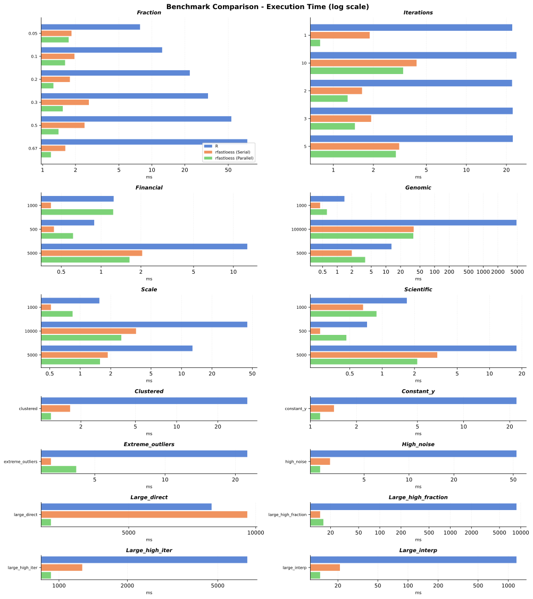

<!-- markdownlint-disable MD033 -->
# Benchmarks

Compares base R's `stats::loess` with serial and parallel `rfastloess`. This implementation has no GPU backend; the benchmarks below compare CPU execution only.

## Benchmark Guide

Run the commands below from this directory:

```sh
cd benchmarks
make install
```

`make install` builds and installs the current R binding before the comparisons. The large direct-fit workloads can take several seconds or longer.

### R and CPU Comparisons

These commands run the same workload categories for base R and the serial and parallel R binding:

| Command | What it measures | Output |
| --- | --- | --- |
| `make bench-r` | Base R's `stats::loess` reference runtime | `output/r_benchmark.json` |
| `make bench-rfastloess-serial` | R binding runtime with serial execution | `output/rfastloess_serial.json` |
| `make bench-rfastloess-parallel` | R binding runtime with parallel execution | `output/rfastloess_parallel.json` |

The workloads vary input size, smoothing fraction, robustness iterations, and signal shape:

| Category | Variants | Description |
| --- | --- | --- |
| **Scalability** | n = 1 000 / 5 000 / 10 000 | Sine wave, fraction 0.1, 3 robustness iterations |
| **Fraction** | 0.05–0.67 (6 levels) | Effect of smoothing span, n = 5 000 |
| **Iterations** | 1–10 (5 levels) | Effect of robustness iterations on outlier data, n = 5 000 |
| **Financial** | n = 500 / 1 000 / 5 000 | Cumulative-return time series, fraction 0.1 |
| **Scientific** | n = 500 / 1 000 / 5 000 | Damped-oscillator signal, fraction 0.15 |
| **Genomic** | n = 1 000 / 5 000 / 100 000 | Step-function expression data, fraction 0.1 |
| **Pathological** | clustered, high-noise, extreme outliers, constant y | Sensitivity to irregular inputs and degenerate signals |
| **Large Scale** | n = 15 000 / 50 000 | Exact fitting, interpolation shortcuts, high iteration count, and wide smoothing windows |

Large-scale variants cover exact fitting and the `stats::loess` interpolation shortcut:

| Variant | Size | Settings |
| --- | --- | --- |
| `large_direct` | 50 000 | Exact-fit baseline, fraction 0.1, 3 iterations, `surface = "direct"` |
| `large_interp` | 50 000 | Same workload with `surface = "interpolate"` |
| `large_high_iter` | 15 000 | 10 iterations, `family = "symmetric"`, `surface = "direct"` |
| `large_high_fraction` | 50 000 | Fraction 0.67, `surface = "interpolate"` |

`surface = "direct"` disables the k-d tree interpolation shortcut, which approximates the fit surface at a fixed grid of vertices and interpolates between them. Use it for an exact comparison; `surface = "interpolate"` is the `stats::loess` default.

### Generate the Comparison Plot

After running the three R/CPU benchmarks:

```sh
make compare
```

This reads the existing CPU JSON files and generates `output/benchmark_comparison.svg`; it does not rerun the benchmarks. Output JSON files are written to `output/`.

## Results

The results below use the latest comparison output. Timings depend on hardware, thread availability, and workload.

### R and CPU Comparison



The plot and table use **mean** timings from `make compare`. Parentheses show speedup relative to base R's `stats::loess`; values above 1 indicate faster execution than R.

| Scenario | R | rfastloess (serial) | rfastloess (parallel) |
| --- | ---: | ---: | ---: |
| clustered | 42.92 ms | 2.40 ms (17.9×) | 1.82 ms (23.6×) |
| constant_y | 27.78 ms | 2.07 ms (13.4×) | 1.62 ms (17.1×) |
| extreme_outliers | 27.74 ms | 4.35 ms (6.4×) | 4.21 ms (6.6×) |
| financial_1000 | 1.48 ms | 0.56 ms (2.7×) | 0.67 ms (2.2×) |
| financial_500 | 0.70 ms | 0.25 ms (2.8×) | 0.66 ms (1.1×) |
| financial_5000 | 13.36 ms | 2.27 ms (5.9×) | 1.71 ms (7.8×) |
| fraction_0.05 | 8.22 ms | 2.70 ms (3.0×) | 4.14 ms (2.0×) |
| fraction_0.1 | 13.74 ms | 2.54 ms (5.4×) | 2.42 ms (5.7×) |
| fraction_0.2 | 24.19 ms | 2.87 ms (8.4×) | 2.25 ms (10.7×) |
| fraction_0.3 | 32.65 ms | 3.26 ms (10.0×) | 3.48 ms (9.4×) |
| fraction_0.5 | 52.39 ms | 2.95 ms (17.8×) | 3.11 ms (16.8×) |
| fraction_0.67 | 75.48 ms | 2.53 ms (29.9×) | 2.57 ms (29.3×) |
| genomic_1000 | 1.34 ms | 0.61 ms (2.2×) | 0.89 ms (1.5×) |
| genomic_100000 | 5 652.21 ms | 51.02 ms (110.8×) | 33.27 ms (169.9×) |
| genomic_5000 | 12.51 ms | 2.79 ms (4.5×) | 2.64 ms (4.7×) |
| high_noise | 70.11 ms | 3.38 ms (20.7×) | 2.45 ms (28.6×) |
| iterations_1 | 22.75 ms | 1.66 ms (13.7×) | 2.87 ms (7.9×) |
| iterations_10 | 22.53 ms | 5.19 ms (4.3×) | 4.45 ms (5.1×) |
| iterations_2 | 23.47 ms | 2.28 ms (10.3×) | 2.68 ms (8.8×) |
| iterations_3 | 23.28 ms | 2.86 ms (8.1×) | 2.55 ms (9.1×) |
| iterations_5 | 22.62 ms | 3.66 ms (6.2×) | 3.26 ms (6.9×) |
| large_direct | 10 066.93 ms | 20 179.44 ms (0.5×) | 9 135.54 ms (1.1×) |
| large_high_fraction | 14 587.37 ms | 24.95 ms (584.7×) | 61.71 ms (236.4×) |
| large_high_iter | 8 461.60 ms | 2 391.07 ms (3.5×) | 1 099.72 ms (7.7×) |
| large_interp | 1 274.90 ms | 26.95 ms (47.3×) | 18.88 ms (67.5×) |
| scale_1000 | 1.41 ms | 0.80 ms (1.8×) | 4.21 ms (0.3×) |
| scale_10000 | 46.15 ms | 5.13 ms (9.0×) | 8.21 ms (5.6×) |
| scale_5000 | 13.27 ms | 3.06 ms (4.3×) | 4.74 ms (2.8×) |
| scientific_1000 | 1.76 ms | 0.83 ms (2.1×) | 1.02 ms (1.7×) |
| scientific_500 | 0.72 ms | 0.39 ms (1.8×) | 0.66 ms (1.1×) |
| scientific_5000 | 18.38 ms | 3.10 ms (5.9×) | 2.73 ms (6.7×) |

At small sizes, fixed per-call overhead can dominate, and parallel execution is not always faster. In this run, `large_direct` is the large exact-fit case where `stats::loess` is faster than serial rfastloess; parallel rfastloess is 1.1× faster than R. The largest listed speedup is 584.7× for serial rfastloess on `large_high_fraction`; parallel execution is not faster than serial for that workload.
