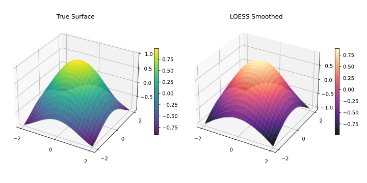

<!-- markdownlint-disable MD024 MD033 -->
# Multivariate LOESS

Smoothing over multiple predictor dimensions simultaneously.

## Overview

Standard LOESS operates on a single predictor $x$. Setting `dimensions > 1` extends the neighbourhood search and local polynomial fit into an $n$-dimensional predictor space, enabling surface smoothing over spatial grids, time–altitude combinations, and similar multi-predictor datasets.



| Dimensions | Use Case | Input Shape |
| --- | --- | --- |
| `1` | Time series, 1D signal (default) | `x`: 1-D array |
| `2` | Spatial surface, 2-predictor model | `x`: n × 2 matrix |
| `3+` | High-dimensional regression | `x`: n × d matrix |

!!! warning "Computational cost"
    Neighbourhood search scales with $d$ dimensions. For `dimensions ≥ 3` keep `fraction` small.

---

## 1D — Standard (Default)

Single predictor. No configuration required.

```@example dimensions
using FastLOESS
using Random, Statistics

rng = MersenneTwister(42)
x = collect(range(0, 2π, length=100))
y = sin.(x) .+ randn(rng, 100) .* 0.3

model = Loess(; fraction=0.3)
result = fit(model, x, y)
println("First smoothed value (1D LOESS): ", result.y[1])
```

---

## 2D — Spatial Surface

Two predictors (e.g., latitude/longitude, time/altitude). Pass an $n \times 2$ matrix as `x`.

```@example dimensions
using FastLOESS
using Random, Statistics

rng = MersenneTwister(42)
n = 100
lat = collect(range(0, 2π, length=n))
lon = collect(range(0, 2π, length=n))
z = sin.(lat) .+ cos.(lon) .+ randn(rng, n) .* 0.1

# x is an (n, 2) matrix of predictors
x2d = hcat(lat, lon)
model = Loess(; dimensions=2, fraction=0.3)
result = fit(model, x2d, z)
println("First smoothed value (2D LOESS, lat/lon): ", result.y[1])
```

---

## 3D and Higher

Three or more predictors. The neighbourhood radius grows in each additional dimension, so a larger `fraction` (or smaller dataset) is typically needed.

```@example dimensions
using FastLOESS
using Random, Statistics

rng = MersenneTwister(42)
n = 100
x1 = collect(range(0, 2π, length=n))
x2 = collect(range(0.0, 1.0, length=n))
x3 = collect(range(1.0, 0.0, length=n))
y = sin.(x1) .+ x2 .- x3 .+ randn(rng, n) .* 0.1

# x is an (n, 3) matrix of predictors
x3d = hcat(x1, x2, x3)
model = Loess(; dimensions=3, fraction=0.5)
result = fit(model, x3d, y)
println("First smoothed value (3D LOESS): ", result.y[1])
```

---

## Distance Metrics for Multivariate Data

When `dimensions > 1` you can also control how inter-point distances are computed.

| Metric | Description | When to Use |
| --- | --- | --- |
| `"normalized"` | Each dimension scaled to unit range (default) | Predictors on different scales |
| `"euclidean"` | Raw Euclidean distance | Predictors already on same scale |
| `"minkowski:p"` | Generalised Minkowski ($L_p$) norm | Custom distance geometry |
| `"weighted"` | Per-dimension weighted Euclidean | Domain-specific importance |

See [API Reference](../api/api.md) for the full list of options per language.
