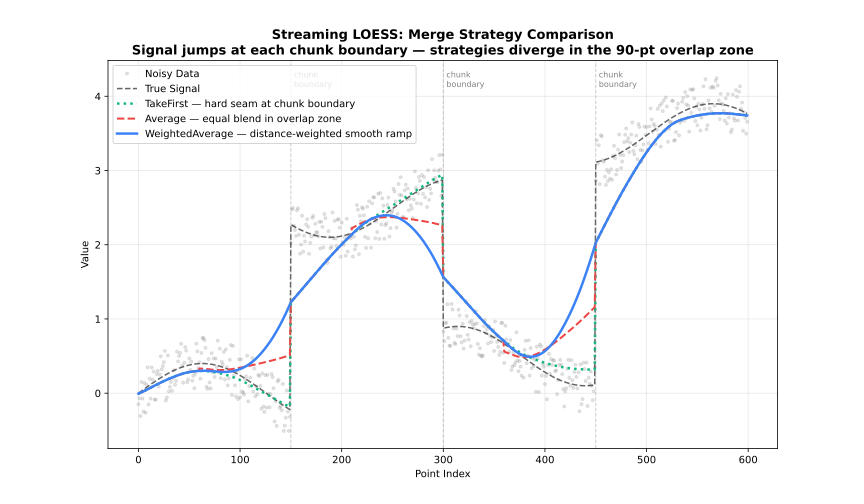

# Streaming Adapter

Process large datasets in chunks with configurable overlap.

See also: [Batch Adapter](api.md)

## When to Use

- Dataset >100,000 points
- Memory-constrained environments
- Batch processing pipelines

## Class

### `StreamingLoess`

The `StreamingLoess` type processes data in chunks, suitable for very large datasets or streaming applications.

**Constructor:**

```@example streaming
using FastLOESS

model = StreamingLoess(; fraction=0.3, chunk_size=5000, overlap=500)
println(typeof(model))
```

- Keyword arguments configure the `StreamingLoess` model; see [Options Structure](#options-structure) below.

#### `process_chunk(model, x, y)`

Feeds one chunk of data into the model. Each chunk is fit together with the trailing `overlap` points buffered from the previous call, then only the points that are fully resolved are returned — the tail of the chunk (the next `overlap` points) is held back internally, since it will be refit once the following chunk arrives and its estimate reconciled via `merge_strategy`. This is what lets the adapter process a dataset far larger than memory allows, one bounded-size chunk at a time, without ever materializing the whole dataset at once.

```@example streaming
using Random, Statistics

rng = MersenneTwister(42)
x = collect(range(0, 2π, length=100))
y = sin.(x) .+ randn(rng, 100) .* 0.3

process_chunk(model, x, y)
println("Called process_chunk")
```

#### `finalize(model)`

Flushes the overlap points still buffered from the last `process_chunk` call. Because each call withholds its tail until the next chunk arrives to resolve it, the final chunk's tail would never be emitted otherwise — always call `finalize` once after the last chunk to retrieve it.

```@example streaming
result = finalize(model)
println("First smoothed value: ", result.y[1])
```

## Options Structure

### `StreamingLoess` keyword arguments (mirrors `Loess`)

| Field | Type | Default | Description |
| --- | --- | --- | --- |
| `fraction` | `Float64` | `0.67` | Smoothing fraction (bandwidth) |
| `iterations` | `Int` | `3` | Number of robustifying iterations |
| `weight_function` | `String` | `"tricube"` | Weight function name |
| `robustness_method` | `String` | `"bisquare"` | Robustness method name |
| `scaling_method` | `String` | `"mad"` | Residual scaling method |
| `boundary_policy` | `String` | `"extend"` | Boundary handling policy |
| `zero_weight_fallback` | `String` | `"use_local_mean"` | Zero-weight handling |
| `missing` | `String` | `"error"` | Policy for non-finite (NaN/Inf) values in each chunk |
| `auto_converge` | `Float64` | `NaN` | Auto-convergence tolerance |
| `return_diagnostics` | `Bool` | `false` | Include diagnostics in result |
| `return_residuals` | `Bool` | `false` | Include residuals in result |
| `return_robustness_weights` | `Bool` | `false` | Include weights in result |
| `parallel` | `Bool` | `true` | Enable parallel execution |
| `degree` | `String` | `"linear"` | Polynomial degree of local fit |
| `dimensions` | `Int` | `1` | Number of predictor dimensions |
| `distance_metric` | `String` | `"normalized"` | Distance metric; use `"minkowski:p"` for custom p |
| `weighted_metric_weights` | `Union{Vector{Float64}, Nothing}` | `nothing` | Per-dimension weights (used when `distance_metric="weighted"`) |
| `surface_mode` | `String` | `"interpolation"` | Surface computation mode |
| `cell` | `Union{Float64, Nothing}` | `nothing` | Cell size for interpolation grid |
| `interpolation_vertices` | `Union{Int, Nothing}` | `nothing` | Number of interpolation vertices |
| `boundary_degree_fallback` | `Union{Bool, Nothing}` | `nothing` | Fall back to lower polynomial degree at boundaries when higher degrees fail |
| `chunk_size` | `Int` | `5000` | Points per chunk |
| `overlap` | `Int` | `chunk_size / 10` | Overlap between chunks |
| `merge_strategy` | `String` | `"weighted_average"` | Strategy for blending overlap regions |

Confidence/prediction intervals, standard errors, cross-validation, and `return_sorted` are Batch-only and not available here; see [Batch Adapter](api.md) for those.

## Options

### fraction

`fraction` is the most important parameter: it controls the size of the local neighbourhood used at each point.

| Range | Effect | Use case |
| --- | --- | --- |
| 0.1-0.3 | Fine detail | Rapidly changing signals |
| 0.3-0.5 | Balanced | General purpose |
| 0.5-0.7 | Heavy smoothing | Noisy data |
| 0.7-1.0 | Very smooth | Trend extraction |

### iterations

`iterations` controls robustness to outliers, at the cost of speed.

| Value | Effect | Performance |
| --- | --- | --- |
| 0 | No robustness | Fastest |
| 1-3 | Moderate | Recommended |
| 4-6 | Strong | Contaminated data |
| 7+ | Very strong | Heavy outliers |

### weight_function

*See: [Weight Functions](../weighting/kernels.md)*

- `"tricube"` (default)
- `"epanechnikov"`
- `"gaussian"`
- `"uniform"` (alias: `"boxcar"`)
- `"biweight"` (alias: `"bisquare"`)
- `"triangle"` (alias: `"triangular"`)
- `"cosine"`

### robustness_method

*See: [Robustness](../weighting/robustness.md)*

- `"bisquare"` (default; alias: `"biweight"`)
- `"huber"`
- `"talwar"`

### scaling_method

*See: [Scaling Methods](../weighting/scaling.md)*

- `"mad"` (default; alias: `"median_absolute_deviation"`)
- `"mar"` (alias: `"median_absolute_residual"`)
- `"mean"` (alias: `"mean_absolute_residual"`)

### boundary_policy

*See: [Boundary Handling](../advanced/boundary.md)*

- `"extend"` (default; alias: `"pad"`)
- `"reflect"` (alias: `"mirror"`)
- `"zero"`
- `"noboundary"` (alias: `"none"`)

### zero_weight_fallback

Behavior when all neighborhood weights are zero:

| Option | Behavior |
| --- | --- |
| `"use_local_mean"` (default; aliases: `"local_mean"`, `"mean"`) | Use the mean of the neighborhood |
| `"return_original"` (alias: `"original"`) | Return the original y value |
| `"return_none"` (alias: `"none"`) | Return `NaN` |

### missing

Policy for handling non-finite (NaN/Inf) values within each chunk:

| Option | Behavior |
| --- | --- |
| `"error"` (default) | Raise an error if any value in the chunk is non-finite |
| `"drop"` | Silently remove rows where any x dimension or y is non-finite before merging the chunk with the overlap buffer |

**Note:** A length mismatch between `x` and `y` always errors, even under `"drop"`.

### auto_converge

*See: [Robustness](../weighting/robustness.md#auto-convergence)*

Convergence tolerance for early stopping of robustness iterations. `NaN` (default) disables early stopping.

### return_diagnostics

*See: [`Diagnostics`](#diagnostics)*

Include a `Diagnostics` object (RMSE, MAE, R2, residual_sd) in the result. `effective_df`/`aic`/`aicc` require standard errors, which are Batch-only, so they're always `nothing` here.

- `false` (default) — leaves `result.diagnostics` as `nothing`
- `true` — populates `result.diagnostics`

### return_residuals

Include per-point residuals (`y - fitted`) in the result.

- `false` (default) — leaves `result.residuals` as `nothing`
- `true` — populates `result.residuals`

### return_robustness_weights

Include the final per-point robustness weights (from the last robustness iteration) in the result.

- `false` (default) — leaves `result.robustness_weights` as `nothing`
- `true` — populates `result.robustness_weights`

### parallel

Enable multi-threaded execution via Rayon.

- `true` (default) — parallelizes the local regression fits across CPU cores
- `false` — forces single-threaded execution

### degree

*See: [Polynomial Degree](../advanced/degree.md)*

- `"constant"` or `"0"` (degree 0)
- `"linear"` or `"1"` (default, degree 1)
- `"quadratic"` or `"2"` (degree 2)
- `"cubic"` or `"3"` (degree 3)
- `"quartic"` or `"4"` (degree 4)

### dimensions

*See: [Multivariate LOESS](../advanced/dimensions.md)*

Number of predictor dimensions. Set to match the number of columns in a multivariate `x` array.

- Any integer `>= 1`; `1` (default) is univariate

### distance_metric

*See: [Multivariate LOESS](../advanced/dimensions.md)*

- `"normalized"` (default — scales each dimension by its range; alias: `"norm"`)
- `"euclidean"` (alias: `"euclid"`)
- `"manhattan"` (alias: `"l1"`)
- `"chebyshev"` (alias: `"linf"`)
- `"minkowski"` (use `"minkowski:p"` string for custom exponent, e.g. `"minkowski:3"`)
- `"weighted"` plus `weighted_metric_weights` for per-dimension scaling (alias: `"weighted_euclidean"`)

### weighted_metric_weights

*See: [Multivariate LOESS](../advanced/dimensions.md)*

Per-dimension weights, one per dimension declared in `dimensions`. Only used when `distance_metric="weighted"`; setting `distance_metric="weighted"` without providing this raises an error.

- `nothing` (default) — has no effect unless `distance_metric="weighted"` is set
- A `Vector{Float64}` of per-dimension weights, required when `distance_metric="weighted"`

### surface_mode

*See: [Polynomial Degree](../advanced/degree.md#surface-mode)*

Controls whether the local polynomial is evaluated at every query point or at a sparser grid of anchor vertices with Hermite cubic interpolation in between.

| Mode | Behavior | Speed | Accuracy |
| --- | --- | --- | --- |
| `"interpolation"` (default) | Evaluate at vertices, interpolate between | Faster | Slight approximation |
| `"direct"` | Evaluate at every query point | Slower | Full precision |

### cell

Cell size for the interpolation grid, as a fraction of the data range. Only applies when `surface_mode="interpolation"`.

- `nothing` (default) — uses the library default (`0.2`)
- Any `Float64` in `(0, 1]`

### interpolation_vertices

Caps the maximum number of interpolation vertices, overriding the count implied by `cell`. Only applies when `surface_mode="interpolation"`.

- `nothing` (default) — uses the library default (no explicit cap)
- Any integer `>= 1`

### boundary_degree_fallback

Whether to reduce the polynomial degree at boundary vertices when the requested `degree` can't be fit there. Only applies when `surface_mode="interpolation"`.

- `nothing` (default) — uses the library default (enabled)
- `true` — falls back to a lower degree at boundaries
- `false` — raises an error instead of silently falling back

### chunk_size

Number of points processed per chunk. Larger chunks reduce per-chunk overhead and give each local fit more surrounding context, at the cost of higher peak memory; smaller chunks bound memory tightly but increase the fraction of points that fall in overlap regions. A good starting point is balancing available memory against how much processing overhead per chunk is acceptable — match it to your file-read buffer or message-batch size to avoid unnecessary copying.

### overlap

Number of points retained from the previous chunk as context, so the neighbourhood at chunk boundaries isn't artificially truncated. Points inside the overlap zone are fitted twice (once by each chunk) and reconciled via `merge_strategy`. A good starting point is 10–20% of `chunk_size`: too little overlap causes visible boundary artefacts, while too much wastes computation refitting the same points twice.

- `-1` (default) — computes `chunk_size / 10`, clamped to at least 1 and at most `chunk_size - 10`
- Any integer `>= 1` and `< chunk_size`

### merge_strategy

*See: [Merge Strategies](../advanced/merge.md)*

| Strategy | Behavior |
| --- | --- |
| `"weighted_average"` (default) | Distance-weighted blend |
| `"average"` | Average overlapping values |
| `"take_first"` | Keep left chunk values |
| `"take_last"` | Keep right chunk values |



---

!!! warning "Always call finalize()"
    The streaming adapter buffers overlap data. Call `finalize(model)` after the last chunk to retrieve the buffered tail.

## Result Structure

### `LoessResult`

Returned by `process_chunk` and `finalize`.

| Field | Type | Description |
| --- | --- | --- |
| `x` | `Vector{Float64}` | x values (same order as input) |
| `y` | `Vector{Float64}` | Smoothed y values |
| `fraction_used` | `Float64` | Fraction used |
| `iterations_used` | `Union{Int, Nothing}` | Robustness iterations actually performed |
| `standard_errors` | `Union{Vector{Float64}, Nothing}` | Always `nothing` (Batch only) |
| `confidence_lower` | `Union{Vector{Float64}, Nothing}` | Always `nothing` (Batch only) |
| `confidence_upper` | `Union{Vector{Float64}, Nothing}` | Always `nothing` (Batch only) |
| `prediction_lower` | `Union{Vector{Float64}, Nothing}` | Always `nothing` (Batch only) |
| `prediction_upper` | `Union{Vector{Float64}, Nothing}` | Always `nothing` (Batch only) |
| `residuals` | `Union{Vector{Float64}, Nothing}` | Residuals (if `return_residuals`) |
| `robustness_weights` | `Union{Vector{Float64}, Nothing}` | Robustness weights (if `return_robustness_weights`) |
| `cv_scores` | `Union{Vector{Float64}, Nothing}` | Always `nothing` (Batch only) |
| `diagnostics` | `Union{Diagnostics, Nothing}` | Fit metrics (if `return_diagnostics`) |
| `dimensions` | `Int` | Number of predictor dimensions |

### `Diagnostics`

| Field | Type | Description |
| --- | --- | --- |
| `rmse` | `Float64` | Root Mean Squared Error |
| `mae` | `Float64` | Mean Absolute Error |
| `r_squared` | `Float64` | R-squared |
| `residual_sd` | `Float64` | Residual standard deviation |
| `effective_df` | `Float64` | Always `NaN` (requires standard errors, Batch only) |
| `aic` | `Float64` | Always `NaN` (requires `effective_df`, Batch only) |
| `aicc` | `Float64` | Always `NaN` (requires `effective_df`, Batch only) |

## Example

```@example streaming
using FastLOESS
using Random, Statistics

rng = MersenneTwister(42)
x = collect(range(0, 2π, length=100))
y = sin.(x) .+ randn(rng, 100) .* 0.3

model = StreamingLoess(;
    fraction=0.3,
    iterations=2,
    chunk_size=5000,
    overlap=500,
    merge_strategy="average"
)
process_chunk(model, x, y)
result = finalize(model)
println("First smoothed value: ", result.y[1])
```

---

---

!!! warning "Always call finalize()"
    In Rust, always call `processor.finalize()` after processing all chunks to retrieve buffered overlap data.
