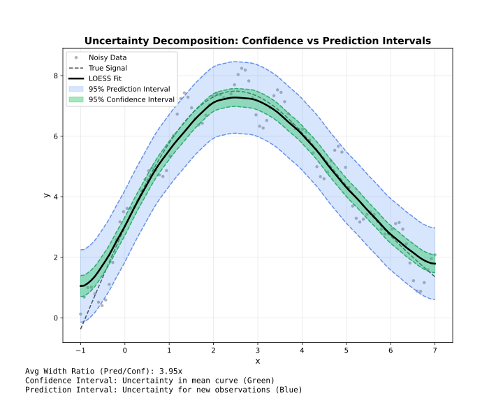

<!-- markdownlint-disable MD024 MD033 -->
# Intervals

Confidence and prediction intervals for uncertainty quantification.

## Overview



!!! note "Adapter support"
    Confidence and prediction intervals are available in **Batch** mode, **Streaming** mode (computed per chunk and merged across overlap boundaries via `merge_strategy`), and **Online** mode when `update_mode="full"` is set (construction fails if combined with the default `"incremental"` mode).

| Type | Represents | Width | Use |
| --- | --- | --- | --- |
| **Confidence** | Uncertainty in mean curve | Narrow | Where is the true trend? |
| **Prediction** | Uncertainty for new points | Wide | Where will new data fall? |

---

## Confidence Intervals

Estimate uncertainty in the smoothed curve itself.

```@example intervals
using FastLOESS
using Random, Statistics

rng = MersenneTwister(42)
x = collect(range(0, 2π, length=100))
y = sin.(x) .+ randn(rng, 100) .* 0.3

model = Loess(; fraction=0.5, intervals=(confidence = 0.95,))
result = fit(model, x, y)

println("Smoothed (first 5): ", result.y[1:5])
println("CI Lower (first 5): ", result.confidence_lower[1:5])
println("CI Upper (first 5): ", result.confidence_upper[1:5])
```

---

## Prediction Intervals

Estimate where new observations might fall.

```@example intervals
using FastLOESS
using Random, Statistics

rng = MersenneTwister(42)
x = collect(range(0, 2π, length=100))
y = sin.(x) .+ randn(rng, 100) .* 0.3

model = Loess(; fraction=0.5, intervals=(prediction = 0.95,))
result = fit(model, x, y)

println("Prediction bounds: [$(result.prediction_lower[1]), $(result.prediction_upper[1])]")
```

---

## Both Intervals

Request both types simultaneously:

```@example intervals
using FastLOESS
using Random, Statistics

rng = MersenneTwister(42)
x = collect(range(0, 2π, length=100))
y = sin.(x) .+ randn(rng, 100) .* 0.3

model = Loess(;
    fraction=0.5,
    intervals=(confidence = 0.95, prediction = 0.95)
)
result = fit(model, x, y)
println("First smoothed value (95% CI + PI): ", result.y[1])
```

---

## Confidence Levels

Common levels and their z-values:

| Level | z-value | Interpretation |
| --- | --- | --- |
| 0.90 | 1.645 | 90% of intervals contain true value |
| 0.95 | 1.960 | 95% of intervals contain true value |
| 0.99 | 2.576 | 99% of intervals contain true value |

```@example intervals
using FastLOESS
using Random, Statistics

rng = MersenneTwister(42)
x = collect(range(0, 2π, length=100))
y = sin.(x) .+ randn(rng, 100) .* 0.3

# 99% confidence interval
model = Loess(; intervals=(confidence = 0.99,))
result = fit(model, x, y)
println("First smoothed value (99% CI): ", result.y[1])
```

---

## Standard Errors

Access standard errors directly (available when intervals are computed):

```@example intervals
using FastLOESS
using Random, Statistics

rng = MersenneTwister(42)
x = collect(range(0, 2π, length=100))
y = sin.(x) .+ randn(rng, 100) .* 0.3

model = Loess(; intervals=(confidence = 0.95,))
result = fit(model, x, y)

println("Standard errors (first 5): ", result.standard_errors[1:5])
```

---

## Availability

!!! note "Supported In All Three Adapters"
    Confidence and prediction intervals are available in **Batch**, **Streaming**, and **Online** mode (`update_mode="full"` only).

| Feature | Batch | Streaming | Online |
| --- | --- | --- | --- |
| Confidence intervals | ✓ | ✓ | ✓ (`update_mode="full"` only) |
| Prediction intervals | ✓ | ✓ | ✓ (`update_mode="full"` only) |
| Standard errors | ✓ | ✓ | ✓ (`update_mode="full"` only) |
