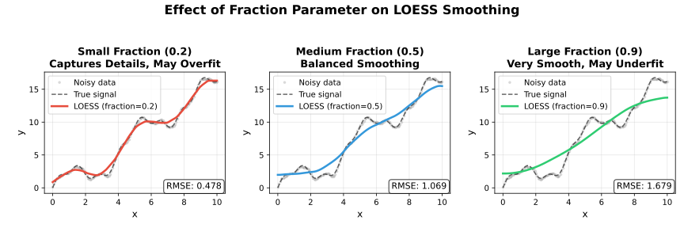
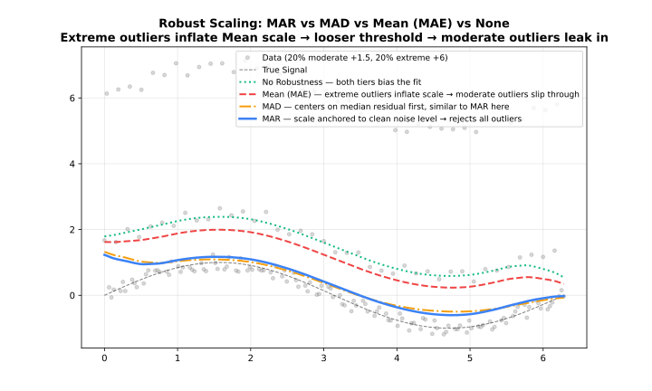
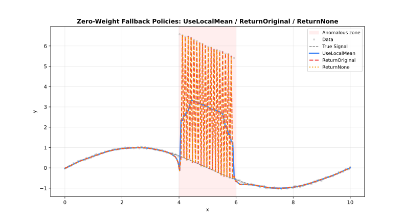

<!-- markdownlint-disable MD024 MD033 -->
# Parameters

Complete reference for all LOESS configuration options.

## Quick Reference

| Parameter | Default | Range/Options | Description | Adapter |
| --- | --- | --- | --- | --- |
| **fraction** | 0.67 | (0, 1] | Smoothing span | All |
| **iterations** | 3 | [0, 1000] | Robustness iterations | All |
| **degree** | 1 | 0–4 | Polynomial degree | All |
| **surface_mode** | `"interpolation"` | 2 options | Fit vs interpolate | All |
| **weight_function** | `"tricube"` | 7 options | Distance kernel | All |
| **robustness_method** | `"bisquare"` | 3 options | Outlier weighting | All |
| **zero_weight_fallback** | `"use_local_mean"` | 3 options | Zero-weight behavior | All |
| **boundary_policy** | `"extend"` | 4 options | Edge handling | All |
| **scaling_method** | `"mad"` | 3 options | Scale estimation | All |
| **auto_converge** | `nothing` | tolerance | Early stopping | All |
| **parallel** | true (false for Online) | logical | Multi-threaded execution | All |
| **custom_weights** | `nothing` | positive | Per-observation weights | Batch |
| **return_residuals** | `false` | logical | Include residuals | All |
| **return_robustness_weights** | `false` | logical | Include weights | All |
| **return_diagnostics** | `false` | logical | Include metrics | All |
| **confidence_intervals** | `nothing` | (0, 1) | CI level | Batch |
| **prediction_intervals** | `nothing` | (0, 1) | PI level | Batch |
| **distance_metric** | `"normalized"` | string option | Distance metric | All |
| **weighted_metric_weights** | `nothing` | numeric | Per-dimension distance weights | All |
| **cell** | `nothing` | (0, ∞) | Interpolation cell size | All |
| **interpolation_vertices** | `nothing` | integer | Interpolation grid vertices | All |
| **boundary_degree_fallback** | `false` | logical | Degree fallback at boundaries | All |
| **cv_method** | `nothing` | method | Auto-select fraction | Batch |
| **cv_k** | 5 | [2, ∞) | K-fold count | Batch |
| **cv_fractions** | `nothing` | numeric | Fractions to evaluate | Batch |
| **cv_seed** | `nothing` | integer | CV fold randomization seed | Batch |
| **cross_validate** | — | method | Auto-select fraction (`cv_method` + `cv_k` + `cv_fractions` + `cv_seed`) | Batch |
| **chunk_size** | 5000 | [10, ∞) | Points per chunk | Streaming |
| **overlap** | 500 | [0, chunk) | Overlap between chunks | Streaming |
| **merge_strategy** | `"weighted_average"` | 4 options | Merge overlaps | Streaming |
| **window_capacity** | 1000 | [3, ∞) | Max window size | Online |
| **min_points** | 3 | [2, window] | Min before output | Online |
| **update_mode** | `"incremental"` | 2 options | Update strategy | Online |

!!! note "Rust option values"
    In Rust, pass option-like parameters as strings (case-insensitive), e.g. `"tricube"`, `"bisquare"`, `"extend"`, `"weighted_average"`.
    For the weighted distance metric, use `.distance_metric("weighted").weighted_metric_weights(vec![...])`.

---

## Parameter Options Summary

| Parameter | Available Options |
| --- | --- |
| **weight_function** | `"tricube"`, `"epanechnikov"`, `"gaussian"`, `"biweight"`, `"cosine"`, `"triangle"`, `"uniform"` |
| **robustness_method** | `"bisquare"`, `"huber"`, `"talwar"` |
| **zero_weight_fallback** | `"use_local_mean"`, `"return_original"`, `"return_none"` |
| **boundary_policy** | `"extend"`, `"reflect"`, `"zero"`, `"noboundary"` |
| **scaling_method** | `"mad"`, `"mar"`, `"mean"` |
| **surface_mode** | `"interpolation"`, `"direct"` |
| **distance_metric** | `"normalized"`, `"euclidean"`, `"manhattan"`, `"chebyshev"`, `"minkowski:p"`, `"weighted"` |
| **merge_strategy** | `"average"`, `"weighted_average"`, `"take_first"`, `"take_last"` |
| **update_mode** | `"incremental"`, `"full"` |

---

## Core Parameters

### fraction

The proportion of data used for each local fit. **Most important parameter.**

| Value | Effect | Use Case |
| --- | --- | --- |
| 0.1–0.3 | Fine detail | Rapidly changing signals |
| 0.3–0.5 | Balanced | General purpose |
| 0.5–0.7 | Heavy smoothing | Noisy data |
| 0.7–1.0 | Very smooth | Trend extraction |



```@example parameters
using FastLOESS
using Random, Statistics

rng = MersenneTwister(42)
x = collect(range(0, 2π, length=100))
y = sin.(x) .+ randn(rng, 100) .* 0.3

model = Loess(; fraction=0.3)
result = fit(model, x, y)
println("First smoothed value (fraction=0.3): ", result.y[1])
```

---

### iterations

Number of robustness iterations for outlier resistance.

| Value | Effect | Performance |
| --- | --- | --- |
| 0 | No robustness | Fastest |
| 1–3 | Moderate | Recommended |
| 4–6 | Strong | Contaminated data |
| 7+ | Very strong | Heavy outliers |

```@example parameters
using FastLOESS
using Random, Statistics

rng = MersenneTwister(42)
x = collect(range(0, 2π, length=100))
y = sin.(x) .+ randn(rng, 100) .* 0.3

model = Loess(; iterations=5)
result = fit(model, x, y)
println("First smoothed value (iterations=5): ", result.y[1])
```

---

### degree

Polynomial degree for the local regression fits.


| Degree | Fit Type |
| --- | --- |
| `0` | Local constant |
| `1` | Local linear (Default) |
| `2` | Local quadratic |
| `3` | Local cubic |
| `4` | Local quartic |

Higher degrees capture curvature but can overfit with small fractions. Degree 1 is appropriate for most use cases.

See [Polynomial Degree](degree.md) for a detailed comparison.

---

### surface_mode

Controls whether the local polynomial is evaluated at every query point or at a sparser grid of anchor vertices with Hermite cubic interpolation in between.

| Mode | Behavior | Speed | Accuracy |
| --- | --- | --- | --- |
| `"interpolation"` (default) | Evaluate at vertices, interpolate between | Faster | Slight approximation |
| `"direct"` | Evaluate at every query point | Slower | Full precision |

See [Polynomial Degree](degree.md#surface-mode) for a visual comparison.

```@example parameters
using FastLOESS
using Random, Statistics

rng = MersenneTwister(42)
x = collect(range(0, 2π, length=100))
y = sin.(x) .+ randn(rng, 100) .* 0.3

model = Loess(; surface_mode="direct")
result = fit(model, x, y)
println("First smoothed value (direct surface mode): ", result.y[1])
```

---

### cell

Cell size for the interpolation grid. Controls the density of anchor vertices when `surface_mode = "interpolation"`. Smaller values produce a finer grid, increasing accuracy at the cost of memory and computation.

- **Default**: `0.2` (20% of x-range per dimension)
- **Range**: `(0, ∞)` — values close to 0 approach `"direct"` accuracy
- **Adapter**: All

| `cell` | Grid density | Accuracy | Speed |
| --- | --- | --- | --- |
| `0.05` | Very fine | Highest | Slowest |
| `0.2` | Moderate (default) | High | Fast |
| `0.5` | Coarse | Lower | Faster |

```@example parameters
using FastLOESS
using Random, Statistics

rng = MersenneTwister(42)
x = collect(range(0, 2π, length=100))
y = sin.(x) .+ randn(rng, 100) .* 0.3

model = Loess(; cell=0.05)
result = fit(model, x, y)
println("First smoothed value (cell=0.05, very fine grid): ", result.y[1])
```

---

### interpolation_vertices

Explicitly set the number of anchor vertices for the interpolation grid, overriding the `cell`-based automatic count. Use when you need a precise vertex budget.

- **Default**: auto (derived from `cell` and data range)
- **Adapter**: All

```@example parameters
using FastLOESS
using Random, Statistics

rng = MersenneTwister(42)
x = collect(range(0, 2π, length=100))
y = sin.(x) .+ randn(rng, 100) .* 0.3

model = Loess(; interpolation_vertices=50)
result = fit(model, x, y)
println("First smoothed value (interpolation_vertices=50): ", result.y[1])
```

---

### dimensions

Number of predictor variables. Enables multivariate LOESS over an n-dimensional input space.


- **1** (default): Standard 1D smoothing over a single predictor
- **2**: Spatial or bi-predictor surface smoothing
- **3+**: High-dimensional local regression

See [Multivariate LOESS](dimensions.md) for detailed usage and distance metric options.

---

### distance_metric / weighted_metric_weights

Distance metric for neighbourhood calculation. Only meaningful when `dimensions > 1`. The `"weighted"` metric lets you assign per-dimension importance via `weighted_metric_weights`.

| Metric | Description |
| --- | --- |
| `"normalized"` | Each dimension scaled to unit range (default) |
| `"euclidean"` | Raw Euclidean distance |
| `"manhattan"` | City-block distance |
| `"chebyshev"` | Maximum coordinate difference |
| `"minkowski:p"` | Generalised $L_p$ norm — e.g. `"minkowski:3"` |
| `"weighted"` | Weighted Euclidean — set `weighted_metric_weights` to one weight per dimension |

```@example parameters
using FastLOESS
using Random, Statistics

rng = MersenneTwister(42)
x = collect(range(0, 2π, length=100))
y = sin.(x) .+ randn(rng, 100) .* 0.3
x2d = hcat(x, x.^2 ./ (2π)^2)

model = Loess(;
    dimensions=2,
    distance_metric="weighted",
    weighted_metric_weights=[2.0, 0.5]
)
result = fit(model, x2d, y)
println("First smoothed value (weighted distance metric, 2D): ", result.y[1])
```

---

### weight_function

Distance weighting kernel for local fits.

| Kernel | Efficiency | Smoothness |
| --- | --- | --- |
| `"tricube"` | 0.998 | Very smooth |
| `"epanechnikov"` | 1.000 | Smooth |
| `"gaussian"` | 0.961 | Infinite |
| `"biweight"` | 0.995 | Very smooth |
| `"cosine"` | 0.999 | Smooth |
| `"triangle"` | 0.989 | Moderate |
| `"uniform"` | 0.943 | None |

See [Weight Functions](kernels.md) for detailed comparison.

```@example parameters
using FastLOESS
using Random, Statistics

rng = MersenneTwister(42)
x = collect(range(0, 2π, length=100))
y = sin.(x) .+ randn(rng, 100) .* 0.3

model = Loess(; weight_function="epanechnikov")
result = fit(model, x, y)
println("First smoothed value (epanechnikov kernel): ", result.y[1])
```

---

### robustness_method

Method for downweighting outliers during iterative refinement.

| Method | Behavior | Use Case |
| --- | --- | --- |
| `"bisquare"` | Smooth downweighting | General-purpose |
| `"huber"` | Linear beyond threshold | Moderate outliers |
| `"talwar"` | Hard threshold (0 or 1) | Extreme contamination |

See [Robustness](robustness.md) for detailed comparison.

```@example parameters
using FastLOESS
using Random, Statistics

rng = MersenneTwister(42)
x = collect(range(0, 2π, length=100))
y = sin.(x) .+ randn(rng, 100) .* 0.3

model = Loess(; robustness_method="talwar")
result = fit(model, x, y)
println("First smoothed value (talwar robustness): ", result.y[1])
```

---

### boundary_policy

Edge handling strategy to reduce boundary bias. See [Boundary Handling](boundary.md) for a detailed comparison.


| Policy | Behavior | Use Case |
| --- | --- | --- |
| `"extend"` | Pad with first/last values | Most cases (default) |
| `"reflect"` | Mirror data at boundaries | Periodic/symmetric data |
| `"zero"` | Pad with zeros | Data approaches zero |
| `"noboundary"` | No padding | Original Cleveland behavior |

For example:

```@example parameters
using FastLOESS
using Random, Statistics

rng = MersenneTwister(42)
x = collect(range(0, 2π, length=100))
y = sin.(x) .+ randn(rng, 100) .* 0.3

model = Loess(; boundary_policy="reflect")
result = fit(model, x, y)
println("First smoothed value (reflect boundary): ", result.y[1])
```

---

### boundary_degree_fallback

When enabled, the polynomial degree is automatically reduced to the highest degree that can be stably estimated for points near the boundary (where the local neighbourhood is one-sided). Prevents numerical failures when `degree ≥ 2` at the edges.

- **Default**: `false`
- **Adapter**: All

!!! tip
    Enable this if you observe NaN values or instability at the edges of your data when using `degree = "quadratic"` or higher.

```@example parameters
using FastLOESS
using Random, Statistics

rng = MersenneTwister(42)
x = collect(range(0, 2π, length=100))
y = sin.(x) .+ randn(rng, 100) .* 0.3

model = Loess(; degree="quadratic", boundary_degree_fallback=true)
result = fit(model, x, y)
println("First smoothed value (quadratic degree, boundary fallback): ", result.y[1])
```

---

### scaling_method

Method for estimating residual scale during robustness iterations. See [Scaling Methods](scaling.md) for a detailed comparison.



| Method | Description | Robustness |
| --- | --- | --- |
| `"mad"` | Median Absolute Deviation | Very robust |
| `"mar"` | Median Absolute Residual | Robust |
| `"mean"` | Mean Absolute Residual | Less robust |

For example:

```@example parameters
using FastLOESS
using Random, Statistics

rng = MersenneTwister(42)
x = collect(range(0, 2π, length=100))
y = sin.(x) .+ randn(rng, 100) .* 0.3

model = Loess(; scaling_method="mad")
result = fit(model, x, y)
println("First smoothed value (MAD scaling): ", result.y[1])
```

---

### zero_weight_fallback

Behavior when all neighborhood weights are zero.



| Option | Behavior |
| --- | --- |
| `"use_local_mean"` | Use mean of neighborhood (default) |
| `"return_original"` | Return original y value |
| `"return_none"` | Return NaN |

For example:

```@example parameters
using FastLOESS
using Random, Statistics

rng = MersenneTwister(42)
x = collect(range(0, 2π, length=100))
y = sin.(x) .+ randn(rng, 100) .* 0.3

model = Loess(; zero_weight_fallback="use_local_mean")
result = fit(model, x, y)
println("First smoothed value (use_local_mean fallback): ", result.y[1])
```

---

### auto_converge

Enable early stopping when robustness weights stabilize.

```@example parameters
using FastLOESS
using Random, Statistics

rng = MersenneTwister(42)
x = collect(range(0, 2π, length=100))
y = sin.(x) .+ randn(rng, 100) .* 0.3

model = Loess(; iterations=20, auto_converge=1e-6)
result = fit(model, x, y)
println("First smoothed value (auto_converge=1e-6): ", result.y[1])
```

---

### parallel

Enable multi-threaded parallel execution via Rayon. Substantially speeds up fitting on datasets with more than a few hundred points.

- **Default**: `true` for Batch and Streaming; `false` for Online
- **Adapter**: All

!!! note
    `OnlineLoess` defaults to `false` because it fits one point at a time. Each update touches only the sliding window, so there is no inner loop large enough to benefit from parallelism — enabling it would add thread overhead with no gain.

!!! tip
    Set to `false` for fully deterministic, reproducible output when debugging, or in environments where thread safety is required.

```@example parameters
using FastLOESS
using Random, Statistics

rng = MersenneTwister(42)
x = collect(range(0, 2π, length=100))
y = sin.(x) .+ randn(rng, 100) .* 0.3

model = Loess(; parallel=false)
result = fit(model, x, y)
println("First smoothed value (parallel=false): ", result.y[1])
```

---

### custom_weights

Per-observation weights applied before distance and robustness weighting. Only
available in the **Batch** adapter.

!!! note "Batch only"
    `custom_weights` is silently ignored in Streaming and Online adapters.

See [Custom Weights](custom-weights.md) for a full discussion.

```@example parameters
using FastLOESS
using Random, Statistics

rng = MersenneTwister(42)
x = collect(range(0, 2π, length=100))
y = sin.(x) .+ randn(rng, 100) .* 0.3

weights = ones(length(y))
weights[5] = 0.0  # Exclude 5th point
model = Loess()
result = fit(model, x, y; custom_weights=weights)
println("First smoothed value (custom weights, index 5 excluded): ", result.y[1])
```

---

## Output Options

### return_residuals

Include residuals (`y - smoothed`) in the output.

```@example parameters
using FastLOESS
using Random, Statistics

rng = MersenneTwister(42)
x = collect(range(0, 2π, length=100))
y = sin.(x) .+ randn(rng, 100) .* 0.3

model = Loess(; return_residuals=true)
result = fit(model, x, y)
println("Residuals: ", result.residuals)
```

---

### return_diagnostics

Include fit quality metrics (Batch and Streaming only).

| Metric | Description |
| --- | --- |
| `rmse` | Root Mean Square Error |
| `mae` | Mean Absolute Error |
| `r_squared` | R² coefficient |
| `residual_sd` | Residual standard deviation |
| `effective_df` | Effective degrees of freedom |
| `aic` | Akaike Information Criterion |
| `aicc` | Corrected AIC |

```@example parameters
using FastLOESS
using Random, Statistics

rng = MersenneTwister(42)
x = collect(range(0, 2π, length=100))
y = sin.(x) .+ randn(rng, 100) .* 0.3

model = Loess(; return_diagnostics=true)
result = fit(model, x, y)
println("R\u00b2: ", result.diagnostics.r_squared)
```

---

### return_robustness_weights

Include final robustness weights (useful for outlier detection).

```@example parameters
using FastLOESS
using Random, Statistics

rng = MersenneTwister(42)
x = collect(range(0, 2π, length=100))
y = sin.(x) .+ randn(rng, 100) .* 0.3

model = Loess(; iterations=3, return_robustness_weights=true)
result = fit(model, x, y)
# Points with result.robustness_weights < 0.5 are likely outliers
println("First smoothed value (robustness weights computed): ", result.y[1])
```

---

### confidence_intervals / prediction_intervals

Request uncertainty estimates (Batch only).

See [Intervals](intervals.md) for detailed usage.

```@example parameters
using FastLOESS
using Random, Statistics

rng = MersenneTwister(42)
x = collect(range(0, 2π, length=100))
y = sin.(x) .+ randn(rng, 100) .* 0.3

model = Loess(; confidence_intervals=0.95, prediction_intervals=0.95)
result = fit(model, x, y)
println("First smoothed value (95% CI + PI): ", result.y[1])
```

---

## CV Methods

### cv_method

Selection strategy for automated parameter tuning.

| Method | Description | Speed |
| --- | --- | --- |
| `"kfold"` | K-Fold Cross-Validation | Fast |
| `"loocv"` | Leave-One-Out Cross-Validation | Slow |

```@example parameters
using FastLOESS
using Random, Statistics

rng = MersenneTwister(42)
x = collect(range(0, 2π, length=100))
y = sin.(x) .+ randn(rng, 100) .* 0.3

model = Loess(; cv_method="kfold", cv_k=5)
result = fit(model, x, y)
println("First smoothed value (k-fold CV, k=5): ", result.y[1])
```

---

## Adapter Parameters

### chunk_size

Points per chunk in Streaming mode.

```@example parameters
using FastLOESS
using Random, Statistics

rng = MersenneTwister(42)
x = collect(range(0, 2π, length=100))
y = sin.(x) .+ randn(rng, 100) .* 0.3

model = StreamingLoess(; chunk_size=10000)
process_chunk(model, x, y)
result = finalize(model)
println("First smoothed value (chunk_size=10000): ", result.y[1])
```

---

### overlap

Overlap between chunks in Streaming mode.

```@example parameters
using FastLOESS
using Random, Statistics

rng = MersenneTwister(42)
x = collect(range(0, 2π, length=100))
y = sin.(x) .+ randn(rng, 100) .* 0.3

model = StreamingLoess(; overlap=1000)
process_chunk(model, x, y)
result = finalize(model)
println("First smoothed value (overlap=1000): ", result.y[1])
```

---

### merge_strategy

Method for merging overlapping chunks. See [Merge Strategies](merge.md) for a detailed comparison.

| Strategy | Description | Robustness |
| --- | --- | --- |
| `"average"` | Average of overlapping chunks | Fastest, least robust |
| `"take_first"` | Left chunk only | Fastest, least robust |
| `"take_last"` | Right chunk only | Fastest, least robust |
| `"weighted_average"` | Weighted average of overlapping chunks | Most robust |

For example:

```@example parameters
using FastLOESS
using Random, Statistics

rng = MersenneTwister(42)
x = collect(range(0, 2π, length=100))
y = sin.(x) .+ randn(rng, 100) .* 0.3

model = StreamingLoess(; merge_strategy="weighted_average")
process_chunk(model, x, y)
result = finalize(model)
println("First smoothed value (weighted_average merge): ", result.y[1])
```

---

### window_capacity

Maximum points held in memory for Online mode.

```@example parameters
using FastLOESS
using Random, Statistics

rng = MersenneTwister(42)
x = collect(range(0, 2π, length=100))
y = sin.(x) .+ randn(rng, 100) .* 0.3

model = OnlineLoess(; window_capacity=500)
result = add_point(model, x[1], y[1])  # nothing until window fills
println("Result before window fills (capacity=500): ", result)
```

---

### min_points

Minimum points required before Online filter starts producing outputs.

```@example parameters
using FastLOESS
using Random, Statistics

rng = MersenneTwister(42)
x = collect(range(0, 2π, length=100))
y = sin.(x) .+ randn(rng, 100) .* 0.3

model = OnlineLoess(; min_points=10)
result = add_point(model, x[1], y[1])  # nothing until 10 points seen
println("Result before min_points reached (min_points=10): ", result)
```

---

### update_mode

Optimization strategy for Online mode updates.

| Mode | Description | Speed |
| --- | --- | --- |
| `"full"` | Re-smooth entire window | Slow |
| `"incremental"` | Update only affected fits | Fast |

For example:

```@example parameters
using FastLOESS
using Random, Statistics

rng = MersenneTwister(42)
x = collect(range(0, 2π, length=100))
y = sin.(x) .+ randn(rng, 100) .* 0.3

model = OnlineLoess(; update_mode="full")
result = add_point(model, x[1], y[1])
println("Result after first point (update_mode=full): ", result)
```
