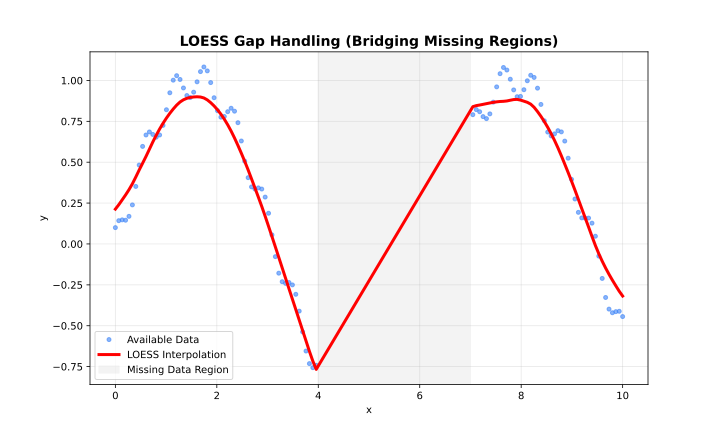

The Node.js bindings provide a high-performance interface to the core Rust library, mirroring the Rust API structure.

## When to Use

- Dataset fits in memory
- Need intervals, cross-validation, or diagnostics
- Processing complete files



## Classes

### `Loess`

The `Loess` class allows configuring the LOESS parameters once and fitting multiple datasets using those parameters.

**Constructor:**

```javascript
const { Loess } = require('fastloess');

const model = new Loess({ fraction: 0.5 });
const result = model.fit(
    new Float64Array([0, 1, 2, 3, 4, 5]),
    new Float64Array([0.0, 1.1, 1.9, 3.1, 3.9, 5.0])
);
console.log("y[0]:", result.y[0].toFixed(4));
```

```output
y[0]: 0.0000
```

- `options`: An object containing `LoessOptions` fields.

**Methods:**

```javascript
const { Loess } = require('fastloess');

const n = 100;
const x = Float64Array.from({ length: n }, (_, i) => i * 2 * Math.PI / (n - 1));
const y = Float64Array.from(x, xi => Math.sin(xi) + 0.1);

const model = new Loess({ fraction: 0.5 });
const result = model.fit(x, y);
console.log("Fraction used:", result.fraction_used);
console.log("Iterations used:", result.iterations_used);
```

```output
Fraction used: 0.5
Iterations used: 3
```

- Fits the model to the provided `x` and `y` typed arrays.
- Returns a `LoessResult` object containing the smoothed values and optional diagnostics.

```javascript
const { Loess } = require('fastloess');

const n = 100;
const x = Float64Array.from({ length: n }, (_, i) => i * 2 * Math.PI / (n - 1));
const y = Float64Array.from(x, xi => Math.sin(xi) + 0.1);

const model = new Loess({ fraction: 0.5 });
model.fit_async(x, y).then(result => {
    console.log("Async fit y[0]:", result.y[0].toFixed(4));
});
```

```output
Async fit y[0]: 0.3274
```

- Async variant of `fit()`. Returns a `Promise` that resolves to a `LoessResult`.

See [nodejs-streaming.md](api-streaming.md) for the `StreamingLoess` class.

See [nodejs-online.md](api-online.md) for the `OnlineLoess` class.

## Options Structures

### `LoessOptions`

| Field | Type | Default | Description |
| --- | --- | --- | --- |
| `fraction` | `number` | `0.67` | Smoothing fraction (bandwidth) |
| `iterations` | `number` | `3` | Number of robustifying iterations |
| `weight_function` | `string` | `"tricube"` | Kernel weight function |
| `robustness_method` | `string` | `"bisquare"` | Robustness method |
| `scaling_method` | `string` | `"mad"` | Residual scaling method |
| `boundary_policy` | `string` | `"extend"` | Boundary handling policy |
| `zero_weight_fallback` | `string` | `"use_local_mean"` | Zero-weight handling |
| `auto_converge` | `number` | `null` | Auto-convergence tolerance |
| `custom_weights` | `Float64Array` | `null` | Per-observation case weights — passed to `fit()`/`fitAsync()`, not the options object (Batch only) |
| `confidence_intervals` | `number` | `null` | Confidence level (e.g., 0.95) |
| `prediction_intervals` | `number` | `null` | Prediction level (e.g., 0.95) |
| `return_diagnostics` | `boolean` | `false` | Compute RMSE, MAE, R², AIC |
| `return_residuals` | `boolean` | `false` | Include residuals in result |
| `return_robustness_weights` | `boolean` | `false` | Include robustness weights in result |
| `return_se` | `boolean` | `false` | Compute hat-matrix statistics (enp, leverage …) |
| `parallel` | `boolean` | `true` | Enable parallel execution |
| `degree` | `string` | `"linear"` | Polynomial degree of local fit |
| `dimensions` | `number` | `1` | Number of predictor dimensions |
| `distance_metric` | `string` | `"normalized"` | Distance metric; use `"minkowski:p"` for custom p |
| `weighted_metric_weights` | `number[]` | `null` | Per-dimension weights (used when `distance_metric = "weighted"`) |
| `surface_mode` | `string` | `"interpolation"` | Surface computation mode |
| `cell` | `number` | `null` | Cell size for interpolation grid (smaller → more vertices, higher accuracy) |
| `interpolation_vertices` | `number` | `null` | Number of interpolation vertices |
| `boundary_degree_fallback` | `boolean` | `null` | Fall back to lower polynomial degree at boundaries when higher degrees fail |
| `cv_method` | `string` | `"kfold"` | CV method (`"kfold"` or `"loocv"`) (Batch only) |
| `cv_k` | `number` | `5` | Number of folds for k-fold CV (Batch only) |
| `cv_fractions` | `number[]` | `null` | Fractions to test for cross-validation (Batch only) |
| `cv_seed` | `number` | `null` | Random seed for cross-validation shuffling (Batch only) |

See [nodejs-streaming.md](api-streaming.md) for `StreamingOptions`.

See [nodejs-online.md](api-online.md) for `OnlineOptions`.

## Result Structure

See [nodejs-online.md](api-online.md) for `OnlineOutput`.

### `LoessResult`

| Field | Type | Description |
| --- | --- | --- |
| `x` | `Float64Array` | Sorted x values |
| `y` | `Float64Array` | Smoothed y values |
| `fraction_used` | `number` | Fraction used (set or selected by CV) |
| `iterations_used` | number \| null | Robustness iterations actually performed |
| `standard_errors` | Float64Array \| null | Per-point SE (if `return_se`) |
| `confidence_lower` | Float64Array \| null | Lower confidence bounds |
| `confidence_upper` | Float64Array \| null | Upper confidence bounds |
| `prediction_lower` | Float64Array \| null | Lower prediction bounds |
| `prediction_upper` | Float64Array \| null | Upper prediction bounds |
| `residuals` | Float64Array \| null | Residuals (if `return_residuals`) |
| `robustness_weights` | Float64Array \| null | Robustness weights (if `return_robustness_weights`) |
| `cv_scores` | Float64Array \| null | CV score per tested fraction |
| `diagnostics` | Diagnostics \| null | Fit metrics (if `return_diagnostics`) |
| `enp` | number \| null | Equivalent number of parameters (if `return_se`) |
| `trace_hat` | number \| null | Trace of hat matrix (if `return_se`) |
| `delta1` | number \| null | First delta statistic (if `return_se`) |
| `delta2` | number \| null | Second delta statistic (if `return_se`) |
| `residual_scale` | number \| null | Residual scale estimate (if `return_se`) |
| `leverage` | Float64Array \| null | Per-point hat-matrix diagonal (if `return_se`) |
| `dimensions` | `number` | Number of predictor dimensions |

### `Diagnostics`

| Field | Type | Description |
| --- | --- | --- |
| `rmse` | `number` | Root Mean Squared Error |
| `mae` | `number` | Mean Absolute Error |
| `r_squared` | `number` | R-squared |
| `residual_sd` | `number` | Residual standard deviation |
| `effective_df` | `number` \| `undefined` | Effective degrees of freedom |
| `aic` | `number` \| `undefined` | AIC |
| `aicc` | `number` \| `undefined` | AICc |

## Options

### weight_function

*See: [Weight Functions](kernels.md)*

- `"tricube"` (default)
- `"epanechnikov"`
- `"gaussian"`
- `"uniform"` (alias: `"boxcar"`)
- `"biweight"` (alias: `"bisquare"`)
- `"triangle"` (alias: `"triangular"`)
- `"cosine"`

### robustness_method

*See: [Robustness](robustness.md)*

- `"bisquare"` (default; alias: `"biweight"`)
- `"huber"`
- `"talwar"`

### boundary_policy

*See: [Boundary Handling](boundary.md)*

- `"extend"` (default; alias: `"pad"`)
- `"reflect"` (alias: `"mirror"`)
- `"zero"`
- `"noboundary"` (alias: `"none"`)

### scaling_method

*See: [Scaling Methods](scaling.md)*

- `"mad"` (default; alias: `"median_absolute_deviation"`)
- `"mar"` (alias: `"median_absolute_residual"`)
- `"mean"` (alias: `"mean_absolute_residual"`)

### zero_weight_fallback

*See: [Parameters](parameters.md)*

- `"use_local_mean"` (default; aliases: `"local_mean"`, `"mean"`)
- `"return_original"` (alias: `"original"`)
- `"return_none"` (alias: `"none"`)

### degree

*See: [Polynomial Degree](degree.md)*

- `"constant"` or `"0"` (degree 0)
- `"linear"` or `"1"` (default, degree 1)
- `"quadratic"` or `"2"` (degree 2)
- `"cubic"` or `"3"` (degree 3)
- `"quartic"` or `"4"` (degree 4)

### distance_metric

*See: [Multivariate LOESS](dimensions.md)*

- `"normalized"` (default — scales each dimension by its range; alias: `"norm"`)
- `"euclidean"` (alias: `"euclid"`)
- `"manhattan"` (alias: `"l1"`)
- `"chebyshev"` (alias: `"linf"`)
- `"minkowski"` (use `"minkowski:p"` string for custom exponent, e.g. `"minkowski:3"`)
- `"weighted"` plus `weighted_metric_weights` for per-dimension scaling (alias: `"weighted_euclidean"`)

### surface_mode

*See: [Parameters](parameters.md)*

- `"interpolation"` (default — faster, uses a spatial grid)
- `"direct"` (fits every point exactly; slower but more accurate)

### merge_strategy

See [nodejs-streaming.md](api-streaming.md).

### update_mode

See [nodejs-online.md](api-online.md).

## Example

```javascript
const { Loess } = require('fastloess');

const x = new Float64Array([1, 2, 3, 4, 5]);
const y = new Float64Array([2.1, 4.0, 6.2, 8.0, 10.1]);

// Configure model
const model = new Loess({ fraction: 0.5 });

// Fit data
const result = model.fit(x, y);

console.log("Smoothed Y:", result.y);
```

```output
Smoothed Y: Float64Array(5) [ 2.1, 4, 6.2, 8, 10.1 ]
```
