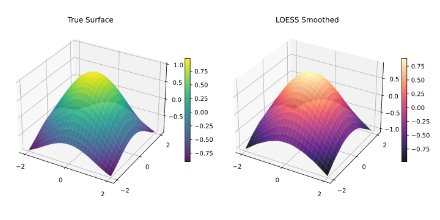

<!-- markdownlint-disable MD024 MD033 -->
Smoothing over multiple predictor dimensions simultaneously.

## Overview

Standard LOESS operates on a single predictor $x$. Setting `dimensions > 1` extends the neighbourhood search and local polynomial fit into an $n$-dimensional predictor space, enabling surface smoothing over spatial grids, time–altitude combinations, and similar multi-predictor datasets.



| Dimensions | Use Case | Input Shape |
| --- | --- | --- |
| `1` | Time series, 1D signal (default) | `x`: 1-D array |
| `2` | Spatial surface, 2-predictor model | `x`: n × 2 matrix |
| `3+` | High-dimensional regression | `x`: n × d matrix |

:::caution[Computational cost]
Neighbourhood search scales with $d$ dimensions. For `dimensions ≥ 3` keep `fraction` small and consider increasing `delta` to activate interpolation.
:::

---

## 1D — Standard (Default)

Single predictor. No configuration required.

```javascript
const { Loess } = require('fastloess');

const n = 100;
const x = Float64Array.from({ length: n }, (_, i) => i * 2 * Math.PI / (n - 1));
const y = Float64Array.from(x, (xi, i) => Math.sin(xi) + (((i * 7 + 3) % 17) / 17 - 0.5) * 0.6);

const model = new Loess({ fraction: 0.3 });
const result = model.fit(x, y);
console.log("y[0]:", result.y[0].toFixed(4));
```

```output
y[0]: 0.0281
```

---

## 2D — Spatial Surface

Two predictors (e.g., latitude/longitude, time/altitude). Pass an $n \times 2$ matrix as `x`.

```javascript
const { Loess } = require('fastloess');

const n = 100;
const lat = Float64Array.from({ length: n }, (_, i) => i * 2 * Math.PI / (n - 1));
const lon = Float64Array.from({ length: n }, (_, i) => i * 2 * Math.PI / (n - 1));
const z = Float64Array.from({ length: n }, (_, i) => Math.sin(lat[i]) + Math.cos(lon[i]) + 0.05);
// x is a flat Float64Array of length n*2, row-major
const x2d = Float64Array.from({ length: n * 2 }, (_, k) => k % 2 === 0 ? lat[k >> 1] : lon[k >> 1]);

const model = new Loess({ dimensions: 2, fraction: 0.3 });
const result = model.fit(x2d, z);
console.log("y[0]:", result.y[0].toFixed(4));
```

```output
y[0]: 1.2204
```

---

## 3D and Higher

Three or more predictors. The neighbourhood radius grows in each additional dimension, so a larger `fraction` (or smaller dataset) is typically needed.

```javascript
const { Loess } = require('fastloess');

const n = 100;
const x1 = Float64Array.from({ length: n }, (_, i) => i * 2 * Math.PI / (n - 1));
const x2 = Float64Array.from({ length: n }, (_, i) => i / (n - 1));
const x3 = Float64Array.from({ length: n }, (_, i) => 1 - i / (n - 1));
const y = Float64Array.from({ length: n }, (_, i) => Math.sin(x1[i]) + x2[i] - x3[i] + 0.05);
const x3d = Float64Array.from({ length: n * 3 }, (_, k) => {
    const i = Math.floor(k / 3), d = k % 3;
    return d === 0 ? x1[i] : d === 1 ? x2[i] : x3[i];
});

const model = new Loess({ dimensions: 3, fraction: 0.5 });
const result = model.fit(x3d, y);
console.log("y[0]:", result.y[0].toFixed(4));
```

```output
y[0]: -0.6708
```

---

## Distance Metrics for Multivariate Data

When `dimensions > 1` you can also control how inter-point distances are computed.

| Metric | Description | When to Use |
| --- | --- | --- |
| `"normalized"` | Each dimension scaled to unit range (default) | Predictors on different scales |
| `"euclidean"` | Raw Euclidean distance | Predictors already on same scale |
| `"minkowski:p"` | Generalised Minkowski ($L_p$) norm | Custom distance geometry |
| `"weighted"` | Per-dimension weighted Euclidean | Domain-specific importance |

See [Parameters](parameters.md#distance_metric) for the full list of options per language.
