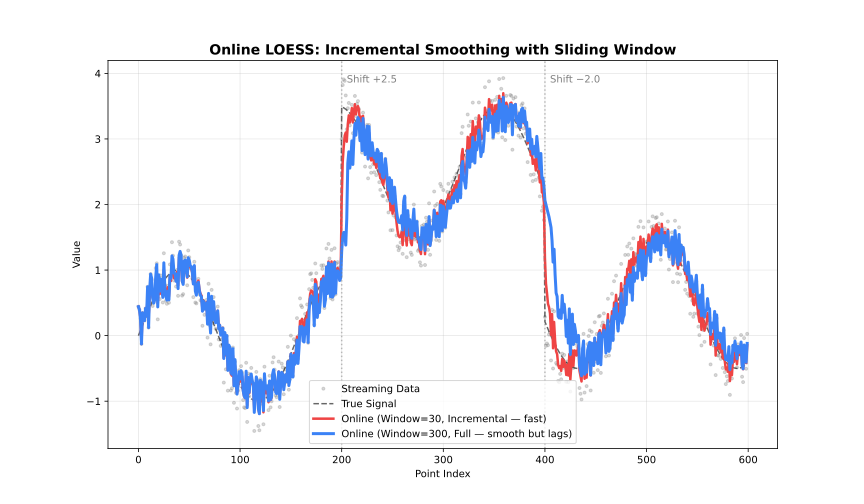

# OnlineLoess API

See also: [fastLoess](api.md)

## When to Use

- Data arrives incrementally (sensors, streams)
- Need real-time smoothed values
- Fixed memory budget

## Class

### `OnlineLoess`

The `OnlineLoess` class updates the model incrementally with new data points.

**Constructor:**

:::{jupyter-execute}
import fastloess as fl

online = fl.OnlineLoess(fraction=0.5, window_capacity=50)
:::

#### `add_point(x, y)`

Adds a single point to the sliding window and returns the smoothed value for that point, or `None` while the window is still filling up (fewer than `min_points` seen so far). Once the window reaches `window_capacity`, each new point evicts the oldest one, so memory stays bounded regardless of how much history has passed through. `update_mode` controls how much work each call does: `"incremental"` re-fits only the newest point, while `"full"` re-smooths the entire window for a more accurate but slower result.

:::{jupyter-execute}
import fastloess as fl
import numpy as np

x = np.linspace(0, 2 * np.pi, 100)
y = np.sin(x) + 0.1

online = fl.OnlineLoess(fraction=0.5, window_capacity=50, min_points=3)

result = online.add_point(x[0], y[0])  # None
result = online.add_point(x[1], y[1])  # None

result = online.add_point(x[2], y[2])
print(result)
:::

## Options Structure

### `OnlineOptions` (inherits `LoessOptions`)

| Field | Type | Default | Description |
| --- | --- | --- | --- |
| `fraction` | `float` | `0.67` | Smoothing fraction (bandwidth) |
| `iterations` | `int` | `3` | Number of robustifying iterations |
| `weight_function` | `str` | `"tricube"` | Weight function name |
| `robustness_method` | `str` | `"bisquare"` | Robustness method name |
| `scaling_method` | `str` | `"mad"` | Residual scaling method |
| `boundary_policy` | `str` | `"extend"` | Boundary handling policy |
| `zero_weight_fallback` | `str` | `"use_local_mean"` | Zero-weight handling strategy |
| `missing` | `str` | `"error"` | Policy for non-finite (NaN/Inf) values in each point |
| `auto_converge` | `float` | `None` | Auto-convergence tolerance |
| `return_robustness_weights` | `bool` | `False` | Include `robustness_weight` in result |
| `degree` | `str` | `"linear"` | Polynomial degree of local fit |
| `dimensions` | `int` | `1` | Number of predictor dimensions |
| `distance_metric` | `str` | `"normalized"` | Distance metric; use `"minkowski:p"` for custom p |
| `weighted_metric_weights` | `list[float]` | `None` | Per-dimension weights (used when `distance_metric="weighted"`) |
| `surface_mode` | `str` | `"interpolation"` | Surface computation mode |
| `cell` | `float` | `None` | Cell size for interpolation grid (smaller → more vertices, higher accuracy) |
| `interpolation_vertices` | `int` | `None` | Number of interpolation vertices |
| `boundary_degree_fallback` | `bool \| None` | `None` | Fall back to lower polynomial degree at boundaries when higher degrees fail |
| `window_capacity` | `int` | `1000` | Max points in sliding window |
| `min_points` | `int` | `2` | Min points before smoothing starts |
| `update_mode` | `str` | `"incremental"` | Update mode (`"full"` or `"incremental"`) |

Confidence/prediction intervals, standard errors, cross-validation, `return_sorted`, `return_diagnostics`, `return_residuals`, and `parallel` are Batch-only (or Batch/Streaming-only) and not available here; see [fastLoess](api.md) for those.

## Options

### fraction

`fraction` is the most important parameter: it controls the size of the local neighbourhood used at each point.

| Range | Effect | Use case |
| --- | --- | --- |
| 0.1-0.3 | Fine detail | Rapidly changing signals |
| 0.3-0.5 | Balanced | General purpose |
| 0.5-0.7 | Heavy smoothing | Noisy data |
| 0.7-1.0 | Very smooth | Trend extraction |

### iterations

`iterations` controls robustness to outliers, at the cost of speed.

| Value | Effect | Performance |
| --- | --- | --- |
| 0 | No robustness | Fastest |
| 1-3 | Moderate | Recommended |
| 4-6 | Strong | Contaminated data |
| 7+ | Very strong | Heavy outliers |

### weight_function

*See: [Weight Functions](../weighting/kernels.md)*

- `"tricube"` (default)
- `"epanechnikov"`
- `"gaussian"`
- `"uniform"` (alias: `"boxcar"`)
- `"biweight"` (alias: `"bisquare"`)
- `"triangle"` (alias: `"triangular"`)
- `"cosine"`

### robustness_method

*See: [Robustness](../weighting/robustness.md)*

- `"bisquare"` (default; alias: `"biweight"`)
- `"huber"`
- `"talwar"`

### scaling_method

*See: [Scaling Methods](../weighting/scaling.md)*

- `"mad"` (default; alias: `"median_absolute_deviation"`)
- `"mar"` (alias: `"median_absolute_residual"`)
- `"mean"` (alias: `"mean_absolute_residual"`)

### boundary_policy

*See: [Boundary Handling](../advanced/boundary.md)*

- `"extend"` (default; alias: `"pad"`)
- `"reflect"` (alias: `"mirror"`)
- `"zero"`
- `"noboundary"` (alias: `"none"`)

### zero_weight_fallback

Behavior when all neighborhood weights are zero:

| Option | Behavior |
| --- | --- |
| `"use_local_mean"` (default; aliases: `"local_mean"`, `"mean"`) | Use the mean of the neighborhood |
| `"return_original"` (alias: `"original"`) | Return the original y value |
| `"return_none"` (alias: `"none"`) | Return `NaN` |

### missing

Policy for handling a non-finite (NaN/Inf) `x` or `y` value passed to `add_point`:

| Option | Behavior |
| --- | --- |
| `"error"` (default) | Raise an error |
| `"drop"` | Silently ignore the point — `add_point` returns `None` instead of adding it to the window |

### auto_converge

*See: [Robustness](../weighting/robustness.md#auto-convergence)*

Convergence tolerance for early stopping of robustness iterations. `None` (default) disables early stopping.

### return_robustness_weights

Include the robustness weight for the latest point (from the last robustness iteration) in the result.

- `False` (default) — leaves `robustness_weight` as `None` in `OnlineOutput`
- `True` — populates `robustness_weight`

### degree

*See: [Polynomial Degree](../advanced/degree.md)*

- `"constant"` or `"0"` (degree 0)
- `"linear"` or `"1"` (default, degree 1)
- `"quadratic"` or `"2"` (degree 2)
- `"cubic"` or `"3"` (degree 3)
- `"quartic"` or `"4"` (degree 4)

### dimensions

*See: [Multivariate LOESS](../advanced/dimensions.md)*

Number of predictor dimensions. Set to match the number of columns in a multivariate `x` array.

- Any integer `>= 1`; `1` (default) is univariate

### distance_metric

*See: [Multivariate LOESS](../advanced/dimensions.md)*

- `"normalized"` (default — scales each dimension by its range; alias: `"norm"`)
- `"euclidean"` (alias: `"euclid"`)
- `"manhattan"` (alias: `"l1"`)
- `"chebyshev"` (alias: `"linf"`)
- `"minkowski"` (use `"minkowski:p"` string for custom exponent, e.g. `"minkowski:3"`)
- `"weighted"` plus `weighted_metric_weights` for per-dimension scaling (alias: `"weighted_euclidean"`)

### weighted_metric_weights

*See: [Multivariate LOESS](../advanced/dimensions.md)*

Per-dimension weights, one per dimension declared in `dimensions`. Only used when `distance_metric="weighted"`; setting `distance_metric="weighted"` without providing this raises an error.

- `None` (default) — has no effect unless `distance_metric="weighted"` is set
- A `list[float]` of per-dimension weights, required when `distance_metric="weighted"`

### surface_mode

*See: [Polynomial Degree](../advanced/degree.md#surface-mode)*

Controls whether the local polynomial is evaluated at every query point or at a sparser grid of anchor vertices with Hermite cubic interpolation in between.

| Mode | Behavior | Speed | Accuracy |
| --- | --- | --- | --- |
| `"interpolation"` (default) | Evaluate at vertices, interpolate between | Faster | Slight approximation |
| `"direct"` | Evaluate at every query point | Slower | Full precision |

### cell

Cell size for the interpolation grid, as a fraction of the data range. Smaller values place more vertices (denser grid), improving accuracy at the cost of speed. Only applies when `surface_mode="interpolation"`.

- `None` (default) — uses the library default (`0.2`)
- Any float in `(0, 1]`

### interpolation_vertices

Caps the maximum number of interpolation vertices, overriding the count implied by `cell`. Only applies when `surface_mode="interpolation"`.

- `None` (default) — uses the library default (no explicit cap)
- Any integer `>= 1`

### boundary_degree_fallback

Whether to reduce the polynomial degree at boundary vertices when the requested `degree` can't be fit there (e.g., not enough neighbours). Only applies when `surface_mode="interpolation"`.

- `None` (default) — uses the library default (enabled)
- `True` — falls back to a lower degree at boundaries
- `False` — raises an error instead of silently falling back

### window_capacity

Maximum number of most recent points kept in the sliding window; older points are discarded as new ones arrive. Each `add_point()` call costs O(`window_capacity`) rather than growing with total history.

### min_points

Minimum number of points required before smoothing starts. `add_point()` returns `None` until the window reaches this size.

### update_mode

*See: [Execution Modes](../guide/adapter-choice.md)*

| Mode | Alias | Behavior | Speed |
| --- | --- | --- | --- |
| `"incremental"` (default) | `"single"` | Update only affected fits | Faster |
| `"full"` | `"resmooth"` | Recompute entire window | More accurate |

## Result Structure

### `OnlineOutput`

Returned by `add_point()` once the window has enough points (`None` until then).

| Field | Type | Description |
| --- | --- | --- |
| `y` | `float` | Smoothed value for the latest point |
| `standard_error` | `float \| None` | Always `None` — standard errors require `return_se`/confidence intervals, which are Batch-only |
| `residual` | `float \| None` | Residual y − smoothed; always present (there is no `return_residuals` option for Online) |
| `robustness_weight` | `float \| None` | Robustness weight, if `return_robustness_weights` was set |
| `iterations_used` | `int \| None` | Robustness iterations performed |

There is no `Diagnostics` object or `return_diagnostics` option for `OnlineLoess`: `OnlineOutput` carries no diagnostics field, since diagnostics like RMSE/R² need more than one point's worth of history to be meaningful.
