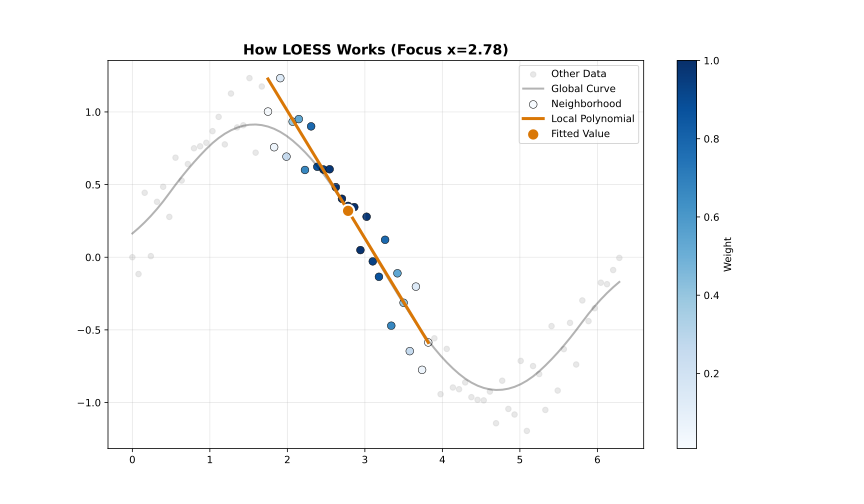
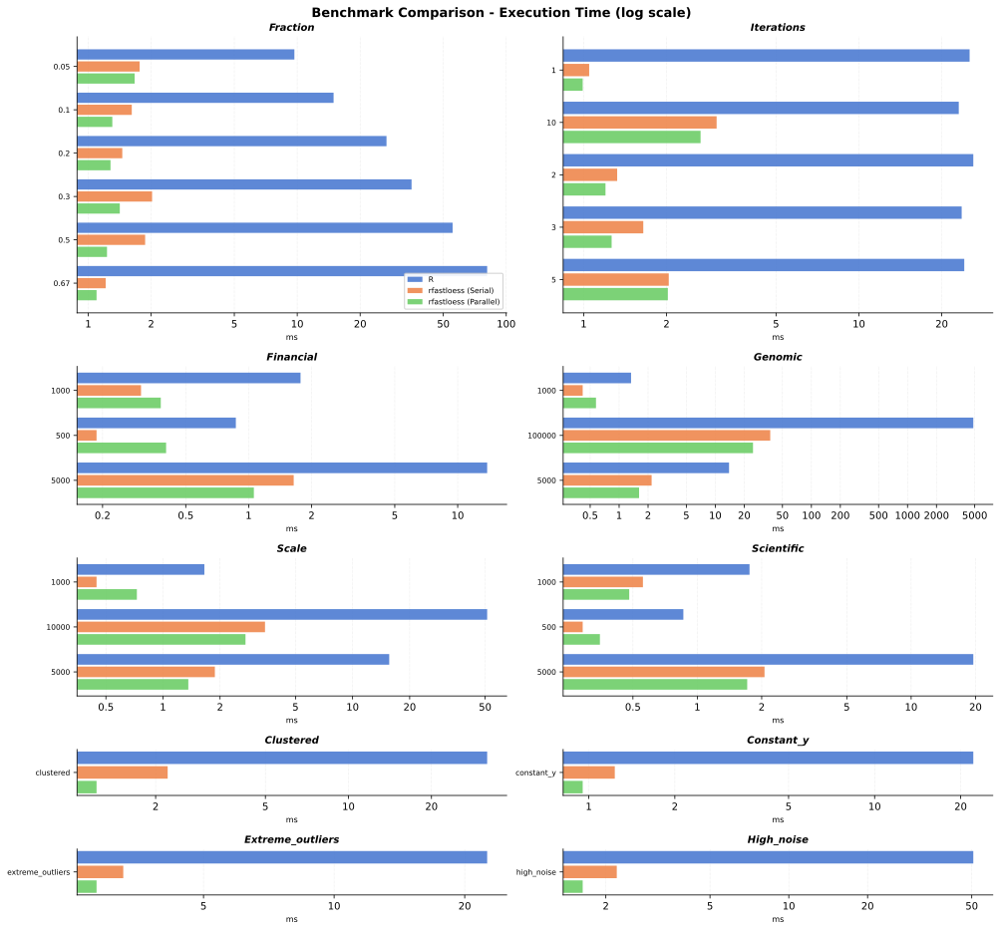

# LOESS Project

The fastest, most robust, and most feature-complete language-agnostic LOESS (Locally Weighted Scatterplot Smoothing) implementation for **Rust**, **Python**, **R**, **Julia**, **JavaScript**, **C++**, and **WebAssembly**.

## What is LOESS?

LOESS is a nonparametric regression method that fits smooth curves through scatter plots. At each point, it fits a weighted polynomial using nearby data, with weights decreasing smoothly with distance. This creates flexible, data-adaptive curves without assuming a global functional form.



**Key advantages:**

- **No parametric assumptions** — Adapts to local data structure
- **Robust to outliers** — With robustness iterations enabled
- **Uncertainty quantification** — Confidence and prediction intervals
- **Handles irregular sampling** — Works with missing regions gracefully

## Why this package?

### Speed

The `loess` project beats the competition in terms of speed, whether in single-threaded or multi-threaded parallel execution. It is typically **5–20x faster** than R's `loess` in serial mode, and up to **200x faster** on large datasets with parallel execution.



For detailed benchmark comparisons, see the [Benchmarks](https://loess.readthedocs.io/benchmarks/) page.

### Robustness

This implementation is *more robust* than R's `loess` due to two key design choices:

**MAD-Based Scale Estimation:**

For robustness weight calculations, this crate uses *Median Absolute Deviation (MAD)* for scale estimation:

$$s = \text{median}(|r_i - \text{median}(r)|)$$

In contrast, R's `loess` uses the median of absolute residuals (MAR):

$$s = \text{median}(|r_i|)$$

- MAD is a *breakdown-point-optimal* estimator—it remains valid even when up to 50% of data are outliers.
- The median-centering step removes asymmetric bias from residual distributions.
- MAD provides consistent outlier detection regardless of whether residuals are centered around zero.

**Boundary Padding:**

This crate applies a range of different *boundary policies* at dataset edges:

- **Extend**: Repeats edge values to maintain local neighborhood size.
- **Reflect**: Mirrors data symmetrically around boundaries.
- **Zero**: Pads with zeros (useful for signal processing).
- **NoBoundary**: Original Cleveland behavior

R's `loess` does not apply boundary padding, which can lead to:

- Biased estimates near boundaries due to asymmetric local neighborhoods.
- Increased variance at the edges of the smoothed curve.

### Features

A variety of features, supporting a range of use cases:

| Feature | This package | R (stats) |
| --- | --- | --- |
| Polynomial Degree | 5 (0–4) | 2 (1 or 2) |
| Kernel | 7 options | only Tricube |
| Robustness Weighting | 3 options | only Bisquare |
| Scale Estimation | 3 options | only MAR |
| Distance Metric | 6 options | normalized only |
| Boundary Padding | 4 options | no padding |
| Zero Weight Fallback | 3 options | no |
| Auto Convergence | yes | no |
| Online Mode | yes | no |
| Streaming Mode | yes | no |
| Confidence Intervals | yes | no |
| Prediction Intervals | yes | no |
| Diagnostics (RMSE, R², AIC) | yes | no |
| Cross-Validation | 2 options | no |
| Parallel Execution | yes | no |
| `no-std` Support | yes | no |

## Installation

Currently available for R, Python, Rust, Julia, Node.js, and WebAssembly.

Install from PyPI:

```bash
pip install fastloess
```

Or from conda-forge:

```bash
conda install -c conda-forge fastloess
```

See the [Installation Guide](getting-started/installation.md) for more options and details.

## Quick Example

:::{jupyter-execute}
import fastloess as fl
import numpy as np

x = np.array([1.0, 2.0, 3.0, 4.0, 5.0])
y = np.array([2.0, 4.1, 5.9, 8.2, 9.8])

model = fl.Loess(fraction=0.5, iterations=3)
result = model.fit(x, y)
print(result.y)
:::

## Getting Started

1. [Installation](getting-started/installation.md) — Set up the library for your language
2. [Quick Start](getting-started/quickstart.md) — Basic usage examples
3. [Concepts](getting-started/concepts.md) — Understand how LOESS works

## License

Dual-licensed under [MIT](https://opensource.org/licenses/MIT) or [Apache-2.0](https://www.apache.org/licenses/LICENSE-2.0).

:::{toctree}
:maxdepth: 1
:hidden:
:caption: Documentation

getting-started/index
user-guide/index
api/index
benchmarks
:::
