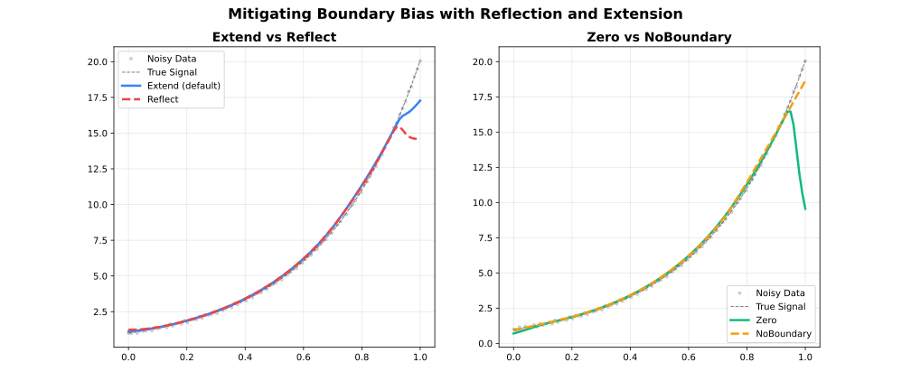

```{r setup, include=FALSE}
knitr::opts_chunk$set(collapse = TRUE, comment = "#>")
```

## Overview



Standard LOESS neighbourhoods become asymmetric at the boundaries: fewer points
exist on one side, pulling the local fit toward the data interior. The
`boundary_policy` parameter controls how the data is padded to mitigate this
effect.

| Policy | Padding Strategy | Best For |
| --- | --- | --- |
| `"extend"` | Repeat first / last value | Most datasets (default) |
| `"reflect"` | Mirror data at boundaries | Periodic or symmetric data |
| `"zero"` | Pad with zeros | Data known to approach zero |
| `"noboundary"` | No padding (Cleveland original) | Reference behaviour |

---

## Extend (Default)

Pads beyond both endpoints by replicating the first and last observed values.
Prevents the fit from curling toward zero and is a safe default for nearly all
use cases.

**Use when**: No strong prior on boundary behaviour; general-purpose smoothing.

```{r boundary_1}
library(rfastloess)
set.seed(42)
x <- seq(0, 2 * pi, length.out = 100)
y <- sin(x) + rnorm(100, sd = 0.3)

model <- Loess(boundary_policy = "extend")
result <- fit(model, x, y)
print(head(result$y))
```

---

## Reflect

Mirrors the data about both endpoints before fitting, then discards the
reflected region from the output. Preserves continuity of derivatives at the
endpoints.

**Use when**: Circular data (e.g., angle, day-of-year), symmetric physical
quantities, or when the derivative at the boundary is expected to be zero.

```{r boundary_2}
model <- Loess(boundary_policy = "reflect")
result <- fit(model, x, y)
print(head(result$y))
```

---

## Zero

Pads beyond both endpoints with zeros before fitting. Appropriate when the
underlying process is known to be zero outside the observed range.

**Use when**: Signal decays to zero at both ends; zero is a meaningful boundary
value.

```{r boundary_3}
model <- Loess(boundary_policy = "zero")
result <- fit(model, x, y)
print(head(result$y))
```

---

## No Boundary Padding

Applies no padding. Each local fit uses only the points that are actually
available, which may be fewer than the requested neighbourhood at the endpoints.
This reproduces the original Cleveland (1979) algorithm exactly.

**Use when**: Reproducing reference results; you prefer the raw LOESS boundary
behaviour.

```{r boundary_4}
model <- Loess(boundary_policy = "noboundary")
result <- fit(model, x, y)
print(head(result$y))
```

---

## Comparing Policies

```{r boundary_5}
library(rfastloess)
set.seed(42)
x <- seq(0, 2 * pi, length.out = 100)
y <- sin(x) + rnorm(100, sd = 0.3)

policies <- c("extend", "reflect", "zero", "noboundary")
colors   <- c("blue", "red", "green", "purple")

plot(x, y, pch = 16, col = "gray",
     main = "Boundary Policy Comparison")

for (i in seq_along(policies)) {
    model  <- Loess(boundary_policy = policies[i])
    result <- fit(model, x, y)
    lines(result$x, result$y, col = colors[i], lwd = 2)
}

legend("topright", policies, col = colors, lwd = 2)
```

```{r session-info}
sessionInfo()
```
