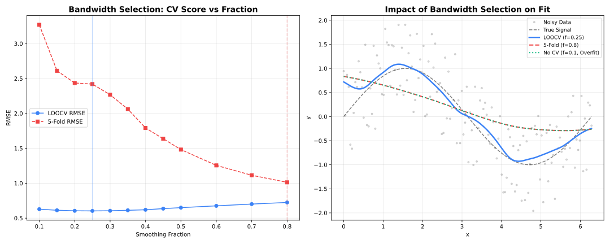

```{r setup, include=FALSE}
knitr::opts_chunk$set(collapse = TRUE, comment = "#>", eval = FALSE)
```

## Overview



Cross-validation helps select the optimal `fraction` parameter by evaluating performance on held-out data.

---

## K-Fold Cross-Validation

```{r}
library(rfastloess)
set.seed(42)
x <- seq(0, 2 * pi, length.out = 100)
y <- sin(x) + rnorm(100, sd = 0.3)

model <- Loess(
    cv_method = "kfold",
    cv_k = 5,
    cv_fractions = c(0.2, 0.3, 0.5, 0.7)
)
result <- fit(model, x, y)

cat("Selected fraction:", result$fraction_used, "\n")
cat("CV scores:", result$cv_scores, "\n")
```

### Parameters

| Parameter | Default | Description |
| --- | --- | --- |
| `cv_method` | `NULL` | `"kfold"` or `"loocv"` |
| `cv_k` | 5 | Number of folds (k-fold only) |
| `cv_fractions` | automatic | Candidate fraction values to search |

---

## Leave-One-Out Cross-Validation (LOOCV)

```{r}
library(rfastloess)
set.seed(42)
x <- seq(0, 2 * pi, length.out = 100)
y <- sin(x) + rnorm(100, sd = 0.3)

model <- Loess(
    cv_method = "loocv",
    cv_fractions = c(0.2, 0.3, 0.5, 0.7)
)
result <- fit(model, x, y)

cat("Selected fraction:", result$fraction_used, "\n")
```

---

## Custom Fraction Grid

```{r}
library(rfastloess)
set.seed(42)
x <- seq(0, 2 * pi, length.out = 100)
y <- sin(x) + rnorm(100, sd = 0.3)

fractions <- seq(0.1, 0.9, by = 0.05)

model <- Loess(
    cv_method = "kfold",
    cv_k = 10,
    cv_fractions = fractions
)
result <- fit(model, x, y)

cat("Best fraction:", result$fraction_used, "\n")
print(data.frame(fraction = fractions, score = result$cv_scores))
```

---

## Inspecting CV Results

```{r}
library(rfastloess)
set.seed(42)
x <- seq(0, 2 * pi, length.out = 100)
y <- sin(x) + rnorm(100, sd = 0.3)

fractions <- c(0.1, 0.2, 0.3, 0.5, 0.7)
model <- Loess(cv_method = "kfold", cv_fractions = fractions)
result <- fit(model, x, y)

plot(fractions, result$cv_scores, type = "b",
     xlab = "Fraction", ylab = "CV Score (MSE)",
     main = "Cross-Validation Score by Fraction")
abline(v = result$fraction_used, col = "red", lty = 2)
```
