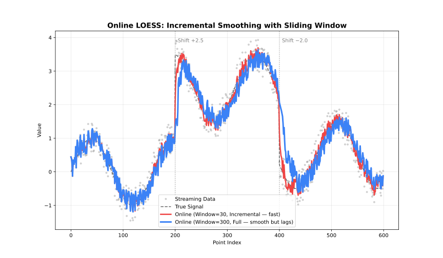

# Online Adapter

Incremental updates with a sliding window for real-time data.

## When to Use

- Data arrives incrementally (sensors, streams)
- Need real-time smoothed values
- Fixed memory budget



## Parameters

| Parameter | Default | Description |
| --- | --- | --- |
| `window_capacity` | 1000 | Max points in window |
| `min_points` | 2 | Points before output starts |
| `update_mode` | `"incremental"` | Update strategy |

## Update Modes

| Mode | Behavior | Speed |
| --- | --- | --- |
| `"incremental"` | Update only affected fits | Faster |
| `"full"` | Recompute entire window | More accurate |

## Example

```javascript
const { OnlineLoess } = require('fastloess-wasm');

const n = 100;
const x = Float64Array.from({ length: n }, (_, i) => i * 2 * Math.PI / (n - 1));
const y = Float64Array.from(x, (xi, i) => Math.sin(xi) + (((i * 7 + 3) % 17) / 17 - 0.5) * 0.6);

const processor = new OnlineLoess(
    { fraction: 0.2, iterations: 1 },
    { window_capacity: 100, min_points: 5, update_mode: "incremental" }
);

let printed = 0;
for (let i = 0; i < n; i++) {
    const res = processor.add_point(x[i], y[i]);
    if (res !== undefined && res !== null) {
        if (printed < 5) console.log(`Smoothed: ${res.y.toFixed(2)}`);
        printed++;
    }
}
console.log(`... (${printed - 5} more)`);
```

```output
Smoothed: 0.45
Smoothed: 0.15
Smoothed: 0.46
Smoothed: 0.17
Smoothed: 0.47
... (91 more)
```

---
