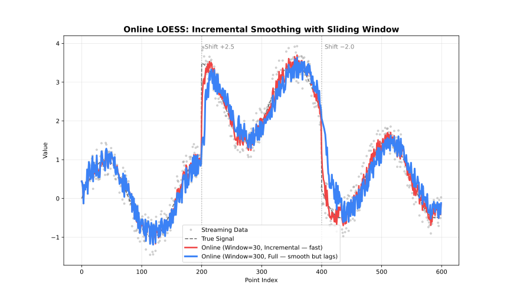

See also: [fastLoess](api.md)

## When to Use

- Data arrives incrementally (sensors, streams)
- Need real-time smoothed values
- Fixed memory budget



## Class

### `OnlineLoess`

The `OnlineLoess` class updates the model incrementally with new data points.

**Constructor:**

```javascript
const { OnlineLoess } = require('fastloess-wasm');

const online = new OnlineLoess({ fraction: 0.5 }, { window_capacity: 50, min_points: 3 });
console.log("typeof add_point:", typeof online.add_point);
```

```output
typeof add_point: function
```

- `options`: An object containing `OnlineSmoothOptions` fields (a subset of the Batch `LoessOptions` fields — see below).
- `onlineOptions`: An object containing `OnlineOptions` fields.

#### `add_point(x, y)`

Adds a single point to the sliding window and returns an `OnlineOutput` once enough points are available, or `null` while the window is still filling.

```javascript
const { OnlineLoess } = require('fastloess-wasm');

const n = 100;
const x = Float64Array.from({ length: n }, (_, i) => i * 2 * Math.PI / (n - 1));
const y = Float64Array.from(x, xi => Math.sin(xi) + 0.1);

const online = new OnlineLoess({ fraction: 0.5 }, { window_capacity: 50, min_points: 3 });

// Returns null until min_points (3) are reached
online.add_point(x[0], y[0]);  // null
online.add_point(x[1], y[1]);  // null

// Returns OnlineOutput once enough points are available
const result = online.add_point(x[2], y[2]);
console.log("Smoothed y:", result.y);
```

```output
Smoothed y: 0.22659245357374927
```

For multivariate models, set `dimensions` and pass a `Float64Array` with one coordinate per dimension to `add_point_vector()`:

```javascript
const { OnlineLoess } = require('fastloess-wasm');

const online2d = new OnlineLoess(
 { dimensions: 2, surface_mode: 'direct', outputs: ['gradient'] },
 { window_capacity: 10, min_points: 3 }
);
const output = online2d.add_point_vector(new Float64Array([0.5, 1.25]), 2.0);
```

Use `add_point_weighted(x, y, weight)` or `add_point_vector_weighted(x, y, weight)` for finite non-negative case weights. `window_diagnostics()` computes fit metrics on demand; `predict_window(newX, options)` predicts from a fresh fit of the bounded current window.

## Options Structures

### `OnlineSmoothOptions`

| Field | Type | Default | Description |
| --- | --- | --- | --- |
| `fraction` | `number` | `0.67` | Smoothing fraction (bandwidth) |
| `iterations` | `number` | `0` | Number of robustifying iterations; positive values require `update_mode = "full"` |
| `weight_function` | `string` | `"tricube"` | Weight function name |
| `robustness_method` | `string` | `"bisquare"` | Robustness method name |
| `degree` | `string` | `"linear"` | Polynomial degree of local fit |
| `dimensions` | `number` | `1` | Number of predictor dimensions |
| `distance_metric` | `string` | `"normalized"` | Distance metric; use `"minkowski:p"` for custom p |
| `weighted_metric_weights` | `number[]` | `null` | Per-dimension weights (used when `distance_metric = "weighted"`) |
| `surface_mode` | `string` | `"interpolation"` | Surface computation mode |
| `cell` | `number` | `null` | Cell size for interpolation grid (smaller → more vertices, higher accuracy) |
| `interpolation_vertices` | `number` | `null` | Number of interpolation vertices |
| `zero_weight_fallback` | `string` | `"use_local_mean"` | Zero-weight handling strategy |
| `boundary_policy` | `string` | `"extend"` | Boundary handling policy |
| `boundary_degree_fallback` | `boolean` | `null` | Fall back to lower polynomial degree at boundaries when higher degrees fail |
| `scaling_method` | `string` | `"mad"` | Residual scaling method |
| `auto_converge` | `number` | `null` | Auto-convergence tolerance |
| `missing` | `string` | `"error"` | Policy for non-finite (NaN/Inf) values in each point |
| `outputs` | `string[]` | `[]` | Optional fields: `"weights"`, `"gradient"` (or `"derivative"`), `"se"` |
| `intervals` | `{ confidence?: number; prediction?: number }` | `disabled` | Grouped confidence and prediction coverage levels. |

Cross-validation, `"sorted"` output, `"diagnostics"` output, `"residuals"` output, and `parallel` are Batch-only (or Batch/Streaming-only) and not available here; see [fastLoess](api.md) for those. Online always runs sequentially.

### `OnlineOptions`

| Field | Type | Default | Description |
| --- | --- | --- | --- |
| `window_capacity` | `number` | `1000` | Max points in sliding window |
| `min_points` | `number` | `2` | Min points before smoothing starts |
| `update_mode` | `string` | `"incremental"` | Update mode (`"full"` or `"incremental"`) |

## Options

### fraction

`fraction` is the most important parameter: it controls the size of the local neighbourhood used at each point.

| Range | Effect | Use case |
| --- | --- | --- |
| 0.1-0.3 | Fine detail | Rapidly changing signals |
| 0.3-0.5 | Balanced | General purpose |
| 0.5-0.7 | Heavy smoothing | Noisy data |
| 0.7-1.0 | Very smooth | Trend extraction |

### iterations

`iterations` controls robustness to outliers, at the cost of speed.

| Value | Effect | Performance |
| --- | --- | --- |
| 0 | No robustness | Fastest |
| 1-3 | Moderate | Recommended |
| 4-6 | Strong | Contaminated data |
| 7+ | Very strong | Heavy outliers |

### weight_function

*See: [Weight Functions](../weighting/kernels.md)*

- `"tricube"` (default)
- `"epanechnikov"`
- `"gaussian"`
- `"uniform"` (alias: `"boxcar"`)
- `"biweight"` (alias: `"bisquare"`)
- `"triangle"` (alias: `"triangular"`)
- `"cosine"`

### robustness_method

*See: [Robustness](../weighting/robustness.md)*

- `"bisquare"` (default; alias: `"biweight"`)
- `"huber"`
- `"talwar"`

### degree

*See: [Polynomial Degree](../advanced/degree.md)*

- `"constant"` or `"0"` (degree 0)
- `"linear"` or `"1"` (default, degree 1)
- `"quadratic"` or `"2"` (degree 2)
- `"cubic"` or `"3"` (degree 3)
- `"quartic"` or `"4"` (degree 4)

### dimensions

*See: [Multivariate LOESS](../advanced/dimensions.md)*

Number of predictor dimensions. Set to match the number of columns in a multivariate `x` array.

- Any integer `>= 1`; `1` (default) is univariate

### distance_metric

*See: [Multivariate LOESS](../advanced/dimensions.md)*

- `"normalized"` (default — scales each dimension by its range; alias: `"norm"`)
- `"euclidean"` (alias: `"euclid"`)
- `"manhattan"` (alias: `"l1"`)
- `"chebyshev"` (alias: `"linf"`)
- `"minkowski"` (use `"minkowski:p"` string for custom exponent, e.g. `"minkowski:3"`)
- `"weighted"` plus `weighted_metric_weights` for per-dimension scaling (alias: `"weighted_euclidean"`)

### weighted_metric_weights

*See: [Multivariate LOESS](../advanced/dimensions.md)*

Per-dimension weights, one per dimension declared in `dimensions`. Only used when `distance_metric = "weighted"`; setting `distance_metric = "weighted"` without providing this raises an error.

- `null` (default) — has no effect unless `distance_metric = "weighted"` is set
- A `number[]` of per-dimension weights, required when `distance_metric = "weighted"`

### surface_mode

*See: [Polynomial Degree](../advanced/degree.md#surface-mode)*

Controls whether the local polynomial is evaluated at every query point or at a sparser grid of anchor vertices with Hermite cubic interpolation in between.

| Mode | Behavior | Speed | Accuracy |
| --- | --- | --- | --- |
| `"interpolation"` (default) | Evaluate at vertices, interpolate between | Faster | Slight approximation |
| `"direct"` | Evaluate at every query point | Slower | Full precision |

### cell

Cell size for the interpolation grid, as a fraction of the data range. Smaller values place more vertices (denser grid), improving accuracy at the cost of speed. Only applies when `surface_mode = "interpolation"`.

- `null` (default) — uses the library default (`0.2`)
- Any number in `(0, 1]`

### interpolation_vertices

Caps the maximum number of interpolation vertices, overriding the count implied by `cell`. Only applies when `surface_mode = "interpolation"`.

- `null` (default) — uses the library default (no explicit cap)
- Any integer `>= 1`

### zero_weight_fallback

Behavior when all neighborhood weights are zero:

| Option | Behavior |
| --- | --- |
| `"use_local_mean"` (default; aliases: `"local_mean"`, `"mean"`) | Use the mean of the neighborhood |
| `"return_original"` (alias: `"original"`) | Return the original y value |
| `"return_none"` (alias: `"none"`) | Return `NaN` |

### boundary_policy

*See: [Boundary Handling](../advanced/boundary.md)*

- `"extend"` (default; alias: `"pad"`)
- `"reflect"` (alias: `"mirror"`)
- `"zero"`
- `"noboundary"` (alias: `"none"`)

### boundary_degree_fallback

Whether to reduce the polynomial degree at boundary vertices when the requested `degree` can't be fit there (e.g., not enough neighbours). Only applies when `surface_mode = "interpolation"`.

- `null` (default) — uses the library default (enabled)
- `true` — falls back to a lower degree at boundaries
- `false` — raises an error instead of silently falling back

### scaling_method

*See: [Scaling Methods](../weighting/scaling.md)*

- `"mad"` (default; alias: `"median_absolute_deviation"`)
- `"mar"` (alias: `"median_absolute_residual"`)
- `"mean"` (alias: `"mean_absolute_residual"`)

### auto_converge

*See: [Robustness](../weighting/robustness.md#auto-convergence)*

Convergence tolerance for early stopping of robustness iterations. `null` (default) disables early stopping.

### missing

Policy for handling a non-finite (NaN/Inf) `x` or `y` value passed to `add_point`:

| Option | Behavior |
| --- | --- |
| `"error"` (default) | Throw an error |
| `"drop"` | Silently ignore the point — `add_point` returns `undefined`/`null` instead of adding it to the window |

### window_capacity

Maximum number of most recent points kept in the sliding window; older points are evicted as new ones arrive. Each `add_point()` call costs O(`window_capacity`) rather than growing with total history.

### min_points

Minimum number of points required before `add_point()` starts returning smoothed output (rather than `null`).

### update_mode

*See: [Execution Modes](../guide/adapter-choice.md)*

| Mode | Alias | Behavior | Speed |
| --- | --- | --- | --- |
| `"incremental"` (default) | `"single"` | Update only affected fits | Faster |
| `"full"` | `"resmooth"` | Recompute entire window | More accurate |

### outputs: se

Include the standard error for the latest point in the result (`OnlineOutput.standard_error`). Same `update_mode = "full"` requirement as `intervals.confidence`.

### outputs: weights

Include the robustness weight for the latest point (from the last robustness iteration) in the result.

### outputs: gradient

Each local polynomial fit (degree >= linear) already computes per-dimension coefficients internally; this exposes the latest point's gradient (`dimensions` values) in `OnlineOutput.gradient` at effectively no extra computation cost. Only supported when `surface_mode` is `"direct"` — throws instead of silently leaving `gradient` as `undefined` if requested under the default `"interpolation"` mode. Omitted by default.

### intervals.confidence

*See: [Intervals](../guide/intervals.md)*

Confidence level for the confidence interval around the mean response (e.g. `0.95`). Only computed under `update_mode = "full"` — throws at construction time if set (or `"se"` output/`intervals.prediction` is set) while `update_mode` is left at its default `"incremental"`, since incremental updates never compute standard errors. `null` (default) disables confidence intervals.

### intervals.prediction

*See: [Intervals](../guide/intervals.md)*

Confidence level for the prediction interval for new observations (e.g. `0.95`). Same `update_mode = "full"` requirement as `intervals.confidence`. `null` (default) disables prediction intervals.

## Result Structure

### `OnlineOutput`

Returned by `add_point()` once the window has enough points (`null` until then).

| Field | Type | Description |
| --- | --- | --- |
| `y` | `number` | Smoothed value for the latest point |
| `standard_error` | `number \| undefined` | Standard error, if `"se"` output/`intervals.confidence`/`intervals.prediction` was set and `update_mode = "full"` |
| `residual` | `number \| undefined` | Residual y − smoothed; always present (there is no `"residuals"` output option for Online) |
| `robustness_weight` | `number \| undefined` | Robustness weight, if `"weights"` output was set |
| `iterations_used` | `number \| undefined` | Robustness iterations performed |
| `confidence_lower` / `confidence_upper` | `number \| undefined` | Confidence interval bounds, if `intervals.confidence` was set and `update_mode = "full"` |
| `prediction_lower` / `prediction_upper` | `number \| undefined` | Prediction interval bounds, if `intervals.prediction` was set and `update_mode = "full"` |
| `gradient` | `Float64Array \| undefined` | Latest point's local fit gradient (`dimensions` values), if `"gradient"` output was set |

There is no `Diagnostics` object or `"diagnostics"` output option for `OnlineLoess`: `OnlineOutput` carries no diagnostics field, since diagnostics like RMSE/R² need more than one point's worth of history to be meaningful.
