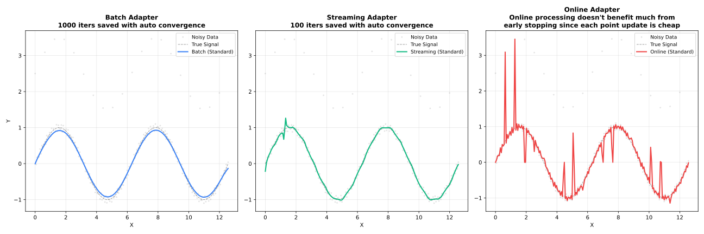
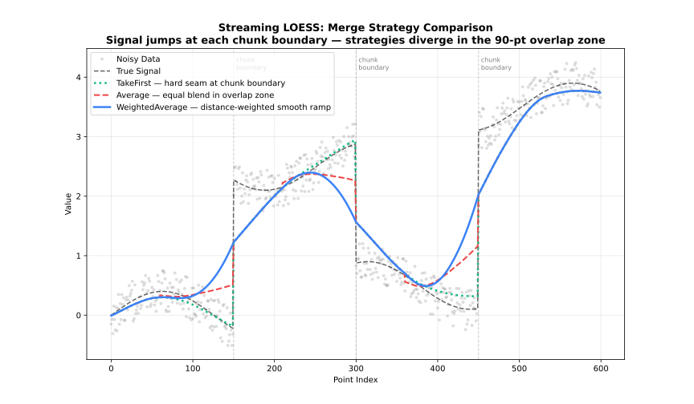

<!-- markdownlint-disable MD024 MD033 MD046 -->
Choose the right adapter for your use case.

## Overview

Choose the first row below whose condition applies:

| Condition | Adapter |
| --- | --- |
| Data too large to fit in memory | `Streaming` |
| Fits in memory, need real-time/incremental updates | `Online` |
| Fits in memory, no real-time requirement | `Batch` |

| Mode | Use Case | Memory | Features |
| --- | --- | --- | --- |
| **Batch** | Complete datasets | Full | All features |
| **Streaming** | Large files (>100K) | Chunked | Residuals, robustness |
| **Online** | Real-time sensors | Fixed window | Incremental updates |



---

## Batch Adapter

Standard mode for complete datasets. **Supports all features.**

### When to Use

- Dataset fits in memory
- Need intervals, cross-validation, or diagnostics
- Processing complete files

### Example

```javascript
const { Loess } = require('fastloess-wasm');

const n = 100;
const x = Float64Array.from({ length: n }, (_, i) => i * 2 * Math.PI / (n - 1));
const y = Float64Array.from(x, xi => Math.sin(xi) + 0.1);

const model = new Loess({
    fraction: 0.5,
    iterations: 3,
    confidence_intervals: 0.95,
    prediction_intervals: 0.95,
    return_diagnostics: true,
    parallel: true
});
const result = model.fit(x, y);
console.log("95% CI at midpoint: [" + result.confidence_lower[50] + ", " + result.confidence_upper[50] + "]");
console.log("R2:", result.diagnostics.r_squared);
```

```output
95% CI at midpoint: [0.0004104796937607347, 0.14291505841208232]
R2: 0.9614463018021437
```

---

## Streaming Adapter

Process large datasets in chunks with configurable overlap.

### When to Use

- Dataset >100,000 points
- Memory-constrained environments
- Batch processing pipelines

### Parameters

| Parameter | Default | Description |
| --- | --- | --- |
| `chunk_size` | 5000 | Points per chunk |
| `overlap` | 500 | Overlap between chunks |
| `merge_strategy` | `"weighted_average"` | How to merge overlaps |

### Merge Strategies

| Strategy | Behavior |
| --- | --- |
| `"average"` | Average overlapping values |
| `"weighted_average"` | Distance-weighted blend (default) |
| `"take_first"` | Keep left chunk values |
| `"take_last"` | Keep right chunk values |



### Example

```javascript
const { StreamingLoess } = require('fastloess-wasm');

const n = 100;
const x = Float64Array.from({ length: n }, (_, i) => i * 2 * Math.PI / (n - 1));
const y = Float64Array.from(x, xi => Math.sin(xi) + 0.1);

const stream = new StreamingLoess(
    { fraction: 0.3, iterations: 2 },
    { chunk_size: 5000, overlap: 500, merge_strategy: "average" }
);
stream.process_chunk(x, y);
const result = stream.finalize();
console.log("Smoothed y[0]:", result.y[0]);
```

```output
Smoothed y[0]: 0.13084302660412298
```

---

:::caution[Always call finalize()]
The streaming adapter buffers overlap data. Call `finalize()` after processing all chunks to retrieve the buffered tail.
:::

## Online Adapter

Incremental updates with a sliding window for real-time data.

### When to Use

- Data arrives incrementally (sensors, streams)
- Need real-time smoothed values
- Fixed memory budget


### Parameters

| Parameter | Default | Description |
| --- | --- | --- |
| `window_capacity` | 1000 | Max points in window |
| `min_points` | 2 | Points before output starts |
| `update_mode` | `"incremental"` | Update strategy |

### Update Modes

| Mode | Behavior | Speed |
| --- | --- | --- |
| `"incremental"` | Update only affected fits | Faster |
| `"full"` | Recompute entire window | More accurate |

### Example

```javascript
const { OnlineLoess } = require('fastloess-wasm');

const n = 100;
const x = Float64Array.from({ length: n }, (_, i) => i * 2 * Math.PI / (n - 1));
const y = Float64Array.from(x, xi => Math.sin(xi) + 0.1);

const online = new OnlineLoess(
    { fraction: 0.2, iterations: 1 },
    { window_capacity: 100, min_points: 5, update_mode: "incremental" }
);
let shown = 0;
for (let i = 0; i < x.length; i++) {
    const result = online.add_point(x[i], y[i]);
    if (result !== null && shown < 5) {
        console.log(result.y);
        shown++;
    }
}
```

```output
0.3511479871810792
0.4120334456984871
0.4716624556603275
0.5297949120891716
0.5861967361004687
```

---

## Feature Comparison

| Feature | Batch | Streaming | Online |
| --- | --- | --- | --- |
| Confidence intervals | ✓ | ✗ | ✗ |
| Prediction intervals | ✓ | ✗ | ✗ |
| Cross-validation | ✓ | ✗ | ✗ |
| Diagnostics | ✓ | ✓ | ✗ |
| Residuals | ✓ | ✓ | ✓ |
| Robustness weights | ✓ | ✓ | ✓ |
| Parallel execution | ✓ | ✓ | ✗ |

---

## Next Steps

- [API Reference](../api/api.md) — All configuration options
- [Streaming API](../api/api-streaming.md) · [Online API](../api/api-online.md)
