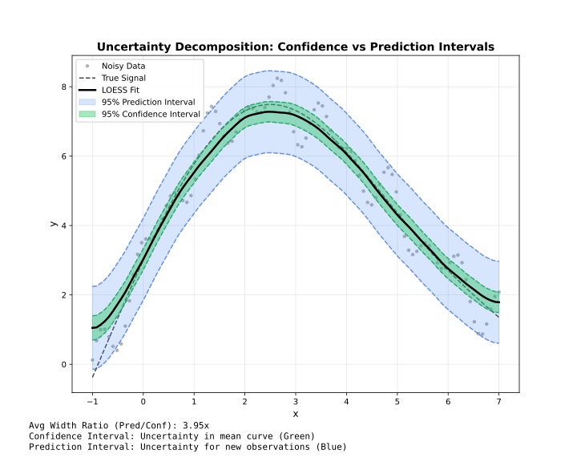

<!-- markdownlint-disable MD024 MD033 -->
Confidence and prediction intervals for uncertainty quantification.

## Overview



:::note[Adapter support]
Confidence and prediction intervals are available in **Batch** mode only. Streaming and Online modes do not support intervals.
:::

| Type | Represents | Width | Use |
| --- | --- | --- | --- |
| **Confidence** | Uncertainty in mean curve | Narrow | Where is the true trend? |
| **Prediction** | Uncertainty for new points | Wide | Where will new data fall? |

---

## Confidence Intervals

Estimate uncertainty in the smoothed curve itself.

```javascript
const { Loess } = require('fastloess-wasm');

const n = 100;
const x = Float64Array.from({ length: n }, (_, i) => i * 2 * Math.PI / (n - 1));
const y = Float64Array.from(x, (xi, i) => Math.sin(xi) + (((i * 7 + 3) % 17) / 17 - 0.5) * 0.6);

const model = new Loess({ fraction: 0.5, confidence_intervals: 0.95 });
const result = model.fit(x, y);

result.y.slice(0, 3).forEach((y, i) => {
    console.log(`x=${result.x[i].toFixed(4)}: y=${y.toFixed(4)} [${result.confidence_lower[i].toFixed(4)}, ${result.confidence_upper[i].toFixed(4)}]`);
});
console.log(`... (${result.y.length - 3} more)`);
```

```output
x=0.0000: y=0.1118 [-0.0078, 0.2313]
x=0.0635: y=0.1389 [0.0201, 0.2577]
x=0.1269: y=0.1702 [0.0521, 0.2882]
... (97 more)
```

---

## Prediction Intervals

Estimate where new observations might fall.

```javascript
const { Loess } = require('fastloess-wasm');

const n = 100;
const x = Float64Array.from({ length: n }, (_, i) => i * 2 * Math.PI / (n - 1));
const y = Float64Array.from(x, (xi, i) => Math.sin(xi) + (((i * 7 + 3) % 17) / 17 - 0.5) * 0.6);

const model = new Loess({ fraction: 0.5, prediction_intervals: 0.95 });
const result = model.fit(x, y);
console.log(`Prediction bounds: [${result.prediction_lower[0]}, ${result.prediction_upper[0]}]`);
```

```output
Prediction bounds: [-0.4048770295448013, 0.6284079607546723]
```

---

## Both Intervals

Request both types simultaneously:

```javascript
const { Loess } = require('fastloess-wasm');

const n = 100;
const x = Float64Array.from({ length: n }, (_, i) => i * 2 * Math.PI / (n - 1));
const y = Float64Array.from(x, (xi, i) => Math.sin(xi) + (((i * 7 + 3) % 17) / 17 - 0.5) * 0.6);

const model = new Loess({
    fraction: 0.5,
    confidence_intervals: 0.95,
    prediction_intervals: 0.95
});
const result = model.fit(x, y);
console.log("CI lower[0]:", result.confidence_lower[0].toFixed(4));
```

```output
CI lower[0]: -0.0078
```

---

## Confidence Levels

Common levels and their z-values:

| Level | z-value | Interpretation |
| --- | --- | --- |
| 0.90 | 1.645 | 90% of intervals contain true value |
| 0.95 | 1.960 | 95% of intervals contain true value |
| 0.99 | 2.576 | 99% of intervals contain true value |

```javascript
const { Loess } = require('fastloess-wasm');

const n = 100;
const x = Float64Array.from({ length: n }, (_, i) => i * 2 * Math.PI / (n - 1));
const y = Float64Array.from(x, (xi, i) => Math.sin(xi) + (((i * 7 + 3) % 17) / 17 - 0.5) * 0.6);

// 99% confidence interval
const model = new Loess({ confidence_intervals: 0.99 });
const result = model.fit(x, y);
console.log("CI lower[0]:", result.confidence_lower[0].toFixed(4));
```

```output
CI lower[0]: 0.0056
```

---

## Standard Errors

Access standard errors directly (available when intervals are computed):

```javascript
const { Loess } = require('fastloess-wasm');

const n = 100;
const x = Float64Array.from({ length: n }, (_, i) => i * 2 * Math.PI / (n - 1));
const y = Float64Array.from(x, (xi, i) => Math.sin(xi) + (((i * 7 + 3) % 17) / 17 - 0.5) * 0.6);

const model = new Loess({ confidence_intervals: 0.95 });
const result = model.fit(x, y);

result.standard_errors.slice(0, 5).forEach((se, i) => {
    console.log(`Point ${i}: SE = ${se.toFixed(4)}`);
});
console.log(`... (${result.standard_errors.length - 5} more)`);
```

```output
Point 0: SE = 0.0624
Point 1: SE = 0.0622
Point 2: SE = 0.0621
Point 3: SE = 0.0620
Point 4: SE = 0.0619
... (95 more)
```

---

## Availability

:::caution[Batch Mode Only]
Confidence and prediction intervals are only available in **Batch** mode. Streaming and Online modes do not support intervals.
:::

| Feature | Batch | Streaming | Online |
| --- | --- | --- | --- |
| Confidence intervals | ✓ | ✗ | ✗ |
| Prediction intervals | ✓ | ✗ | ✗ |
| Standard errors | ✓ | ✗ | ✗ |
