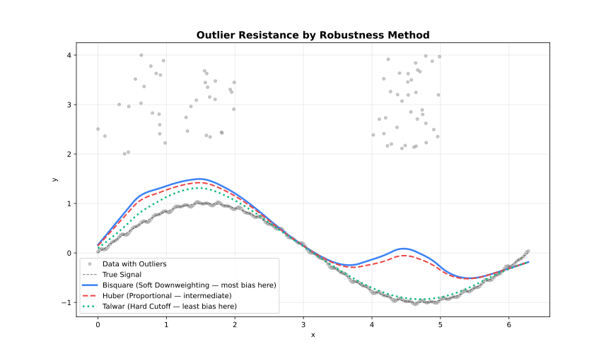
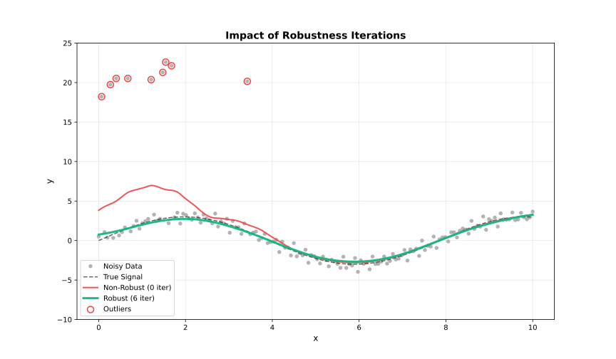

<!-- markdownlint-disable MD024 MD033 -->

Outlier handling through iterative reweighting.

## How Robustness Works

Standard LOESS can be biased by outliers. Robustness iterations downweight points with large residuals:

1. Fit initial LOESS
2. Compute residuals
3. Assign robustness weights (large residuals → low weight)
4. Refit using combined distance × robustness weights
5. Repeat steps 2–4





---

## Robustness Methods

### Bisquare (Default)

Smooth downweighting. Points transition gradually from full weight to zero.

$$w(u) = \begin{cases} (1 - u^2)^2 & |u| < 1 \\ 0 & |u| \geq 1 \end{cases}$$

**Use when**: General purpose, balanced approach.

```javascript
const { Loess } = require('fastloess-wasm');

const n = 100;
const x = Float64Array.from({ length: n }, (_, i) => i * 2 * Math.PI / (n - 1));
const y = Float64Array.from(x, (xi, i) => Math.sin(xi) + (((i * 7 + 3) % 17) / 17 - 0.5) * 0.6);

const model = new Loess({ iterations: 3, robustness_method: "bisquare" });
const result = model.fit(x, y);
console.log("y[0]:", result.y[0].toFixed(4));
```

```output
y[0]: 0.1663
```

---

### Huber

Linear penalty beyond threshold. Less aggressive than Bisquare.

$$w(u) = \begin{cases} 1 & |u| \leq k \\ k/|u| & |u| > k \end{cases}$$

**Use when**: Moderate outliers, want to retain some influence.

```javascript
const { Loess } = require('fastloess-wasm');

const n = 100;
const x = Float64Array.from({ length: n }, (_, i) => i * 2 * Math.PI / (n - 1));
const y = Float64Array.from(x, (xi, i) => Math.sin(xi) + (((i * 7 + 3) % 17) / 17 - 0.5) * 0.6);

const model = new Loess({ iterations: 3, robustness_method: "huber" });
const result = model.fit(x, y);
console.log("y[0]:", result.y[0].toFixed(4));
```

```output
y[0]: 0.1703
```

---

### Talwar

Hard threshold. Points are either fully weighted or completely excluded.

$$w(u) = \begin{cases} 1 & |u| \leq k \\ 0 & |u| > k \end{cases}$$

**Use when**: Extreme outliers, want binary exclusion.

```javascript
const { Loess } = require('fastloess-wasm');

const n = 100;
const x = Float64Array.from({ length: n }, (_, i) => i * 2 * Math.PI / (n - 1));
const y = Float64Array.from(x, (xi, i) => Math.sin(xi) + (((i * 7 + 3) % 17) / 17 - 0.5) * 0.6);

const model = new Loess({ iterations: 3, robustness_method: "talwar" });
const result = model.fit(x, y);
console.log("y[0]:", result.y[0].toFixed(4));
```

```output
y[0]: 0.1913
```

---

## Comparison

| Method | Transition | Aggressiveness | Use Case |
| --- | --- | --- | --- |
| **Bisquare** | Smooth | Moderate | General purpose |
| **Huber** | Gradual | Mild | Preserve influence |
| **Talwar** | Hard | Strong | Extreme contamination |

---

## Detecting Outliers

Use robustness weights to identify potential outliers:

```javascript
const { Loess } = require('fastloess-wasm');

const n = 100;
const x = Float64Array.from({ length: n }, (_, i) => i * 2 * Math.PI / (n - 1));
const y = Float64Array.from(x, (xi, i) => Math.sin(xi) + (((i * 7 + 3) % 17) / 17 - 0.5) * 0.6);

const model = new Loess({ iterations: 5, return_robustness_weights: true });
const result = model.fit(x, y);

result.robustness_weights.forEach((w, i) => {
    if (w < 0.5) {
        console.log(`Potential outlier at index ${i}: weight = ${w.toFixed(3)}`);
    }
});
```

```output
Potential outlier at index 14: weight = 0.354
Potential outlier at index 16: weight = 0.486
Potential outlier at index 21: weight = 0.284
Potential outlier at index 23: weight = 0.455
Potential outlier at index 26: weight = 0.175
Potential outlier at index 28: weight = 0.368
Potential outlier at index 31: weight = 0.148
Potential outlier at index 33: weight = 0.373
Potential outlier at index 38: weight = 0.464
Potential outlier at index 63: weight = 0.387
Potential outlier at index 68: weight = 0.330
Potential outlier at index 70: weight = 0.127
Potential outlier at index 73: weight = 0.363
Potential outlier at index 75: weight = 0.181
Potential outlier at index 78: weight = 0.482
Potential outlier at index 80: weight = 0.321
Potential outlier at index 87: weight = 0.412
```

---

## Scale Estimation

Residuals are scaled before computing robustness weights. Two methods:

| Method | Formula | Robustness |
| --- | --- | --- |
| **MAD** | `median(\|r − median(r)\|)` | Very robust (default) |
| **MAR** | `median(\|r\|)` | Robust, uncentered |
| **Mean** | `mean(\|r\|)` | Less robust, fastest |


```javascript
const { Loess } = require('fastloess-wasm');

const n = 100;
const x = Float64Array.from({ length: n }, (_, i) => i * 2 * Math.PI / (n - 1));
const y = Float64Array.from(x, (xi, i) => Math.sin(xi) + (((i * 7 + 3) % 17) / 17 - 0.5) * 0.6);

const model = new Loess({ iterations: 3, scaling_method: "mad" });
const result = model.fit(x, y);
console.log("y[0]:", result.y[0].toFixed(4));
```

```output
y[0]: 0.1663
```

---

## Auto-Convergence

Stop iterations early when weights stabilize:

:::tip[Performance]
Auto-convergence can significantly reduce computation when weights stabilize before reaching max iterations.
:::

```javascript
const { Loess } = require('fastloess-wasm');

const n = 100;
const x = Float64Array.from({ length: n }, (_, i) => i * 2 * Math.PI / (n - 1));
const y = Float64Array.from(x, (xi, i) => Math.sin(xi) + (((i * 7 + 3) % 17) / 17 - 0.5) * 0.6);

const model = new Loess({ iterations: 10, auto_converge: 1e-6 });
const result = model.fit(x, y);
console.log("Iterations used:", result.iterations_used);
```

```output
Iterations used: 10
```
