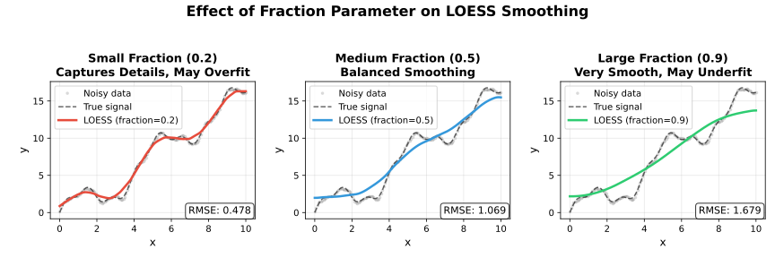
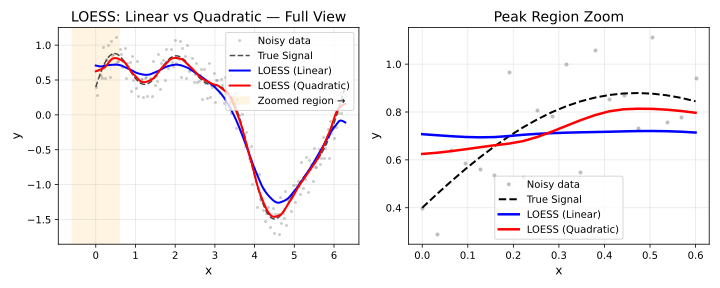
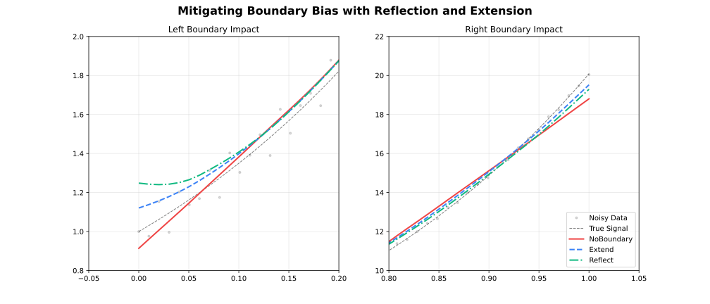
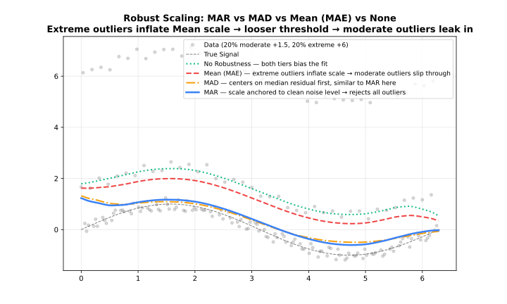
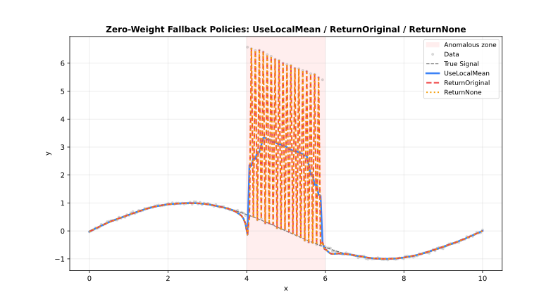

<!-- markdownlint-disable MD024 MD033 -->
# Parameters

Complete reference for all LOESS configuration options.

## Quick Reference

| Parameter | Default | Range/Options | Description | Adapter |
| --- | --- | --- | --- | --- |
| **fraction** | 0.67 | (0, 1] | Smoothing span | All |
| **iterations** | 3 | [0, 1000] | Robustness iterations | All |
| **degree** | 1 | 0–4 | Polynomial degree | All |
| **surface_mode** | `"interpolation"` | 2 options | Fit vs interpolate | All |
| **weight_function** | `"tricube"` | 7 options | Distance kernel | All |
| **robustness_method** | `"bisquare"` | 3 options | Outlier weighting | All |
| **zero_weight_fallback** | `"use_local_mean"` | 3 options | Zero-weight behavior | All |
| **boundary_policy** | `"extend"` | 4 options | Edge handling | All |
| **scaling_method** | `"mad"` | 3 options | Scale estimation | All |
| **auto_converge** | `None` | tolerance | Early stopping | All |
| **custom_weights** | `None` | positive | Per-observation weights | Batch |
| **return_residuals** | `false` | logical | Include residuals | All |
| **return_robustness_weights** | `false` | logical | Include weights | All |
| **return_diagnostics** | `false` | logical | Include metrics | All |
| **confidence_intervals** | `None` | (0, 1) | CI level | Batch |
| **prediction_intervals** | `None` | (0, 1) | PI level | Batch |
| **distance_metric** | `"normalized"` | string option | Distance metric | All |
| **weighted_metric_weights** | `None` | numeric | Per-dimension distance weights | All |
| **cell** | `None` | (0, ∞) | Interpolation cell size | All |
| **interpolation_vertices** | `None` | integer | Interpolation grid vertices | All |
| **boundary_degree_fallback** | `false` | logical | Degree fallback at boundaries | All |
| **cv_method** | `None` | method | Auto-select fraction | Batch |
| **cv_k** | 5 | [2, ∞) | K-fold count | Batch |
| **cv_fractions** | `None` | numeric | Fractions to evaluate | Batch |
| **cv_seed** | `None` | integer | CV fold randomization seed | Batch |
| **cross_validate** | — | method | Auto-select fraction (`cv_method` + `cv_k` + `cv_fractions` + `cv_seed`) | Batch |
| **chunk_size** | 5000 | [10, ∞) | Points per chunk | Streaming |
| **overlap** | 500 | [0, chunk) | Overlap between chunks | Streaming |
| **merge_strategy** | `"weighted_average"` | 4 options | Merge overlaps | Streaming |
| **window_capacity** | 1000 | [3, ∞) | Max window size | Online |
| **min_points** | 2 | [2, window] | Min before output | Online |
| **update_mode** | `"incremental"` | 2 options | Update strategy | Online |

!!! note "Rust option values"
    In Rust, pass option-like parameters as strings (case-insensitive), e.g. `"tricube"`, `"bisquare"`, `"extend"`, `"weighted_average"`.
    For the weighted distance metric, use `.distance_metric("weighted").weighted_metric_weights(vec![...])`.

---

## Parameter Options Summary

| Parameter | Available Options |
| --- | --- |
| **weight_function** | `"tricube"`, `"epanechnikov"`, `"gaussian"`, `"biweight"`, `"cosine"`, `"triangle"`, `"uniform"` |
| **robustness_method** | `"bisquare"`, `"huber"`, `"talwar"` |
| **zero_weight_fallback** | `"use_local_mean"`, `"return_original"`, `"return_none"` |
| **boundary_policy** | `"extend"`, `"reflect"`, `"zero"`, `"noboundary"` |
| **scaling_method** | `"mad"`, `"mar"`, `"mean"` |
| **surface_mode** | `"interpolation"`, `"direct"` |
| **distance_metric** | `"normalized"`, `"euclidean"`, `"manhattan"`, `"chebyshev"`, `"minkowski:p"`, `"weighted"` |
| **merge_strategy** | `"average"`, `"weighted_average"`, `"take_first"`, `"take_last"` |
| **update_mode** | `"incremental"`, `"full"` |

---

## Core Parameters

### fraction

The proportion of data used for each local fit. **Most important parameter.**

| Value | Effect | Use Case |
| --- | --- | --- |
| 0.1–0.3 | Fine detail | Rapidly changing signals |
| 0.3–0.5 | Balanced | General purpose |
| 0.5–0.7 | Heavy smoothing | Noisy data |
| 0.7–1.0 | Very smooth | Trend extraction |



```rust
use loess_rs::prelude::*;
use std::f64::consts::TAU;

fn main() -> Result<(), LoessError> {
    let n = 100usize;
    let x: Vec<f64> = (0..n).map(|i| i as f64 * TAU / (n - 1) as f64).collect();
    let y: Vec<f64> = x.iter().map(|&xi| xi.sin() + 0.1).collect();

    let model = Loess::new()
        .fraction(0.3)
        .build()?;
    let result = model.fit(&x, &y)?;

    println!("First smoothed value (fraction=0.3): {}", result.y[0]);
    Ok(())
}
```

```output
First smoothed value (fraction=0.3): 0.24731032286452273
```

---

### iterations

Number of robustness iterations for outlier resistance.

| Value | Effect | Performance |
| --- | --- | --- |
| 0 | No robustness | Fastest |
| 1–3 | Moderate | Recommended |
| 4–6 | Strong | Contaminated data |
| 7+ | Very strong | Heavy outliers |

```rust
use loess_rs::prelude::*;
use std::f64::consts::TAU;

fn main() -> Result<(), LoessError> {
    let n = 100usize;
    let x: Vec<f64> = (0..n).map(|i| i as f64 * TAU / (n - 1) as f64).collect();
    let y: Vec<f64> = x.iter().map(|&xi| xi.sin() + 0.1).collect();

    let model = Loess::new()
        .iterations(5)
        .build()?;
    let result = model.fit(&x, &y)?;

    println!("First smoothed value (5 iterations): {}", result.y[0]);
    Ok(())
}
```

```output
First smoothed value (5 iterations): 0.38524239321263437
```

---

### degree

Polynomial degree for the local regression fits.



| Degree | Fit Type |
| --- | --- |
| `0` | Local constant |
| `1` | Local linear (Default) |
| `2` | Local quadratic |
| `3` | Local cubic |
| `4` | Local quartic |

Higher degrees capture curvature but can overfit with small fractions. Degree 1 is appropriate for most use cases.

See [Polynomial Degree](degree.md) for a detailed comparison.

---

### surface_mode

Controls whether the local polynomial is evaluated at every query point or at a sparser grid of anchor vertices with Hermite cubic interpolation in between.

| Mode | Behavior | Speed | Accuracy |
| --- | --- | --- | --- |
| `"interpolation"` (default) | Evaluate at vertices, interpolate between | Faster | Slight approximation |
| `"direct"` | Evaluate at every query point | Slower | Full precision |

See [Polynomial Degree](degree.md#surface-mode) for a visual comparison.

```rust
use loess_rs::prelude::*;
use std::f64::consts::TAU;

fn main() -> Result<(), LoessError> {
    let n = 100usize;
    let x: Vec<f64> = (0..n).map(|i| i as f64 * TAU / (n - 1) as f64).collect();
    let y: Vec<f64> = x.iter().map(|&xi| xi.sin() + 0.1).collect();

    let model = Loess::new()
        .surface_mode("direct")
        .build()?;
    let result = model.fit(&x, &y)?;

    println!("First smoothed value (direct surface): {}", result.y[0]);
    Ok(())
}
```

```output
First smoothed value (direct surface): 0.3770070674933047
```

---

### cell

Cell size for the interpolation grid. Controls the density of anchor vertices when `surface_mode = "interpolation"`. Smaller values produce a finer grid, increasing accuracy at the cost of memory and computation.

- **Default**: `0.2` (20% of x-range per dimension)
- **Range**: `(0, ∞)` — values close to 0 approach `"direct"` accuracy
- **Adapter**: All

| `cell` | Grid density | Accuracy | Speed |
| --- | --- | --- | --- |
| `0.05` | Very fine | Highest | Slowest |
| `0.2` | Moderate (default) | High | Fast |
| `0.5` | Coarse | Lower | Faster |

```rust
use loess_rs::prelude::*;
use std::f64::consts::TAU;

fn main() -> Result<(), LoessError> {
    let n = 100usize;
    let x: Vec<f64> = (0..n).map(|i| i as f64 * TAU / (n - 1) as f64).collect();
    let y: Vec<f64> = x.iter().map(|&xi| xi.sin() + 0.1).collect();

    let model = Loess::new().cell(0.05).build()?;
    let result = model.fit(&x, &y)?;

    println!("First smoothed value (cell=0.05): {}", result.y[0]);
    Ok(())
}
```

```output
First smoothed value (cell=0.05): 0.38397556953643597
```

---

### interpolation_vertices

Explicitly set the number of anchor vertices for the interpolation grid, overriding the `cell`-based automatic count. Use when you need a precise vertex budget.

- **Default**: auto (derived from `cell` and data range)
- **Adapter**: All

```rust
use loess_rs::prelude::*;
use std::f64::consts::TAU;

fn main() -> Result<(), LoessError> {
    let n = 100usize;
    let x: Vec<f64> = (0..n).map(|i| i as f64 * TAU / (n - 1) as f64).collect();
    let y: Vec<f64> = x.iter().map(|&xi| xi.sin() + 0.1).collect();

    let model = Loess::new().interpolation_vertices(50).build()?;
    let result = model.fit(&x, &y)?;

    println!("First smoothed value: {}", result.y[0]);
    Ok(())
}
```

```output
First smoothed value: 0.3851521721408434
```

---

### dimensions

Number of predictor variables. Enables multivariate LOESS over an n-dimensional input space.


- **1** (default): Standard 1D smoothing over a single predictor
- **2**: Spatial or bi-predictor surface smoothing
- **3+**: High-dimensional local regression

See [Multivariate LOESS](dimensions.md) for detailed usage and distance metric options.

---

### distance_metric / weighted_metric_weights

Distance metric for neighbourhood calculation. Only meaningful when `dimensions > 1`. The `"weighted"` metric lets you assign per-dimension importance via `weighted_metric_weights`.

| Metric | Description |
| --- | --- |
| `"normalized"` | Each dimension scaled to unit range (default) |
| `"euclidean"` | Raw Euclidean distance |
| `"manhattan"` | City-block distance |
| `"chebyshev"` | Maximum coordinate difference |
| `"minkowski:p"` | Generalised $L_p$ norm — e.g. `"minkowski:3"` |
| `"weighted"` | Weighted Euclidean — set `weighted_metric_weights` to one weight per dimension |

```rust
use loess_rs::prelude::*;
use std::f64::consts::TAU;

fn main() -> Result<(), LoessError> {
    let n = 100usize;
    let x: Vec<f64> = (0..n).map(|i| i as f64 * TAU / (n - 1) as f64).collect();
    let y: Vec<f64> = x.iter().map(|&xi| xi.sin() + 0.1).collect();
    let x2d: Vec<f64> = x.iter().flat_map(|&xi| [xi, xi * xi / (TAU * TAU)]).collect();

    let model = Loess::new()
        .dimensions(2)
        .distance_metric("weighted")
        .weighted_metric_weights(vec![2.0, 0.5])
        .build()?;
    let result = model.fit(&x2d, &y)?;

    println!("First smoothed value (2D): {}", result.y[0]);
    Ok(())
}
```

```output
First smoothed value (2D): 0.059001235293146694
```

---

### weight_function

Distance weighting kernel for local fits.

| Kernel | Efficiency | Smoothness |
| --- | --- | --- |
| `"tricube"` | 0.998 | Very smooth |
| `"epanechnikov"` | 1.000 | Smooth |
| `"gaussian"` | 0.961 | Infinite |
| `"biweight"` | 0.995 | Very smooth |
| `"cosine"` | 0.999 | Smooth |
| `"triangle"` | 0.989 | Moderate |
| `"uniform"` | 0.943 | None |

See [Weight Functions](kernels.md) for detailed comparison.

```rust
use loess_rs::prelude::*;
use std::f64::consts::TAU;

fn main() -> Result<(), LoessError> {
    let n = 100usize;
    let x: Vec<f64> = (0..n).map(|i| i as f64 * TAU / (n - 1) as f64).collect();
    let y: Vec<f64> = x.iter().map(|&xi| xi.sin() + 0.1).collect();

    let model = Loess::new()
        .weight_function("epanechnikov")
        .build()?;
    let result = model.fit(&x, &y)?;

    println!("First smoothed value (epanechnikov kernel): {}", result.y[0]);
    Ok(())
}
```

```output
First smoothed value (epanechnikov kernel): 0.3985034976621205
```

---

### robustness_method

Method for downweighting outliers during iterative refinement.

| Method | Behavior | Use Case |
| --- | --- | --- |
| `"bisquare"` | Smooth downweighting | General-purpose |
| `"huber"` | Linear beyond threshold | Moderate outliers |
| `"talwar"` | Hard threshold (0 or 1) | Extreme contamination |

See [Robustness](robustness.md) for detailed comparison.

```rust
use loess_rs::prelude::*;
use std::f64::consts::TAU;

fn main() -> Result<(), LoessError> {
    let n = 100usize;
    let x: Vec<f64> = (0..n).map(|i| i as f64 * TAU / (n - 1) as f64).collect();
    let y: Vec<f64> = x.iter().map(|&xi| xi.sin() + 0.1).collect();

    let model = Loess::new()
        .robustness_method("talwar")
        .build()?;
    let result = model.fit(&x, &y)?;

    println!("First smoothed value (talwar robustness): {}", result.y[0]);
    Ok(())
}
```

```output
First smoothed value (talwar robustness): 0.38439982448576715
```

---

### boundary_policy

Edge handling strategy to reduce boundary bias. See [Boundary Handling](boundary.md) for a detailed comparison.



| Policy | Behavior | Use Case |
| --- | --- | --- |
| `"extend"` | Pad with first/last values | Most cases (default) |
| `"reflect"` | Mirror data at boundaries | Periodic/symmetric data |
| `"zero"` | Pad with zeros | Data approaches zero |
| `"noboundary"` | No padding | Original Cleveland behavior |

For example:

```rust
use loess_rs::prelude::*;
use std::f64::consts::TAU;

fn main() -> Result<(), LoessError> {
    let n = 100usize;
    let x: Vec<f64> = (0..n).map(|i| i as f64 * TAU / (n - 1) as f64).collect();
    let y: Vec<f64> = x.iter().map(|&xi| xi.sin() + 0.1).collect();

    let model = Loess::new()
        .boundary_policy("reflect")
        .build()?;
    let result = model.fit(&x, &y)?;

    println!("First smoothed value (reflect boundary): {}", result.y[0]);
    Ok(())
}
```

```output
First smoothed value (reflect boundary): 0.6490699323588787
```

---

### boundary_degree_fallback

When enabled, the polynomial degree is automatically reduced to the highest degree that can be stably estimated for points near the boundary (where the local neighbourhood is one-sided). Prevents numerical failures when `degree ≥ 2` at the edges.

- **Default**: `false`
- **Adapter**: All

!!! tip
    Enable this if you observe NaN values or instability at the edges of your data when using `degree = "quadratic"` or higher.

```rust
use loess_rs::prelude::*;
use std::f64::consts::TAU;

fn main() -> Result<(), LoessError> {
    let n = 100usize;
    let x: Vec<f64> = (0..n).map(|i| i as f64 * TAU / (n - 1) as f64).collect();
    let y: Vec<f64> = x.iter().map(|&xi| xi.sin() + 0.1).collect();

    let model = Loess::new()
        .degree("quadratic")
        .boundary_degree_fallback(true)
        .build()?;
    let result = model.fit(&x, &y)?;

    println!("First smoothed value (quadratic degree): {}", result.y[0]);
    Ok(())
}
```

```output
First smoothed value (quadratic degree): 0.25022647704930756
```

---

### scaling_method

Method for estimating residual scale during robustness iterations. See [Scaling Methods](scaling.md) for a detailed comparison.



| Method | Description | Robustness |
| --- | --- | --- |
| `"mad"` | Median Absolute Deviation | Very robust |
| `"mar"` | Median Absolute Residual | Robust |
| `"mean"` | Mean Absolute Residual | Less robust |

For example:

```rust
use loess_rs::prelude::*;
use std::f64::consts::TAU;

fn main() -> Result<(), LoessError> {
    let n = 100usize;
    let x: Vec<f64> = (0..n).map(|i| i as f64 * TAU / (n - 1) as f64).collect();
    let y: Vec<f64> = x.iter().map(|&xi| xi.sin() + 0.1).collect();

    let model = Loess::new()
        .scaling_method("mad")
        .build()?;
    let result = model.fit(&x, &y)?;

    println!("First smoothed value (mad scaling): {}", result.y[0]);
    Ok(())
}
```

```output
First smoothed value (mad scaling): 0.3851521721408434
```

---

### zero_weight_fallback

Behavior when all neighborhood weights are zero.



| Option | Behavior |
| --- | --- |
| `"use_local_mean"` | Use mean of neighborhood (default) |
| `"return_original"` | Return original y value |
| `"return_none"` | Return NaN |

For example:

```rust
use loess_rs::prelude::*;
use std::f64::consts::TAU;

fn main() -> Result<(), LoessError> {
    let n = 100usize;
    let x: Vec<f64> = (0..n).map(|i| i as f64 * TAU / (n - 1) as f64).collect();
    let y: Vec<f64> = x.iter().map(|&xi| xi.sin() + 0.1).collect();

    let model = Loess::new()
        .zero_weight_fallback("use_local_mean")
        .build()?;
    let result = model.fit(&x, &y)?;

    println!("First smoothed value (use_local_mean fallback): {}", result.y[0]);
    Ok(())
}
```

```output
First smoothed value (use_local_mean fallback): 0.3851521721408434
```

---

### auto_converge

Enable early stopping when robustness weights stabilize.

```rust
use loess_rs::prelude::*;
use std::f64::consts::TAU;

fn main() -> Result<(), LoessError> {
    let n = 100usize;
    let x: Vec<f64> = (0..n).map(|i| i as f64 * TAU / (n - 1) as f64).collect();
    let y: Vec<f64> = x.iter().map(|&xi| xi.sin() + 0.1).collect();

    let model = Loess::new()
        .iterations(20)           // Maximum
        .auto_converge(1e-6)      // Stop when change < 1e-6
        .build()?;
    let result = model.fit(&x, &y)?;

    println!("First smoothed value (auto-converge): {}", result.y[0]);
    Ok(())
}
```

```output
First smoothed value (auto-converge): 0.38525100784395816
```

---

### parallel

Enable multi-threaded parallel execution via Rayon. Substantially speeds up fitting on datasets with more than a few hundred points.

- **Default**: `true` for Batch and Streaming; `false` for Online
- **Adapter**: All

!!! note
    `OnlineLoess` defaults to `false` because it fits one point at a time. Each update touches only the sliding window, so there is no inner loop large enough to benefit from parallelism — enabling it would add thread overhead with no gain.

!!! tip
    Set to `false` for fully deterministic, reproducible output when debugging, or in environments where thread safety is required.

```rust
use loess_rs::prelude::*;
use std::f64::consts::TAU;

fn main() -> Result<(), LoessError> {
    let n = 100usize;
    let x: Vec<f64> = (0..n).map(|i| i as f64 * TAU / (n - 1) as f64).collect();
    let y: Vec<f64> = x.iter().map(|&xi| xi.sin() + 0.1).collect();

    let model = Loess::new()
        .parallel(false)
        .build()?;
    let result = model.fit(&x, &y)?;

    println!("First smoothed value (single-threaded): {}", result.y[0]);
    Ok(())
}
```

```output
First smoothed value (single-threaded): 0.3851521721408434
```

---

### custom_weights

Per-observation weights applied before distance and robustness weighting. Only
available in the **Batch** adapter.

!!! note "Batch only"
    `custom_weights` is silently ignored in Streaming and Online adapters.

See [Custom Weights](custom-weights.md) for a full discussion.

```rust
use loess_rs::prelude::*;
use std::f64::consts::TAU;

fn main() -> Result<(), LoessError> {
    let n = 100usize;
    let x: Vec<f64> = (0..n).map(|i| i as f64 * TAU / (n - 1) as f64).collect();
    let y: Vec<f64> = x.iter().map(|&xi| xi.sin() + 0.1).collect();

    let mut weights = vec![1.0f64; y.len()];
    weights[4] = 0.0; // Exclude 5th point
    let model = Loess::new()
        .custom_weights(weights)
        .build()?;
    let result = model.fit(&x, &y)?;

    println!("First smoothed value (custom weights): {}", result.y[0]);
    Ok(())
}
```

```output
First smoothed value (custom weights): 0.38960937887234354
```

---

## Output Options

### return_residuals

Include residuals (`y - smoothed`) in the output.

```rust
use loess_rs::prelude::*;
use std::f64::consts::TAU;

fn main() -> Result<(), LoessError> {
    let n = 100usize;
    let x: Vec<f64> = (0..n).map(|i| i as f64 * TAU / (n - 1) as f64).collect();
    let y: Vec<f64> = x.iter().map(|&xi| xi.sin() + 0.1).collect();

    let model = Loess::new()
        .return_residuals()
        .build()?;

    let result = model.fit(&x, &y)?;
    if let Some(residuals) = result.residuals {
        println!("Residuals: {:?}", residuals);
    }

    Ok(())
}
```

```output
Residuals: [-0.28515217214084343, -0.24049135722330595, -0.19723347500443886, -0.15576361234838854, -0.11646480356362487, -0.07971701446041934, -0.04589613876408016, -0.015373010925038177, 0.01148756069915391, 0.03662973747657061, 0.06206555457505736, 0.08754380730215405, 0.11282290430727682, 0.13767167632519828, 0.16187014295347002, 0.18521023437624362, 0.20749646512836128, 0.22854655718671069, 0.24819200987986922, 0.26627861432121835, 0.2826669102940833, 0.2972325837491835, 0.3098668033138152, 0.32047649445775794, 0.32898455021193707, 0.3353299775913571, 0.3394679791327023, 0.341369969218294, 0.3410235251206626, 0.3384322729648682, 0.3334195665218195, 0.32589745397787206, 0.31602598159538453, 0.3039801505845664, 0.28994948969700285, 0.2741375693218948, 0.25676145904158254, 0.23805113083058238, 0.2182488103012432, 0.19760827860832886, 0.176394127823509, 0.15488097277810525, 0.13335262254771907, 0.11210121491488428, 0.09142631729495643, 0.0716339977454925, 0.05303586979984032, 0.035948114971050715, 0.02069048686215222, 0.0075853008928765675, -0.005471184432776055, -0.02060154417857174, -0.03751094369819993, -0.055906089573248274, -0.07549625020200855, -0.09599426607274922, -0.11711754565344251, -0.138589042887851, -0.16013821236193948, -0.18150193829449296, -0.20242543361123022, -0.22266310548214985, -0.2419793838369011, -0.2601495095220403, -0.27696027892653824, -0.2922107420771986, -0.30571285139300075, -0.3172920584860633, -0.32678785660612103, -0.33405426654428416, -0.3389602640395142, -0.34152649744124475, -0.3418434011643674, -0.3399080085601567, -0.33573340183241707, -0.329348826075162, -0.32079973822804153, -0.31014779075238663, -0.297470750093606, -0.2828623502582548, -0.2664320820953723, -0.24830491913057307, -0.2286209810568669, -0.20753513623720687, -0.18521654481935057, -0.1618481443027452, -0.13762607962888285, -0.11275908008994717, -0.08746778556472112, -0.061984024794765835, -0.03655004860700167, -0.011417721170222439, 0.015429601639464108, 0.045941067006463, 0.07975177238731193, 0.11649078914566893, 0.15578212937031563, 0.19724573306507065, 0.24049847173555358, 0.2851551643317093]
```

---

### return_diagnostics

Include fit quality metrics (Batch and Streaming only).

| Metric | Description |
| --- | --- |
| `rmse` | Root Mean Square Error |
| `mae` | Mean Absolute Error |
| `r_squared` | R² coefficient |
| `residual_sd` | Residual standard deviation |
| `effective_df` | Effective degrees of freedom |
| `aic` | Akaike Information Criterion |
| `aicc` | Corrected AIC |

```rust
use loess_rs::prelude::*;
use std::f64::consts::TAU;

fn main() -> Result<(), LoessError> {
    let n = 100usize;
    let x: Vec<f64> = (0..n).map(|i| i as f64 * TAU / (n - 1) as f64).collect();
    let y: Vec<f64> = x.iter().map(|&xi| xi.sin() + 0.1).collect();

    let model = Loess::new()
        .return_diagnostics()
        .build()?;

    let result = model.fit(&x, &y)?;
    if let Some(diag) = result.diagnostics {
        println!("R\u{00b2}: {:.4}", diag.r_squared);
        println!("RMSE: {:.4}", diag.rmse);
    }

    Ok(())
}
```

```output
R²: 0.8989
RMSE: 0.2237
```

---

### return_robustness_weights

Include final robustness weights (useful for outlier detection).

```rust
use loess_rs::prelude::*;
use std::f64::consts::TAU;

fn main() -> Result<(), LoessError> {
    let n = 100usize;
    let x: Vec<f64> = (0..n).map(|i| i as f64 * TAU / (n - 1) as f64).collect();
    let y: Vec<f64> = x.iter().map(|&xi| xi.sin() + 0.1).collect();

    let model = Loess::new()
        .iterations(3)
        .return_robustness_weights()
        .build()?;

    let result = model.fit(&x, &y)?;
    // Points with weight < 0.5 are likely outliers

    if let Some(w) = &result.robustness_weights {
        println!("First robustness weight: {}", w[0]);
    }
    Ok(())
}
```

```output
First robustness weight: 0.6033490262567007
```

---

### confidence_intervals / prediction_intervals

Request uncertainty estimates (Batch only).

See [Intervals](intervals.md) for detailed usage.

```rust
use loess_rs::prelude::*;
use std::f64::consts::TAU;

fn main() -> Result<(), LoessError> {
    let n = 100usize;
    let x: Vec<f64> = (0..n).map(|i| i as f64 * TAU / (n - 1) as f64).collect();
    let y: Vec<f64> = x.iter().map(|&xi| xi.sin() + 0.1).collect();

    let model = Loess::new()
        .confidence_intervals(0.95)
        .prediction_intervals(0.95)
        .build()?;
    let result = model.fit(&x, &y)?;

    if let (Some(lo), Some(hi)) = (&result.confidence_lower, &result.confidence_upper) {
        println!("First point 95% CI: [{}, {}]", lo[0], hi[0]);
    }
    Ok(())
}
```

```output
First point 95% CI: [0.3357975113901477, 0.43450683289153913]
```

---

## CV Methods

### cv_method

Selection strategy for automated parameter tuning.

| Method | Description | Speed |
| --- | --- | --- |
| `"kfold"` | K-Fold Cross-Validation | Fast |
| `"loocv"` | Leave-One-Out Cross-Validation | Slow |

```rust
use loess_rs::prelude::*;
use std::f64::consts::TAU;

fn main() -> Result<(), LoessError> {
    let n = 100usize;
    let x: Vec<f64> = (0..n).map(|i| i as f64 * TAU / (n - 1) as f64).collect();
    let y: Vec<f64> = x.iter().map(|&xi| xi.sin() + 0.1).collect();

    let model = Loess::new()
        .cv_method("kfold")
        .cv_k(5)
        .cv_fractions(vec![0.1, 0.3, 0.5])
        .build()?;
    let result = model.fit(&x, &y)?;

    println!("Selected fraction (CV): {}", result.fraction_used);
    Ok(())
}
```

```output
Selected fraction (CV): 0.3
```

---

## Adapter Parameters

### chunk_size

Points per chunk in Streaming mode.

```rust
use loess_rs::prelude::*;
use std::f64::consts::TAU;

fn main() -> Result<(), LoessError> {
    let n = 100usize;
    let x: Vec<f64> = (0..n).map(|i| i as f64 * TAU / (n - 1) as f64).collect();
    let y: Vec<f64> = x.iter().map(|&xi| xi.sin() + 0.1).collect();

    let mut model = StreamingLoess::new()
        .chunk_size(10000)
        .build()?;
    let _ = model.process_chunk(&x[..50], &y[..50])?;
    let _ = model.process_chunk(&x[50..], &y[50..])?;
    let result = model.finalize()?;

    println!("First smoothed value (chunk): {}", result.y[0]);
    Ok(())
}
```

```output
First smoothed value (chunk): 0.38836636249409756
```

---

### overlap

Overlap between chunks in Streaming mode.

```rust
use loess_rs::prelude::*;
use std::f64::consts::TAU;

fn main() -> Result<(), LoessError> {
    let n = 100usize;
    let x: Vec<f64> = (0..n).map(|i| i as f64 * TAU / (n - 1) as f64).collect();
    let y: Vec<f64> = x.iter().map(|&xi| xi.sin() + 0.1).collect();

    let mut model = StreamingLoess::new()
        .overlap(1000)
        .build()?;
    let _ = model.process_chunk(&x[..50], &y[..50])?;
    let _ = model.process_chunk(&x[50..], &y[50..])?;
    let result = model.finalize()?;

    println!("First smoothed value (with overlap): {}", result.y[0]);
    Ok(())
}
```

```output
First smoothed value (with overlap): 0.38836636249409756
```

---

### merge_strategy

Method for merging overlapping chunks. See [Merge Strategies](merge.md) for a detailed comparison.

| Strategy | Description | Robustness |
| --- | --- | --- |
| `"average"` | Average of overlapping chunks | Fastest, least robust |
| `"take_first"` | Left chunk only | Fastest, least robust |
| `"take_last"` | Right chunk only | Fastest, least robust |
| `"weighted_average"` | Weighted average of overlapping chunks | Most robust |

For example:

```rust
use loess_rs::prelude::*;
use std::f64::consts::TAU;

fn main() -> Result<(), LoessError> {
    let n = 100usize;
    let x: Vec<f64> = (0..n).map(|i| i as f64 * TAU / (n - 1) as f64).collect();
    let y: Vec<f64> = x.iter().map(|&xi| xi.sin() + 0.1).collect();

    let mut model = StreamingLoess::new()
        .merge_strategy("weighted_average")
        .build()?;
    let _ = model.process_chunk(&x[..50], &y[..50])?;
    let _ = model.process_chunk(&x[50..], &y[50..])?;
    let result = model.finalize()?;

    println!("First smoothed value (weighted_average merge): {}", result.y[0]);
    Ok(())
}
```

```output
First smoothed value (weighted_average merge): 0.38836636249409756
```

---

### window_capacity

Maximum points held in memory for Online mode.

```rust
use loess_rs::prelude::*;
use std::f64::consts::TAU;

fn main() -> Result<(), LoessError> {
    let n = 100usize;
    let x: Vec<f64> = (0..n).map(|i| i as f64 * TAU / (n - 1) as f64).collect();
    let y: Vec<f64> = x.iter().map(|&xi| xi.sin() + 0.1).collect();

    let mut model = OnlineLoess::new()
        .window_capacity(500)
        .build()?;
    let out = model.add_point(&[x[0]], y[0])?;

    println!("add_point result (window=500): {:?}", out);
    Ok(())
}
```

```output
add_point result (window=500): None
```

---

### min_points

Minimum points required before Online filter starts producing outputs.

```rust
use loess_rs::prelude::*;
use std::f64::consts::TAU;

fn main() -> Result<(), LoessError> {
    let n = 100usize;
    let x: Vec<f64> = (0..n).map(|i| i as f64 * TAU / (n - 1) as f64).collect();
    let y: Vec<f64> = x.iter().map(|&xi| xi.sin() + 0.1).collect();

    let mut model = OnlineLoess::new()
        .min_points(10)
        .build()?;
    let out = model.add_point(&[x[0]], y[0])?;

    println!("add_point result (min_points=10): {:?}", out);
    Ok(())
}
```

```output
add_point result (min_points=10): None
```

---

### update_mode

Optimization strategy for Online mode updates.

| Mode | Description | Speed |
| --- | --- | --- |
| `"full"` | Re-smooth entire window | Slow |
| `"incremental"` | Update only affected fits | Fast |

For example:

```rust
use loess_rs::prelude::*;
use std::f64::consts::TAU;

fn main() -> Result<(), LoessError> {
    let n = 100usize;
    let x: Vec<f64> = (0..n).map(|i| i as f64 * TAU / (n - 1) as f64).collect();
    let y: Vec<f64> = x.iter().map(|&xi| xi.sin() + 0.1).collect();

    let mut model = OnlineLoess::new()
        .update_mode("full")
        .build()?;
    let out = model.add_point(&[x[0]], y[0])?;

    println!("add_point result (full mode): {:?}", out);
    Ok(())
}
```

```output
add_point result (full mode): None
```
