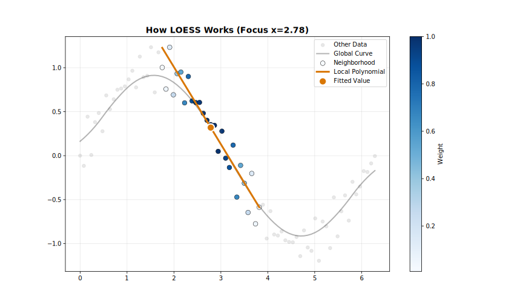

<!-- markdownlint-disable MD033 -->
# LOESS Project

The fastest, most robust, and most feature-complete language-agnostic LOESS (Locally Weighted Scatterplot Smoothing) implementation for **Rust**, **Python**, **R**, **Julia**, **JavaScript**, **C++**, and **WebAssembly**.

## What is LOESS?

LOESS is a nonparametric regression method that fits smooth curves through scatter plots. At each point, it fits a weighted polynomial using nearby data, with weights decreasing smoothly with distance. This creates flexible, data-adaptive curves without assuming a global functional form.



**Key advantages:**

- **No parametric assumptions** — Adapts to local data structure
- **Robust to outliers** — With robustness iterations enabled
- **Uncertainty quantification** — Confidence and prediction intervals
- **Handles irregular sampling** — Works with missing regions gracefully

## Why this package?

### Speed

The `loess` project beats the competition in terms of speed, whether in single-threaded or multi-threaded parallel execution. It is on average **2-3x faster** than R's `loess`.

For detailed benchmark comparisons, see the [BENCHMARKS](https://github.com/thisisamirv/loess-project/blob/main/BENCHMARKS.md) file.

### Robustness

This implementation is *more robust* than R's `loess` due to two key design choices:

**MAD-Based Scale Estimation:**

For robustness weight calculations, this crate uses *Median Absolute Deviation (MAD)* for scale estimation:

$$s = \text{median}(|r_i - \text{median}(r)|)$$

In contrast, R's `loess` uses the median of absolute residuals (MAR):

$$s = \text{median}(|r_i|)$$

- MAD is a *breakdown-point-optimal* estimator—it remains valid even when up to 50% of data are outliers.
- The median-centering step removes asymmetric bias from residual distributions.
- MAD provides consistent outlier detection regardless of whether residuals are centered around zero.

**Boundary Padding:**

This crate applies a range of different *boundary policies* at dataset edges:

- **Extend**: Repeats edge values to maintain local neighborhood size.
- **Reflect**: Mirrors data symmetrically around boundaries.
- **Zero**: Pads with zeros (useful for signal processing).
- **NoBoundary**: Original Cleveland behavior

R's `loess` does not apply boundary padding, which can lead to:

- Biased estimates near boundaries due to asymmetric local neighborhoods.
- Increased variance at the edges of the smoothed curve.

### Features

A variety of features, supporting a range of use cases:

| Feature | This package | R (stats) |
| --- | --- | --- |
| Kernel | 7 options | only Tricube |
| Robustness Weighting | 3 options | only Huber |
| Scale Estimation | 3 options | only MAR |
| Boundary Padding | 4 options | no padding |
| Zero Weight Fallback | 3 options | no |
| Auto Convergence | yes | no |
| Online Mode | yes | no |
| Streaming Mode | yes | no |
| Confidence Intervals | yes | no |
| Prediction Intervals | yes | no |
| Cross-Validation | 2 options | no |
| Parallel Execution | yes | no |
| `no-std` Support | yes | no |

## Installation

Currently available for R, Python, Rust, Julia, Node.js, and WebAssembly.

=== "R"

    From R-universe (recommended, no Rust toolchain required):

    ```r
    install.packages("rfastloess", repos = "https://thisisamirv.r-universe.dev")
    ```

    Or from conda-forge:

    ```r
    conda install -c conda-forge r-rfastloess
    ```

=== "Python"

    Install from PyPI:

    ```bash
    pip install fastloess
    ```

    Or from conda-forge:

    ```bash
    conda install -c conda-forge fastloess
    ```

=== "Rust"

    Add the crate to your `Cargo.toml`:

    === "loess-rs (no_std compatible)"

        ```toml
        [dependencies]
        loess-rs = "*"
        ```

    === "fastLoess (parallel)"

        ```toml
        [dependencies]
        fastLoess = "*"
        ```

=== "Julia"

    Install from the Julia General Registry:

    ```julia
    using Pkg
    Pkg.add("FastLOESS")
    ```

=== "Node.js"

    Install from npm:

    ```bash
    npm install fastloess
    ```

=== "WebAssembly"

    Install from npm:

    ```bash
    npm install fastloess-wasm
    ```

    Or via CDN:

    ```html
    <script type="module">
      import { smooth } from "https://cdn.jsdelivr.net/npm/fastloess-wasm@0.99/index.js";
    </script>
    ```

=== "C++"

    Install from source:

    ```bash
    git clone https://github.com/thisisamirv/loess-project.git
    cd loess-project
    make cpp
    ```

    Or from conda-forge:

    ```bash
    conda install -c conda-forge libfastloess
    ```

See the [Installation Guide](getting-started/installation.md) for more options and details.

## Quick Example

=== "R"

    ```r
    library(rfastloess)

    x <- c(1, 2, 3, 4, 5)
    y <- c(2.0, 4.1, 5.9, 8.2, 9.8)

    model <- Loess(fraction = 0.5, iterations = 3)
    result <- model$fit(x, y)
    print(result$y)
    ```

=== "Python"

    ```python
    import fastloess as fl
    import numpy as np

    x = np.array([1.0, 2.0, 3.0, 4.0, 5.0])
    y = np.array([2.0, 4.1, 5.9, 8.2, 9.8])

    result = fl.Loess(fraction=0.5, iterations=3).fit(x, y)
    print(result["y"])
    ```

=== "Rust"

    ```rust
    use loess_rs::prelude::*;

    let x = vec![1.0, 2.0, 3.0, 4.0, 5.0];
    let y = vec![2.0, 4.1, 5.9, 8.2, 9.8];

    let model = Loess::new()
        .fraction(0.5)
        .iterations(3)
        .adapter(Batch)
        .build()?;

    let result = model.fit(&x, &y)?;
    println!("{}", result);
    ```

=== "Julia"

    ```julia
    using FastLOESS

    x = [1.0, 2.0, 3.0, 4.0, 5.0]
    y = [2.0, 4.1, 5.9, 8.2, 9.8]

    result = fit(Loess(fraction=0.5, iterations=3), x, y)
    println(result.y)
    ```

=== "Node.js"

    ```javascript
    const fl = require("fastloess");

    const x = new Float64Array([1, 2, 3, 4, 5]);
    const y = new Float64Array([2.0, 4.1, 5.9, 8.2, 9.8]);

    const result = new fl.Loess({ fraction: 0.5, iterations: 3 }).fit(x, y);
    console.log(result.y);
    ```

=== "WebAssembly"

    ```javascript
    import { smooth } from "fastloess-wasm";

    const x = new Float64Array([1, 2, 3, 4, 5]);
    const y = new Float64Array([2.0, 4.1, 5.9, 8.2, 9.8]);

    const result = smooth(x, y, { fraction: 0.5, iterations: 3 });
    console.log(result.y);
    ```

=== "C++"

    ```cpp
    #include <fastloess.hpp>
    #include <iostream>
    #include <vector>

    int main() {
        std::vector<double> x = {1.0, 2.0, 3.0, 4.0, 5.0};
        std::vector<double> y = {2.0, 4.1, 5.9, 8.2, 9.8};

        fastloess::LoessOptions options;
        options.fraction = 0.5;
        options.iterations = 3;

        fastloess::Loess model(options);
        auto result = model.fit(x, y).value();

        for (const auto& val : result.yVector()) {
            std::cout << val << " ";
        }
        std::cout << std::endl;
        return 0;
    }
    ```

## Getting Started

1. [Installation](getting-started/installation.md) — Set up the library for your language
2. [Quick Start](getting-started/quickstart.md) — Basic usage examples
3. [Concepts](getting-started/concepts.md) — Understand how LOESS works

<!-- markdownlint-disable MD033 -->
<div class="grid cards" markdown>

- :fontawesome-brands-rust: **Rust**

    ---

    Pure Rust crates with zero-copy ndarray support, parallel execution.

    [:octicons-arrow-right-24: Rust API](api/rust.md)

- :fontawesome-brands-python: **Python**

    ---

    Native Python bindings via PyO3 with NumPy integration and pip installation.

    [:octicons-arrow-right-24: Python API](api/python.md)

- :simple-r: **R**

    ---

    R package with Bioconductor-style documentation and seamless integration.

    [:octicons-arrow-right-24: R API](api/r.md)

- :simple-julia: **Julia**

    ---

    Native Julia package with C FFI, supporting parallel execution and JLL dependencies.

    [:octicons-arrow-right-24: Julia API](api/julia.md)

</div>

<!-- markdownlint-disable MD033 -->
<div class="grid cards" markdown>

- :simple-nodedotjs: **Node.js**

    ---

    Native Node.js bindings with high-performance C++ core and support for asynchronous streaming.

    [:octicons-arrow-right-24: Node.js API](api/nodejs.md)

- :simple-webassembly: **WebAssembly**

    ---

    Optimized WebAssembly build for browsers and Node.js with zero-overhead data transfer.

    [:octicons-arrow-right-24: WebAssembly API](api/wasm.md)

</div>

<!-- markdownlint-disable MD033 -->
<div class="grid cards" markdown>

- :material-language-cpp: **C++**

    ---

    Native C++ bindings with RAII memory management and STL container support.

    [:octicons-arrow-right-24: C++ API](api/cpp.md)

</div>

## License

Dual-licensed under [MIT](https://opensource.org/licenses/MIT) or [Apache-2.0](https://www.apache.org/licenses/LICENSE-2.0).
