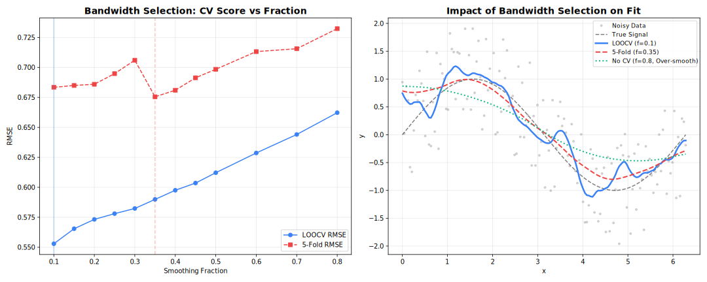

<!-- markdownlint-disable MD024 MD046 -->
# Cross-Validation

Automated parameter selection via cross-validation.

## Overview

Cross-validation helps select optimal parameters (especially `fraction`) by evaluating performance on held-out data.



---

## K-Fold Cross-Validation

Split data into K folds, train on K-1, validate on 1.

=== "R"
    ```r
    model <- Loess(
        cv_method = "kfold",
        cv_k = 5,
        cv_fractions = c(0.2, 0.3, 0.5, 0.7)
    )
    result <- model$fit(x, y)

    cat("Selected fraction:", result$fraction_used, "\n")
    cat("CV scores:", result$cv_scores, "\n")
    ```

=== "Python"
    ```python
    result = fl.Loess(
        cv_method="kfold",
        cv_k=5,
        cv_fractions=[0.2, 0.3, 0.5, 0.7]
    ).fit(x, y)

    print(f"Selected fraction: {result['fraction_used']}")
    print(f"CV scores: {result['cv_scores']}")
    ```

=== "Rust"
    ```rust
    use fastLoess::prelude::*;

    let model = Loess::new()
        .cross_validate(KFold(5, &[0.2, 0.3, 0.5, 0.7]))  // 5 folds, 4 fractions
        .adapter(Batch)
        .build()?;

    let result = model.fit(&x, &y)?;
    
    // The best fraction was automatically selected
    println!("Selected fraction: {}", result.fraction_used);
    
    if let Some(cv_scores) = &result.cv_scores {
        println!("CV scores: {:?}", cv_scores);
    }
    ```

=== "Julia"
    ```julia
    using FastLOESS

    result = fit(Loess(
        cv_method="kfold",
        cv_k=5,
        cv_fractions=[0.2, 0.3, 0.5, 0.7]
    ), x, y)

    println("Selected fraction: ", result.fraction_used)
    ```

=== "Node.js"
    ```javascript
    const result = new Loess({
        cvMethod: "kfold",
        cvK: 5,
        cvFractions: [0.2, 0.3, 0.5, 0.7]
    }).fit(x, y);

    console.log("Selected fraction:", result.fractionUsed);
    console.log("CV scores:", result.cvScores);
    ```

=== "WebAssembly"
    ```javascript
    const result = smooth(x, y, {
        cvMethod: "kfold",
        cvK: 5,
        cvFractions: [0.2, 0.3, 0.5, 0.7]
    });

    console.log("Selected fraction:", result.fractionUsed);
    console.log("CV scores:", result.cvScores);
    ```

=== "C++"
    ```cpp
    #include "fastloess.hpp"

    fastloess::LoessOptions opts;
    opts.cv_fractions = {0.2, 0.3, 0.5, 0.7};
    opts.cv_method = "kfold";
    opts.cv_k = 5;

    fastloess::Loess model(opts);
    auto result = model.fit(x, y).value();

    std::cout << "Selected fraction: " << result.fractionUsed() << std::endl;
    ```

---

## Leave-One-Out (LOOCV)

Each point is held out once. Most thorough but slowest.

=== "R"
    ```r
    model <- Loess(
        cv_method = "loocv",
        cv_fractions = c(0.2, 0.3, 0.5, 0.7)
    )
    result <- model$fit(x, y)
    ```

=== "Python"
    ```python
    result = fl.Loess(
        cv_method="loocv",
        cv_fractions=[0.2, 0.3, 0.5, 0.7]
    ).fit(x, y)
    ```

=== "Rust"
    ```rust
    let model = Loess::new()
        .cross_validate(LOOCV(&[0.2, 0.3, 0.5, 0.7]))
        .adapter(Batch)
        .build()?;
    ```

=== "Julia"
    ```julia
    result = fit(Loess(
        cv_method="loocv",
        cv_fractions=[0.2, 0.3, 0.5, 0.7]
    ), x, y)
    ```

=== "Node.js"
    ```javascript
    const result = new Loess({
        cvMethod: "loocv",
        cvFractions: [0.2, 0.3, 0.5, 0.7]
    }).fit(x, y);
    ```

=== "WebAssembly"
    ```javascript
    const result = smooth(x, y, {
        cvMethod: "loocv",
        cvFractions: [0.2, 0.3, 0.5, 0.7]
    });
    ```

=== "C++"
    ```cpp
    #include "fastloess.hpp"

    fastloess::LoessOptions opts;
    opts.cv_method = "loocv";
    opts.cv_fractions = {0.2, 0.3, 0.5, 0.7};

    fastloess::Loess model(opts);
    auto result = model.fit(x, y).value();
    ```

---

## Seeded Randomization

Set a seed for reproducible fold assignments:

=== "R"
    ```r
    model <- Loess(
        cv_method = "kfold",
        cv_k = 5,
        cv_fractions = c(0.3, 0.5, 0.7),
        cv_seed = 42
    )
    result <- model$fit(x, y)
    ```

=== "Python"
    ```python
    result = fl.Loess(
        cv_method="kfold",
        cv_k=5,
        cv_fractions=[0.3, 0.5, 0.7],
        cv_seed=42
    ).fit(x, y)
    ```

=== "Rust"
    ```rust
    let model = Loess::new()
        .cross_validate(KFold(5, &[0.3, 0.5, 0.7]).seed(42))
        .adapter(Batch)
        .build()?;
    ```

=== "Julia"
    ```julia
    result = fit(Loess(
        cv_method="kfold",
        cv_k=5,
        cv_fractions=[0.3, 0.5, 0.7],
        cv_seed=42
    ), x, y)
    ```

=== "Node.js"
    ```javascript
    const result = new Loess({
        cvMethod: "kfold",
        cvK: 5,
        cvFractions: [0.3, 0.5, 0.7],
        cvSeed: 42
    }).fit(x, y);
    ```

=== "WebAssembly"
    ```javascript
    const result = smooth(x, y, {
        cvMethod: "kfold",
        cvK: 5,
        cvFractions: [0.3, 0.5, 0.7],
        cvSeed: 42
    });
    ```

=== "C++"
    ```cpp
    #include "fastloess.hpp"

    fastloess::LoessOptions opts;
    opts.cv_fractions = {0.3, 0.5, 0.7};
    opts.cv_method = "kfold";
    opts.cv_k = 5;
    opts.cv_seed = 42;

    fastloess::Loess model(opts);
    auto result = model.fit(x, y).value();
    ```

---

## Comparison

| Method | Folds | Speed | Variance | Bias |
| --- | --- | --- | --- | --- |
| **KFold(5)** | 5 | Fast | Moderate | Low |
| **KFold(10)** | 10 | Medium | Lower | Lower |
| **LOOCV** | N | Slow | Lowest | Lowest |

!!! tip "Recommendation"
    Use **5-fold** or **10-fold** CV for most applications. LOOCV is only worth it for small datasets (N < 100).

---

## CV Metrics

Cross-validation uses MSE (Mean Squared Error) by default:

```text
MSE = mean((y_true - y_pred)²)
```

Lower MSE indicates better fit on held-out data.

---

## Interpreting Results

=== "R"
    ```r
    # Example output
    model <- Loess(cv_method = "kfold", cv_k = 5,
                    cv_fractions = c(0.1, 0.3, 0.5, 0.7))
    result <- model$fit(x, y)

    # Fraction  | CV Score (MSE)
    # 0.1       | 0.0542  ← Undersmoothed
    # 0.3       | 0.0231  ← Best
    # 0.5       | 0.0298
    # 0.7       | 0.0412  ← Oversmoothed
    ```

=== "Python"
    ```python
    # Example output
    result = fl.Loess(cv_method="kfold", cv_k=5,
                       cv_fractions=[0.1, 0.3, 0.5, 0.7]).fit(x, y)

    # Fraction  | CV Score (MSE)
    # 0.1       | 0.0542  ← Undersmoothed
    # 0.3       | 0.0231  ← Best
    # 0.5       | 0.0298
    # 0.7       | 0.0412  ← Oversmoothed
    ```

=== "Rust"
    ```rust
    // Example output
    let model = Loess::new()
        .cross_validate(KFold(5, &[0.1, 0.3, 0.5, 0.7]))
        .adapter(Batch)
        .build()?;

    let result = model.fit(&x, &y)?;

    // Fraction  | CV Score (MSE)
    // 0.1       | 0.0542  ← Undersmoothed
    // 0.3       | 0.0231  ← Best
    // 0.5       | 0.0298
    // 0.7       | 0.0412  ← Oversmoothed
    ```

=== "Julia"
    ```julia
    # Example output
    result = fit(Loess(cv_method="kfold", cv_k=5,
                    cv_fractions=[0.1, 0.3, 0.5, 0.7]), x, y)

    # Fraction  | CV Score (MSE)
    # 0.1       | 0.0542  ← Undersmoothed
    # 0.3       | 0.0231  ← Best
    # 0.5       | 0.0298
    # 0.7       | 0.0412  ← Oversmoothed
    ```

=== "Node.js"
    ```javascript
    // Example output
    const result = new Loess({
        cvMethod: "kfold",
        cvK: 5,
        cvFractions: [0.1, 0.3, 0.5, 0.7]
    }).fit(x, y);

    // Fraction  | CV Score (MSE)
    // 0.1       | 0.0542  ← Undersmoothed
    // 0.3       | 0.0231  ← Best
    // 0.5       | 0.0298
    // 0.7       | 0.0412  ← Oversmoothed
    ```

=== "WebAssembly"
    ```javascript
    // Example output
    const result = smooth(x, y, {
        cvMethod: "kfold",
        cvK: 5,
        cvFractions: [0.1, 0.3, 0.5, 0.7]
    });

    // Fraction  | CV Score (MSE)
    // 0.1       | 0.0542  ← Undersmoothed
    // 0.3       | 0.0231  ← Best
    // 0.5       | 0.0298
    // 0.7       | 0.0412  ← Oversmoothed
    ```

=== "C++"
    ```cpp
    // Example output
    auto model = fastloess::Loess::new()
        .cross_validate(fastloess::KFold(5, {0.1, 0.3, 0.5, 0.7}))
        .adapter(fastloess::Batch)
        .build()?;

    auto result = model.fit(&x, &y)?;

    // Fraction  | CV Score (MSE)
    // 0.1       | 0.0542  ← Undersmoothed
    // 0.3       | 0.0231  ← Best
    // 0.5       | 0.0298
    // 0.7       | 0.0412  ← Oversmoothed
    ```

The fraction with **lowest CV score** is automatically selected.

---

## Availability

!!! warning "Batch Mode Only"
    Cross-validation is only available in **Batch** mode.

| Feature | Batch | Streaming | Online |
| --- | --- | --- | --- |
| K-Fold CV | ✓ | ✗ | ✗ |
| LOOCV | ✓ | ✗ | ✗ |

---

## Best Practices

1. **Test a range**: Include fractions from 0.1 to 0.9
2. **Use enough folds**: 5-10 folds balance speed and accuracy
3. **Set a seed**: For reproducible results
4. **Check the curve**: CV optimizes MSE, but visual inspection matters
