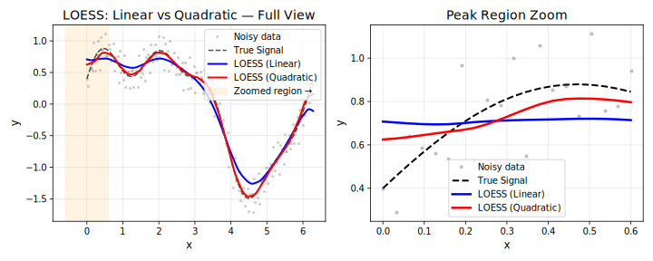
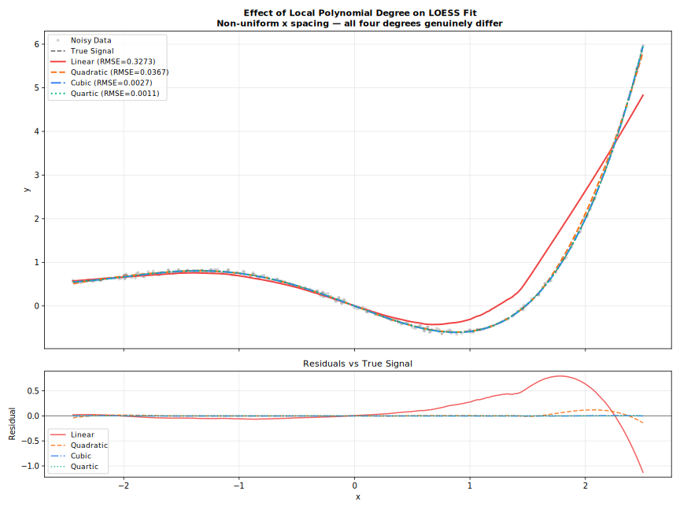
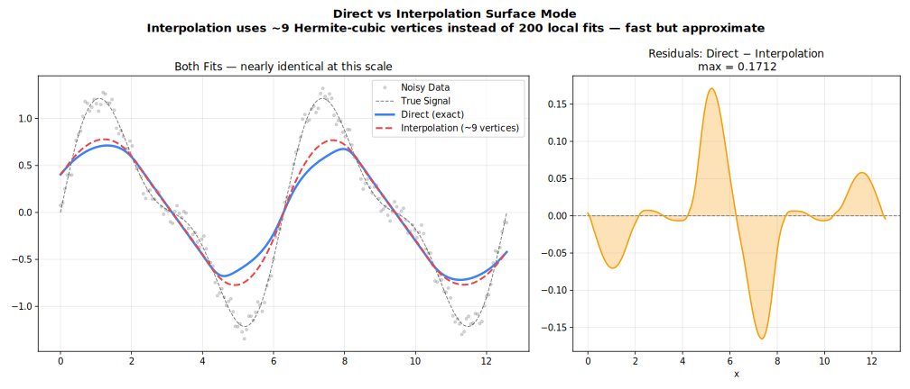
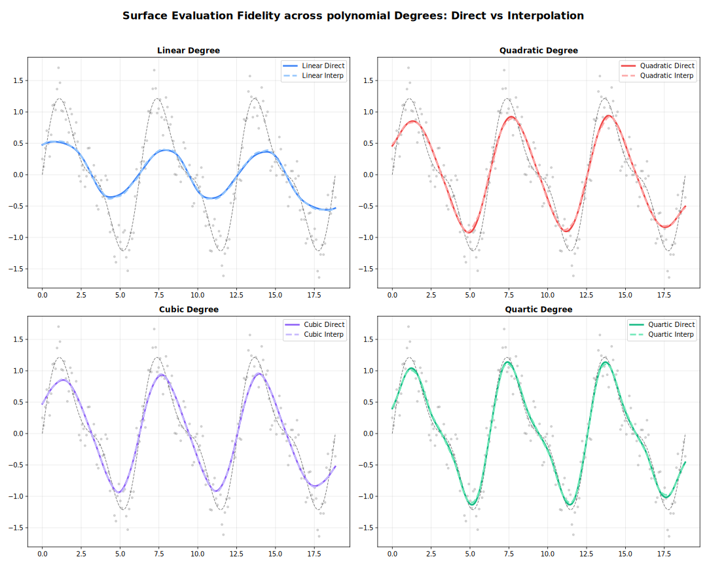

<!-- markdownlint-disable MD024 -->
# Polynomial Degree

Degree of the local polynomial fitted at each point.

## Overview

At each target point, LOESS fits a polynomial to the neighbouring data using weighted least squares. The `degree` parameter controls the order of that polynomial.



| Degree | Local Fit | Captures | Risk |
| --- | --- | --- | --- |
| `0` | Constant | Level only | Over-smooth, biased at edges |
| `1` | Linear | Trend (default) | Rarely overfits |
| `2` | Quadratic | Curvature | Overfits with small `fraction` |
| `3` | Cubic | Inflections | Requires larger `fraction` |
| `4` | Quartic | Fine structure | High variance, rarely needed |

---

## Degree 0 — Local Constant

$$\hat{y}(x_0) = \arg\min_a \sum_i w_i(x_0)\,(y_i - a)^2$$

The fit at each point is simply a weighted mean. Produces very smooth results but ignores local slope, introducing bias wherever the true function changes.

**Use when**: Maximum smoothness is more important than accuracy; computationally cheapest option.

=== "R"
    ```r
    result <- Loess(degree = 0L, fraction = 0.5)$fit(x, y)
    ```

=== "Python"
    ```python
    result = fl.smooth(x, y, degree=0, fraction=0.5)
    ```

=== "Rust"
    ```rust
    let model = Loess::new()
        .degree(PolynomialDegree::Constant)
        .fraction(0.5)
        .adapter(Batch)
        .build()?;
    ```

=== "Julia"
    ```julia
    result = fit(Loess(; degree=0, fraction=0.5), x, y)
    ```

=== "Node.js"
    ```javascript
    const result = smooth(x, y, { degree: 0, fraction: 0.5 });
    ```

=== "WebAssembly"
    ```javascript
    const result = smooth(x, y, { degree: 0, fraction: 0.5 });
    ```

=== "C++"
    ```cpp
    auto result = fastloess::smooth(x, y, { .degree = 0, .fraction = 0.5 });
    ```

---

## Degree 1 — Local Linear (Default)

$$\hat{y}(x_0) = \arg\min_{a,b} \sum_i w_i(x_0)\,(y_i - a - b x_i)^2$$

Fits a weighted line through the neighbourhood. Removes first-order bias and handles boundary regions correctly. The right choice for the vast majority of applications.

**Use when**: Default; monotone or gently curved data; boundary accuracy matters.

=== "R"
    ```r
    result <- Loess(degree = 1L, fraction = 0.5)$fit(x, y)
    ```

=== "Python"
    ```python
    result = fl.smooth(x, y, degree=1, fraction=0.5)
    ```

=== "Rust"
    ```rust
    let model = Loess::new()
        .degree(PolynomialDegree::Linear)
        .fraction(0.5)
        .adapter(Batch)
        .build()?;
    ```

=== "Julia"
    ```julia
    result = fit(Loess(; degree=1, fraction=0.5), x, y)
    ```

=== "Node.js"
    ```javascript
    const result = smooth(x, y, { degree: 1, fraction: 0.5 });
    ```

=== "WebAssembly"
    ```javascript
    const result = smooth(x, y, { degree: 1, fraction: 0.5 });
    ```

=== "C++"
    ```cpp
    auto result = fastloess::smooth(x, y, { .degree = 1, .fraction = 0.5 });
    ```

---

## Degree 2 — Local Quadratic

$$\hat{y}(x_0) = \arg\min_{a,b,c} \sum_i w_i(x_0)\,(y_i - a - b x_i - c x_i^2)^2$$

Fits a weighted parabola through the neighbourhood. Removes second-order bias and captures local curvature more faithfully, but requires more data per neighbourhood — pair with a larger `fraction` (≥ 0.4) to avoid overfitting.

**Use when**: Data with pronounced peaks, valleys, or curvature; `fraction` ≥ 0.4.

=== "R"
    ```r
    result <- Loess(degree = 2L, fraction = 0.5)$fit(x, y)
    ```

=== "Python"
    ```python
    result = fl.smooth(x, y, degree=2, fraction=0.5)
    ```

=== "Rust"
    ```rust
    let model = Loess::new()
        .degree(PolynomialDegree::Quadratic)
        .fraction(0.5)
        .adapter(Batch)
        .build()?;
    ```

=== "Julia"
    ```julia
    result = fit(Loess(; degree=2, fraction=0.5), x, y)
    ```

=== "Node.js"
    ```javascript
    const result = smooth(x, y, { degree: 2, fraction: 0.5 });
    ```

=== "WebAssembly"
    ```javascript
    const result = smooth(x, y, { degree: 2, fraction: 0.5 });
    ```

=== "C++"
    ```cpp
    auto result = fastloess::smooth(x, y, { .degree = 2, .fraction = 0.5 });
    ```

---

## Degree 3 — Local Cubic

$$\hat{y}(x_0) = \arg\min_{a,b,c,d} \sum_i w_i(x_0)\,(y_i - a - b x_i - c x_i^2 - d x_i^3)^2$$

Fits a weighted cubic polynomial. Captures inflection points and S-shaped local behaviour. Requires a substantially larger neighbourhood than degree 2 — use `fraction` ≥ 0.5 and verify visually for overfitting.

**Use when**: Data has clear S-shaped curves or multiple inflection points; `fraction` ≥ 0.5.

=== "R"
    ```r
    result <- Loess(degree = 3L, fraction = 0.6)$fit(x, y)
    ```

=== "Python"
    ```python
    result = fl.smooth(x, y, degree=3, fraction=0.6)
    ```

=== "Rust"
    ```rust
    let model = Loess::new()
        .degree(PolynomialDegree::Cubic)
        .fraction(0.6)
        .adapter(Batch)
        .build()?;
    ```

=== "Julia"
    ```julia
    result = fit(Loess(; degree=3, fraction=0.6), x, y)
    ```

=== "Node.js"
    ```javascript
    const result = smooth(x, y, { degree: 3, fraction: 0.6 });
    ```

=== "WebAssembly"
    ```javascript
    const result = smooth(x, y, { degree: 3, fraction: 0.6 });
    ```

=== "C++"
    ```cpp
    auto result = fastloess::smooth(x, y, { .degree = 3, .fraction = 0.6 });
    ```

---

## Degree 4 — Local Quartic

$$\hat{y}(x_0) = \arg\min_{a,...,e} \sum_i w_i(x_0)\,(y_i - a - b x_i - \cdots - e x_i^4)^2$$

Fits a weighted quartic polynomial. Rarely needed in practice; only useful for capturing highly oscillatory local structure. Very prone to overfitting — require `fraction` ≥ 0.6 and cross-validate.

**Use when**: Fine oscillatory structure is physically meaningful and the dataset is large; always cross-validate.

=== "R"
    ```r
    result <- Loess(degree = 4L, fraction = 0.7)$fit(x, y)
    ```

=== "Python"
    ```python
    result = fl.smooth(x, y, degree=4, fraction=0.7)
    ```

=== "Rust"
    ```rust
    let model = Loess::new()
        .degree(PolynomialDegree::Quartic)
        .fraction(0.7)
        .adapter(Batch)
        .build()?;
    ```

=== "Julia"
    ```julia
    result = fit(Loess(; degree=4, fraction=0.7), x, y)
    ```

=== "Node.js"
    ```javascript
    const result = smooth(x, y, { degree: 4, fraction: 0.7 });
    ```

=== "WebAssembly"
    ```javascript
    const result = smooth(x, y, { degree: 4, fraction: 0.7 });
    ```

=== "C++"
    ```cpp
    auto result = fastloess::smooth(x, y, { .degree = 4, .fraction = 0.7 });
    ```

---

## Choosing the Right Degree

| Situation | Recommended Degree |
| --- | --- |
| Monotone trend, general purpose | `1` (default) |
| Maximum smoothness, speed | `0` |
| Clear peaks / valleys / inflections | `2` (with `fraction` ≥ 0.4) |
| S-shaped curves, multiple inflections | `3` (with `fraction` ≥ 0.5) |
| Fine oscillatory structure (rare) | `4` (with `fraction` ≥ 0.6, cross-validate) |
| Boundary accuracy is critical | `1` or `2` (not `0`) |
| Very small dataset (n < 50) | `1` |

---

## Higher Degree Effects



---

## Surface Mode

The `surface_mode` parameter controls whether LOESS evaluates the local polynomial at every query point or at a sparser grid of vertices with Hermite cubic interpolation in between.

| Mode | Behaviour | Speed | Accuracy |
| --- | --- | --- | --- |
| `Interpolation` (default) | Evaluate at anchor vertices, blend via Hermite cubic | Faster | Slight approximation |
| `Direct` | Evaluate at every query point | Exact | Full precision |




