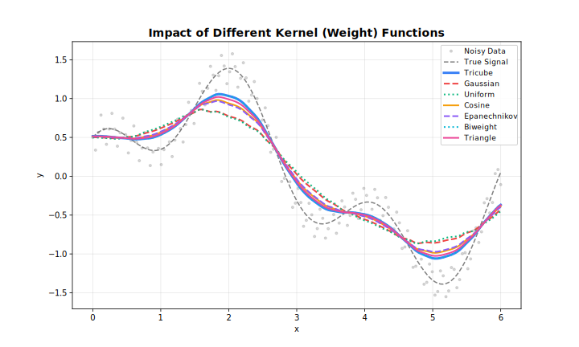
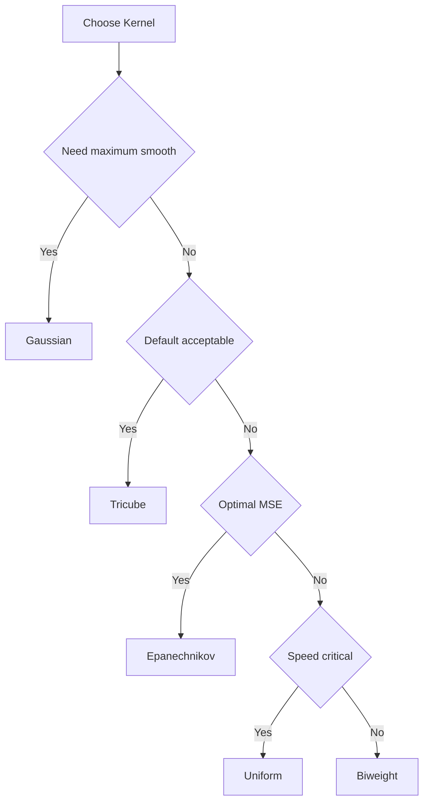

<!-- markdownlint-disable MD024 -->
# Weight Functions

Kernel functions for distance weighting.

## Overview

Weight functions (kernels) determine how neighboring points contribute to each local fit. Points closer to the target receive higher weights.



---

## Available Kernels

| Kernel | Efficiency | Smoothness | Support |
| --- | --- | --- | --- |
| **Tricube** | 0.998 | Very smooth | Compact |
| **Epanechnikov** | 1.000 | Smooth | Compact |
| **Gaussian** | 0.961 | Infinite | Unbounded |
| **Biweight** | 0.995 | Very smooth | Compact |
| **Cosine** | 0.999 | Smooth | Compact |
| **Triangle** | 0.989 | Moderate | Compact |
| **Uniform** | 0.943 | None | Compact |

**Efficiency** = AMISE relative to Epanechnikov (1.0 = optimal)

---

## Tricube (Default)

Cleveland's original choice. Best all-around performance.

$$w(u) = (1 - |u|^3)^3$$

**Use when**: Default choice for most applications.

=== "R"
    ```r
    result <- Loess(weight_function = "tricube")$fit(x, y)
    ```

=== "Python"
    ```python
    result = fl.Loess(weight_function="tricube").fit(x, y)
    ```

=== "Rust"
    ```rust
    let model = Loess::new()
        .weight_function(Tricube)
        .adapter(Batch)
        .build()?;
    ```

=== "Julia"
    ```julia
    result = fit(Loess(weight_function="tricube"), x, y)
    ```

=== "Node.js"
    ```javascript
    const result = new Loess({ weightFunction: "tricube" }).fit(x, y);
    ```

=== "WebAssembly"
    ```javascript
    const result = smooth(x, y, { weightFunction: "tricube" });
    ```

=== "C++"
    ```cpp
    fastloess::Loess model({ .weight_function = "tricube" });
    auto result = model.fit(x, y).value();
    ```

---

## Epanechnikov

Theoretically optimal for kernel density estimation.

$$w(u) = \frac{3}{4}(1 - u^2)$$

**Use when**: Optimal MSE properties desired.

=== "R"
    ```r
    result <- Loess(weight_function = "epanechnikov")$fit(x, y)
    ```

=== "Python"
    ```python
    result = fl.Loess(weight_function="epanechnikov").fit(x, y)
    ```

=== "Rust"
    ```rust
    let model = Loess::new()
        .weight_function(Epanechnikov)
        .adapter(Batch)
        .build()?;
    ```

=== "Julia"
    ```julia
    result = fit(Loess(weight_function="epanechnikov"), x, y)
    ```

=== "Node.js"
    ```javascript
    const result = new Loess({ weightFunction: "epanechnikov" }).fit(x, y);
    ```

=== "WebAssembly"
    ```javascript
    const result = smooth(x, y, { weightFunction: "epanechnikov" });
    ```

=== "C++"
    ```cpp
    fastloess::Loess model({ .weight_function = "epanechnikov" });
    auto result = model.fit(x, y).value();
    ```

---

## Gaussian

Infinitely smooth. No boundary effects.

$$w(u) = \exp(-u^2/2)$$

**Use when**: Maximum smoothness needed, computational cost acceptable.

=== "R"
    ```r
    result <- Loess(weight_function = "gaussian")$fit(x, y)
    ```

=== "Python"
    ```python
    result = fl.Loess(weight_function="gaussian").fit(x, y)
    ```

=== "Rust"
    ```rust
    let model = Loess::new()
        .weight_function(Gaussian)
        .adapter(Batch)
        .build()?;
    ```

=== "Julia"
    ```julia
    result = fit(Loess(weight_function="gaussian"), x, y)
    ```

=== "Node.js"
    ```javascript
    const result = new Loess({ weightFunction: "gaussian" }).fit(x, y);
    ```

=== "WebAssembly"
    ```javascript
    const result = smooth(x, y, { weightFunction: "gaussian" });
    ```

=== "C++"
    ```cpp
    fastloess::Loess model({ .weight_function = "gaussian" });
    auto result = model.fit(x, y).value();
    ```

---

## Biweight

Good balance of efficiency and smoothness.

$$w(u) = (1 - u^2)^2$$

**Use when**: Alternative to Tricube with slightly different properties.

=== "R"
    ```r
    result <- Loess(weight_function = "biweight")$fit(x, y)
    ```

=== "Python"
    ```python
    result = fl.Loess(weight_function="biweight").fit(x, y)
    ```

=== "Rust"
    ```rust
    let model = Loess::new()
        .weight_function(Biweight)
        .adapter(Batch)
        .build()?;
    ```

=== "Julia"
    ```julia
    result = fit(Loess(weight_function="biweight"), x, y)
    ```

=== "Node.js"
    ```javascript
    const result = new Loess({ weightFunction: "biweight" }).fit(x, y);
    ```

=== "WebAssembly"
    ```javascript
    const result = smooth(x, y, { weightFunction: "biweight" });
    ```

=== "C++"
    ```cpp
    fastloess::Loess model({ .weight_function = "biweight" });
    auto result = model.fit(x, y).value();
    ```

---

## Cosine

Smooth and computationally efficient.

$$w(u) = \cos(\pi u / 2)$$

**Use when**: Want smooth kernel with simple form.

=== "R"
    ```r
    result <- Loess(weight_function = "cosine")$fit(x, y)
    ```

=== "Python"
    ```python
    result = fl.Loess(weight_function="cosine").fit(x, y)
    ```

=== "Rust"
    ```rust
    let model = Loess::new()
        .weight_function(Cosine)
        .adapter(Batch)
        .build()?;
    ```

=== "Julia"
    ```julia
    result = fit(Loess(weight_function="cosine"), x, y)
    ```

=== "Node.js"
    ```javascript
    const result = new Loess({ weightFunction: "cosine" }).fit(x, y);
    ```

=== "WebAssembly"
    ```javascript
    const result = smooth(x, y, { weightFunction: "cosine" });
    ```

=== "C++"
    ```cpp
    fastloess::Loess model({ .weight_function = "cosine" });
    auto result = model.fit(x, y).value();
    ```

---

## Triangle

Simple linear taper.

$$w(u) = 1 - |u|$$

**Use when**: Simple, interpretable weights.

=== "R"
    ```r
    result <- Loess(weight_function = "triangle")$fit(x, y)
    ```

=== "Python"
    ```python
    result = fl.Loess(weight_function="triangle").fit(x, y)
    ```

=== "Rust"
    ```rust
    let model = Loess::new()
        .weight_function(Triangle)
        .adapter(Batch)
        .build()?;
    ```

=== "Julia"
    ```julia
    result = fit(Loess(weight_function="triangle"), x, y)
    ```

=== "Node.js"
    ```javascript
    const result = new Loess({ weightFunction: "triangle" }).fit(x, y);
    ```

=== "WebAssembly"
    ```javascript
    const result = smooth(x, y, { weightFunction: "triangle" });
    ```

=== "C++"
    ```cpp
    fastloess::Loess model({ .weight_function = "triangle" });
    auto result = model.fit(x, y).value();
    ```

---

## Uniform

Equal weights within window. Fastest but least smooth.

$$w(u) = 1$$

**Use when**: Speed is critical, smoothness less important.

=== "R"
    ```r
    result <- Loess(weight_function = "uniform")$fit(x, y)
    ```

=== "Python"
    ```python
    result = fl.Loess(weight_function="uniform").fit(x, y)
    ```

=== "Rust"
    ```rust
    let model = Loess::new()
        .weight_function(Uniform)
        .adapter(Batch)
        .build()?;
    ```

=== "Julia"
    ```julia
    result = fit(Loess(weight_function="uniform"), x, y)
    ```

=== "Node.js"
    ```javascript
    const result = new Loess({ weightFunction: "uniform" }).fit(x, y);
    ```

=== "WebAssembly"
    ```javascript
    const result = smooth(x, y, { weightFunction: "uniform" });
    ```

=== "C++"
    ```cpp
    fastloess::Loess model({ .weight_function = "uniform" });
    auto result = model.fit(x, y).value();
    ```

---

## Choosing a Kernel



!!! tip "Recommendation"
    Stick with **Tricube** (default) unless you have specific requirements. The differences between kernels are usually small in practice.
