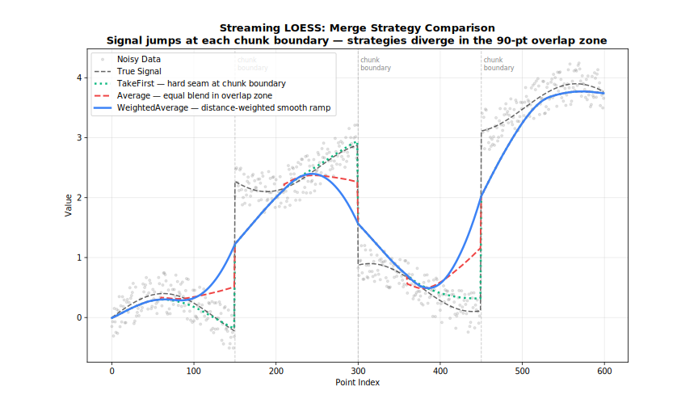

<!-- markdownlint-disable MD024 -->
# Merge Strategies

How overlapping chunk boundaries are reconciled in Streaming mode.

## Overview

Streaming LOESS processes data in fixed-size chunks with a configurable overlap. Points inside the overlap zone are fitted twice — once by the left chunk and once by the right chunk. The `merge_strategy` decides how those two estimates are combined into a single output value.

```text
Chunk A:   [=========|=====]
Chunk B:            [=====|=========]
Overlap:            [=====]
                      ↑
                 merge_strategy
                 applied here
```

| Strategy | Method | Robustness | Speed |
| --- | --- | --- | --- |
| `"average"` | Simple mean of both estimates | Low | Fastest |
| `"take_first"` | Left-chunk estimate only | Low | Fastest |
| `"take_last"` | Right-chunk estimate only | Low | Fastest |
| `"weighted_average"` | Distance-weighted mean | High | Moderate |



---

## Average

Takes the arithmetic mean of the left-chunk and right-chunk estimates in the overlap region. Fast and sufficient when both chunks have similar smoothing quality.

**Use when**: Chunks are large and the overlap region has uniform data density.

=== "R"
    ```r
    model <- StreamingLoess(
        merge_strategy = "average",
        chunk_size = 5000,
        overlap = 500
    )
    result <- model$process_chunk(x_chunk, y_chunk)
    ```

=== "Python"
    ```python
    from fastloess import StreamingLoess
    model = StreamingLoess(merge_strategy="average", chunk_size=5000, overlap=500)
    result = model.process_chunk(x_chunk, y_chunk)
    ```

=== "Rust"
    ```rust
    let model = StreamingLoess::new()
        .merge_strategy("average")
        .chunk_size(5000)
        .overlap(500)
        .build()?;
    ```

=== "Julia"
    ```julia
    model = StreamingLoess(; merge_strategy="average", chunk_size=5000, overlap=500)
    result = process_chunk(model, x_chunk, y_chunk)
    ```

=== "Node.js"
    ```javascript
    const processor = new StreamingLoess(
        {},
        { merge_strategy: "average", chunk_size: 5000, overlap: 500 }
    );
    const result = processor.processChunk(xChunk, yChunk);
    ```

=== "WebAssembly"
    ```javascript
    const processor = new StreamingLoess(
        {},
        { merge_strategy: "average", chunk_size: 5000, overlap: 500 }
    );
    const result = processor.processChunk(xChunk, yChunk);
    ```

=== "C++"
    ```cpp
    fastloess::StreamingOptions opts;
    opts.merge_strategy = "average";
    opts.chunk_size = 5000;
    opts.overlap = 500;
    fastloess::StreamingLoess stream(opts);
    (void)stream.process_chunk(x, y);
    auto result = stream.finalize().value();
    ```

---

## Take First

Keeps only the left-chunk estimate in the overlap zone and discards the right-chunk estimate. Produces a definitive, non-revised output as soon as the right boundary of each chunk is reached.

**Use when**: You need final output values immediately after each chunk (no look-ahead revision); left-chunk data quality is higher.

=== "R"
    ```r
    model <- StreamingLoess(merge_strategy = "take_first")
    ```

=== "Python"
    ```python
    from fastloess import StreamingLoess
    model = StreamingLoess(merge_strategy="take_first")
    ```

=== "Rust"
    ```rust
    .merge_strategy("take_first")
    ```

=== "Julia"
    ```julia
    model = StreamingLoess(; merge_strategy="take_first")
    ```

=== "Node.js"
    ```javascript
    { merge_strategy: "take_first" }
    ```

=== "WebAssembly"
    ```javascript
    { merge_strategy: "take_first" }
    ```

=== "C++"
    ```cpp
    fastloess::StreamingOptions s_opts;
    s_opts.merge_strategy = "take_first";
    fastloess::StreamingLoess model(s_opts);
    ```

---

## Take Last

Keeps only the right-chunk estimate in the overlap zone. The right chunk sees more of the surrounding data, so its fit can be more accurate near the left boundary of the new chunk.

**Use when**: Right-chunk context improves overlap quality; you are post-processing complete data rather than streaming live.

=== "R"
    ```r
    model <- StreamingLoess(merge_strategy = "take_last")
    ```

=== "Python"
    ```python
    from fastloess import StreamingLoess
    model = StreamingLoess(merge_strategy="take_last")
    ```

=== "Rust"
    ```rust
    .merge_strategy("take_last")
    ```

=== "Julia"
    ```julia
    model = StreamingLoess(; merge_strategy="take_last")
    ```

=== "Node.js"
    ```javascript
    { merge_strategy: "take_last" }
    ```

=== "WebAssembly"
    ```javascript
    { merge_strategy: "take_last" }
    ```

=== "C++"
    ```cpp
    fastloess::StreamingOptions s_opts;
    s_opts.merge_strategy = "take_last";
    fastloess::StreamingLoess model(s_opts);
    ```

---

## Weighted Average

Assigns each overlap point a weight proportional to its proximity to the centre of its respective chunk: points near the left-chunk centre get higher left weight; points near the right-chunk centre get higher right weight. This produces the smoothest transition across chunk boundaries.

$$\hat{y} = \frac{w_L \hat{y}_L + w_R \hat{y}_R}{w_L + w_R}$$

where $w_L$ and $w_R$ are linear distance weights from the chunk centres.

**Use when**: Minimising boundary artefacts is more important than speed; moderate overlap (10–20 % of chunk size).

=== "R"
    ```r
    model <- StreamingLoess(
        merge_strategy = "weighted_average",
        chunk_size = 5000,
        overlap = 500
    )
    ```

=== "Python"
    ```python
    from fastloess import StreamingLoess
    model = StreamingLoess(
        merge_strategy="weighted_average",
        chunk_size=5000,
        overlap=500
    )
    ```

=== "Rust"
    ```rust
    let model = StreamingLoess::new()
    .merge_strategy("weighted_average")
    .chunk_size(5000)
    .overlap(500)
    .build()?;
    ```

=== "Julia"
    ```julia
    model = StreamingLoess(;
        merge_strategy="weighted_average",
        chunk_size=5000,
        overlap=500
    )
    ```

=== "Node.js"
    ```javascript
    const processor = new StreamingLoess(
        {},
        { merge_strategy: "weighted_average", chunk_size: 5000, overlap: 500 }
    );
    ```

=== "WebAssembly"
    ```javascript
    const processor = new StreamingLoess(
        {},
        { merge_strategy: "weighted_average", chunk_size: 5000, overlap: 500 }
    );
    ```

=== "C++"
    ```cpp
    fastloess::StreamingOptions s_opts;
    s_opts.merge_strategy = "weighted_average";
    fastloess::StreamingLoess model(s_opts);
    ```

---

## Choosing a Strategy

| Situation | Recommended Strategy |
| --- | --- |
| General purpose | `"weighted_average"` |
| Maximum throughput | `"average"` |
| Immediate finalised output | `"take_first"` |
| Post-processing, right context better | `"take_last"` |
| Minimising boundary artefacts | `"weighted_average"` |

!!! tip "Overlap size matters"
    A larger overlap gives the merge strategy more room to blend, reducing boundary artefacts regardless of the strategy chosen. A good starting point is 10 % of `chunk_size`.
