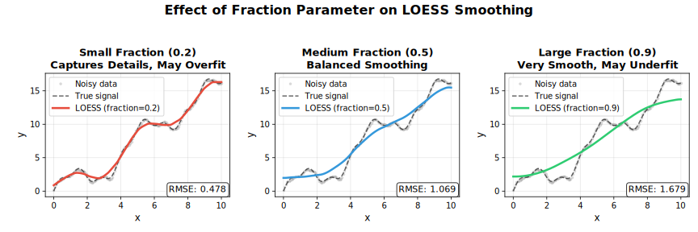
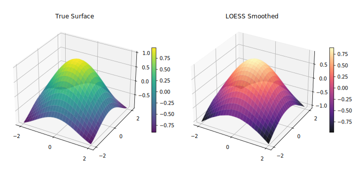
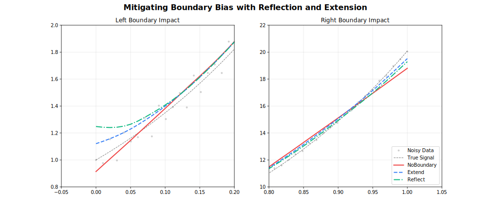
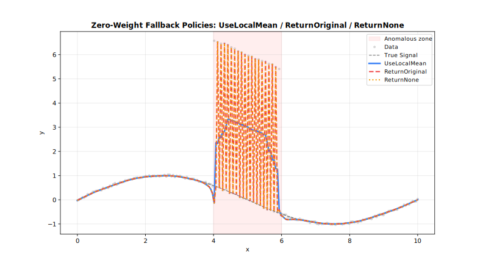

<!-- markdownlint-disable MD024 -->
# Parameters

Complete reference for all LOESS configuration options.

## Quick Reference

!!! note "Language-specific values"
    **Null value** — R: `NULL` · Python: `None` · Rust: `None` · Julia: `nothing` · Node.js/WASM: `null` · C++: `NAN` (floats), `0` (integers), `{}` (vectors)

    **Logical false** — R uses `FALSE`, Python uses `False`, and Rust, Julia, Node.js, WASM, and C++ use`false`.

| Parameter | Default | Range/Options | Description | Adapter |
| --- | --- | --- | --- | --- |
| **fraction** | 0.67 | (0, 1] | Smoothing span | All |
| **iterations** | 3 | [0, 1000] | Robustness iterations | All |
| **degree** | 1 | 0–4 | Polynomial degree | All |
| **surface_mode** | `"interpolation"` | 2 options | Fit vs interpolate | All |
| **weight_function** | `"tricube"` | 7 options | Distance kernel | All |
| **robustness_method** | `"bisquare"` | 3 options | Outlier weighting | All |
| **zero_weight_fallback** | `"use_local_mean"` | 3 options | Zero-weight behavior | All |
| **boundary_policy** | `"extend"` | 4 options | Edge handling | All |
| **scaling_method** | `"mad"` | 3 options | Scale estimation | All |
| **auto_converge** | Null value | tolerance | Early stopping | All |
| **parallel** | true (false for Online) | logical | Multi-threaded execution | All |
| **custom_weights** | Null value | positive | Per-observation weights | Batch |
| **return_residuals** | Logical false | logical | Include residuals | All |
| **return_robustness_weights** | Logical false | logical | Include weights | All |
| **return_diagnostics** | Logical false | logical | Include metrics | All |
| **confidence_intervals** | Null value | (0, 1) | CI level | Batch |
| **prediction_intervals** | Null value | (0, 1) | PI level | Batch |
| **distance_metric** | `"normalized"` | string option | Distance metric | All |
| **weighted_metric_weights** | Null value | numeric | Per-dimension distance weights | All |
| **cell** | Null value | (0, ∞) | Interpolation cell size | All |
| **interpolation_vertices** | Null value | integer | Interpolation grid vertices | All |
| **boundary_degree_fallback** | Logical false | logical | Degree fallback at boundaries | All |
| **cv_method** | Null value | method | Auto-select fraction | Batch |
| **cv_k** | 5 | [2, ∞) | K-fold count | Batch |
| **cv_fractions** | Null value | numeric | Fractions to evaluate | Batch |
| **cv_seed** | Null value | integer | CV fold randomization seed | Batch |
| **cross_validate** | — | method | Auto-select fraction (`cv_method` + `cv_k` + `cv_fractions` + `cv_seed`) | Batch |
| **chunk_size** | 5000 | [10, ∞) | Points per chunk | Streaming |
| **overlap** | 500 | [0, chunk) | Overlap between chunks | Streaming |
| **merge_strategy** | `"weighted_average"` | 4 options | Merge overlaps | Streaming |
| **window_capacity** | 1000 | [3, ∞) | Max window size | Online |
| **min_points** | 2 | [2, window] | Min before output | Online |
| **update_mode** | `"incremental"` | 2 options | Update strategy | Online |

!!! note "Rust option values"
    In Rust, pass option-like parameters as strings (case-insensitive), e.g. `"tricube"`, `"bisquare"`, `"extend"`, `"weighted_average"`.
    For the weighted distance metric, use `.distance_metric("weighted").weighted_metric_weights(vec![...])`.

---

## Parameter Options Summary

| Parameter | Available Options |
| --- | --- |
| **weight_function** | `"tricube"`, `"epanechnikov"`, `"gaussian"`, `"biweight"`, `"cosine"`, `"triangle"`, `"uniform"` |
| **robustness_method** | `"bisquare"`, `"huber"`, `"talwar"` |
| **zero_weight_fallback** | `"use_local_mean"`, `"return_original"`, `"return_none"` |
| **boundary_policy** | `"extend"`, `"reflect"`, `"zero"`, `"noboundary"` |
| **scaling_method** | `"mad"`, `"mar"`, `"mean"` |
| **surface_mode** | `"interpolation"`, `"direct"` |
| **distance_metric** | `"normalized"`, `"euclidean"`, `"manhattan"`, `"chebyshev"`, `"minkowski:p"`, `"weighted"` |
| **merge_strategy** | `"average"`, `"weighted_average"`, `"take_first"`, `"take_last"` |
| **update_mode** | `"incremental"`, `"full"` |

---

## Core Parameters

### fraction

The proportion of data used for each local fit. **Most important parameter.**

| Value | Effect | Use Case |
| --- | --- | --- |
| 0.1–0.3 | Fine detail | Rapidly changing signals |
| 0.3–0.5 | Balanced | General purpose |
| 0.5–0.7 | Heavy smoothing | Noisy data |
| 0.7–1.0 | Very smooth | Trend extraction |



=== "R"
    ```r
    model <- Loess(fraction = 0.3)
    result <- model$fit(x, y)
    ```

=== "Python"
    ```python
    model = fl.Loess(fraction=0.3)
    result = model.fit(x, y)
    ```

=== "Rust"
    ```rust
    let model = Loess::new()
        .fraction(0.3)
        .build()?;
    let result = model.fit(&x, &y)?;
    ```

=== "Julia"
    ```julia
    model = Loess(; fraction=0.3)
    result = fit(model, x, y)
    ```

=== "Node.js"
    ```javascript
    const model = new Loess({ fraction: 0.3 });
    const result = model.fit(x, y);
    ```

=== "WebAssembly"
    ```javascript
    const model = new Loess({ fraction: 0.3 });
    const result = model.fit(x, y);
    ```

=== "C++"
    ```cpp
    fastloess::Loess model({ .fraction = 0.3 });
    auto result = model.fit(x, y).value();
    ```

---

### iterations

Number of robustness iterations for outlier resistance.

| Value | Effect | Performance |
| --- | --- | --- |
| 0 | No robustness | Fastest |
| 1–3 | Moderate | Recommended |
| 4–6 | Strong | Contaminated data |
| 7+ | Very strong | Heavy outliers |

=== "R"
    ```r
    model <- Loess(iterations = 5)
    result <- model$fit(x, y)
    ```

=== "Python"
    ```python
    model = fl.Loess(iterations=5)
    result = model.fit(x, y)
    ```

=== "Rust"
    ```rust
    let model = Loess::new()
        .iterations(5)
        .build()?;
    let result = model.fit(&x, &y)?;
    ```

=== "Julia"
    ```julia
    model = Loess(; iterations=5)
    result = fit(model, x, y)
    ```

=== "Node.js"
    ```javascript
    const model = new Loess({ iterations: 5 });
    const result = model.fit(x, y);
    ```

=== "WebAssembly"
    ```javascript
    const model = new Loess({ iterations: 5 });
    const result = model.fit(x, y);
    ```

=== "C++"
    ```cpp
    fastloess::Loess model({ .iterations = 5 });
    auto result = model.fit(x, y).value();
    ```

---

### degree

Polynomial degree for the local regression fits.


| Degree | Fit Type |
| --- | --- |
| `0` | Local constant |
| `1` | Local linear (Default) |
| `2` | Local quadratic |
| `3` | Local cubic |
| `4` | Local quartic |

Higher degrees capture curvature but can overfit with small fractions. Degree 1 is appropriate for most use cases.

See [Polynomial Degree](degree.md) for a detailed comparison.

---

### surface_mode

Controls whether the local polynomial is evaluated at every query point or at a sparser grid of anchor vertices with Hermite cubic interpolation in between.

| Mode | Behavior | Speed | Accuracy |
| --- | --- | --- | --- |
| `"interpolation"` (default) | Evaluate at vertices, interpolate between | Faster | Slight approximation |
| `"direct"` | Evaluate at every query point | Slower | Full precision |

See [Polynomial Degree](degree.md#surface-mode) for a visual comparison.

=== "R"
    ```r
    model <- Loess(surface_mode = "direct")
    result <- model$fit(x, y)
    ```

=== "Python"
    ```python
    model = fl.Loess(surface_mode="direct")
    result = model.fit(x, y)
    ```

=== "Rust"
    ```rust
    let model = Loess::new()
        .surface_mode("direct")
        .build()?;
    let result = model.fit(&x, &y)?;
    ```

=== "Julia"
    ```julia
    model = Loess(; surface_mode="direct")
    result = fit(model, x, y)
    ```

=== "Node.js"
    ```javascript
    const model = new Loess({ surface_mode: "direct" });
    const result = model.fit(x, y);
    ```

=== "WebAssembly"
    ```javascript
    const model = new Loess({ surface_mode: "direct" });
    const result = model.fit(x, y);
    ```

=== "C++"
    ```cpp
    fastloess::Loess model({ .surface_mode = "direct" });
    auto result = model.fit(x, y).value();
    ```

---

### cell

Cell size for the interpolation grid. Controls the density of anchor vertices when `surface_mode = "interpolation"`. Smaller values produce a finer grid, increasing accuracy at the cost of memory and computation.

- **Default**: `0.2` (20% of x-range per dimension)
- **Range**: `(0, ∞)` — values close to 0 approach `"direct"` accuracy
- **Adapter**: All

| `cell` | Grid density | Accuracy | Speed |
| --- | --- | --- | --- |
| `0.05` | Very fine | Highest | Slowest |
| `0.2` | Moderate (default) | High | Fast |
| `0.5` | Coarse | Lower | Faster |

=== "R"
    ```r
    model <- Loess(cell = 0.05)
    result <- model$fit(x, y)
    ```

=== "Python"
    ```python
    model = fl.Loess(cell=0.05)
    result = model.fit(x, y)
    ```

=== "Rust"
    ```rust
    let model = Loess::new().cell(0.05).build()?;
    ```

=== "Julia"
    ```julia
    model = Loess(; cell=0.05)
    result = fit(model, x, y)
    ```

=== "Node.js"
    ```javascript
    const model = new Loess({ cell: 0.05 });
    const result = model.fit(x, y);
    ```

=== "WebAssembly"
    ```javascript
    const model = new Loess({ cell: 0.05 });
    const result = model.fit(x, y);
    ```

=== "C++"
    ```cpp
    fastloess::Loess model({ .cell = 0.05 });
    auto result = model.fit(x, y).value();
    ```

---

### interpolation_vertices

Explicitly set the number of anchor vertices for the interpolation grid, overriding the `cell`-based automatic count. Use when you need a precise vertex budget.

- **Default**: auto (derived from `cell` and data range)
- **Adapter**: All

=== "R"
    ```r
    model <- Loess(interpolation_vertices = 50L)
    result <- model$fit(x, y)
    ```

=== "Python"
    ```python
    model = fl.Loess(interpolation_vertices=50)
    result = model.fit(x, y)
    ```

=== "Rust"
    ```rust
    let model = Loess::new().interpolation_vertices(50).build()?;
    ```

=== "Julia"
    ```julia
    model = Loess(; interpolation_vertices=50)
    result = fit(model, x, y)
    ```

=== "Node.js"
    ```javascript
    const model = new Loess({ interpolation_vertices: 50 });
    const result = model.fit(x, y);
    ```

=== "WebAssembly"
    ```javascript
    const model = new Loess({ interpolation_vertices: 50 });
    const result = model.fit(x, y);
    ```

=== "C++"
    ```cpp
    fastloess::Loess model({ .interpolation_vertices = 50 });
    auto result = model.fit(x, y).value();
    ```

---

### dimensions

Number of predictor variables. Enables multivariate LOESS over an n-dimensional input space.



- **1** (default): Standard 1D smoothing over a single predictor
- **2**: Spatial or bi-predictor surface smoothing
- **3+**: High-dimensional local regression

See [Multivariate LOESS](dimensions.md) for detailed usage and distance metric options.

---

### distance_metric / weighted_metric_weights

Distance metric for neighbourhood calculation. Only meaningful when `dimensions > 1`. The `"weighted"` metric lets you assign per-dimension importance via `weighted_metric_weights`.

| Metric | Description |
| --- | --- |
| `"normalized"` | Each dimension scaled to unit range (default) |
| `"euclidean"` | Raw Euclidean distance |
| `"manhattan"` | City-block distance |
| `"chebyshev"` | Maximum coordinate difference |
| `"minkowski:p"` | Generalised $L_p$ norm — e.g. `"minkowski:3"` |
| `"weighted"` | Weighted Euclidean — set `weighted_metric_weights` to one weight per dimension |

=== "R"
    ```r
    model <- Loess(
        dimensions = 2L,
        distance_metric = "weighted",
        weighted_metric_weights = c(2.0, 0.5)  # x1 twice as important
    )
    result <- model$fit(x2d, y)
    ```

=== "Python"
    ```python
    model = fl.Loess(
        dimensions=2,
        distance_metric="weighted",
        weighted_metric_weights=[2.0, 0.5]
    )
    result = model.fit(x2d, y)
    ```

=== "Rust"
    ```rust
    let model = Loess::new()
        .dimensions(2)
        .distance_metric("weighted")
        .weighted_metric_weights(vec![2.0, 0.5])
        .build()?;
    let result = model.fit(&x2d, &y)?;
    ```

=== "Julia"
    ```julia
    model = Loess(;
        dimensions=2,
        distance_metric="weighted",
        weighted_metric_weights=[2.0, 0.5]
    )
    result = fit(model, x2d, y)
    ```

=== "Node.js"
    ```javascript
    const model = new Loess({
        dimensions: 2,
        distance_metric: "weighted",
        weighted_metric_weights: [2.0, 0.5]
    });
    const result = model.fit(x2d, y);
    ```

=== "WebAssembly"
    ```javascript
    const model = new Loess({
        dimensions: 2,
        distance_metric: "weighted",
        weighted_metric_weights: [2.0, 0.5]
    });
    const result = model.fit(x2d, y);
    ```

=== "C++"
    ```cpp
    fastloess::LoessOptions opts;
    opts.dimensions = 2;
    opts.distance_metric = "weighted";
    opts.weighted_metric_weights = {2.0, 0.5};
    fastloess::Loess model(opts);
    auto result = model.fit(x2d, y).value();
    ```

---

### weight_function

Distance weighting kernel for local fits.

| Kernel | Efficiency | Smoothness |
| --- | --- | --- |
| `"tricube"` | 0.998 | Very smooth |
| `"epanechnikov"` | 1.000 | Smooth |
| `"gaussian"` | 0.961 | Infinite |
| `"biweight"` | 0.995 | Very smooth |
| `"cosine"` | 0.999 | Smooth |
| `"triangle"` | 0.989 | Moderate |
| `"uniform"` | 0.943 | None |

See [Weight Functions](kernels.md) for detailed comparison.

=== "R"
    ```r
    model <- Loess(weight_function = "epanechnikov")
    result <- model$fit(x, y)
    ```

=== "Python"
    ```python
    model = fl.Loess(weight_function="epanechnikov")
    result = model.fit(x, y)
    ```

=== "Rust"
    ```rust
    let model = Loess::new()
        .weight_function("epanechnikov")
        .build()?;
    let result = model.fit(&x, &y)?;
    ```

=== "Julia"
    ```julia
    model = Loess(; weight_function="epanechnikov")
    result = fit(model, x, y)
    ```

=== "Node.js"
    ```javascript
    const model = new Loess({ weight_function: "epanechnikov" });
    const result = model.fit(x, y);
    ```

=== "WebAssembly"
    ```javascript
    const model = new Loess({ weight_function: "epanechnikov" });
    const result = model.fit(x, y);
    ```

=== "C++"
    ```cpp
    fastloess::Loess model({ .weight_function = "epanechnikov" });
    auto result = model.fit(x, y).value();
    ```

---

### robustness_method

Method for downweighting outliers during iterative refinement.

| Method | Behavior | Use Case |
| --- | --- | --- |
| `"bisquare"` | Smooth downweighting | General-purpose |
| `"huber"` | Linear beyond threshold | Moderate outliers |
| `"talwar"` | Hard threshold (0 or 1) | Extreme contamination |

See [Robustness](robustness.md) for detailed comparison.

=== "R"
    ```r
    model <- Loess(robustness_method = "talwar")
    result <- model$fit(x, y)
    ```

=== "Python"
    ```python
    model = fl.Loess(robustness_method="talwar")
    result = model.fit(x, y)
    ```

=== "Rust"
    ```rust
    let model = Loess::new()
        .robustness_method("talwar")
        .build()?;
    let result = model.fit(&x, &y)?;
    ```

=== "Julia"
    ```julia
    model = Loess(; robustness_method="talwar")
    result = fit(model, x, y)
    ```

=== "Node.js"
    ```javascript
    const model = new Loess({ robustness_method: "talwar" });
    const result = model.fit(x, y);
    ```

=== "WebAssembly"
    ```javascript
    const model = new Loess({ robustness_method: "talwar" });
    const result = model.fit(x, y);
    ```

=== "C++"
    ```cpp
    fastloess::Loess model({ .robustness_method = "talwar" });
    auto result = model.fit(x, y).value();
    ```

---

### boundary_policy

Edge handling strategy to reduce boundary bias. See [Boundary Handling](boundary.md) for a detailed comparison.



| Policy | Behavior | Use Case |
| --- | --- | --- |
| `"extend"` | Pad with first/last values | Most cases (default) |
| `"reflect"` | Mirror data at boundaries | Periodic/symmetric data |
| `"zero"` | Pad with zeros | Data approaches zero |
| `"noboundary"` | No padding | Original Cleveland behavior |

For example:

=== "R"
    ```r
    model <- Loess(boundary_policy = "reflect")
    result <- model$fit(x, y)
    ```

=== "Python"
    ```python
    model = fl.Loess(boundary_policy="reflect")
    result = model.fit(x, y)
    ```

=== "Rust"
    ```rust
    let model = Loess::new()
        .boundary_policy("reflect")
        .build()?;
    let result = model.fit(&x, &y)?;
    ```

=== "Julia"
    ```julia
    model = Loess(; boundary_policy="reflect")
    result = fit(model, x, y)
    ```

=== "Node.js"
    ```javascript
    const model = new Loess({ boundary_policy: "reflect" });
    const result = model.fit(x, y);
    ```

=== "WebAssembly"
    ```javascript
    const model = new Loess({ boundary_policy: "reflect" });
    const result = model.fit(x, y);
    ```

=== "C++"
    ```cpp
    fastloess::Loess model({ .boundary_policy = "reflect" });
    auto result = model.fit(x, y).value();
    ```

---

### boundary_degree_fallback

When enabled, the polynomial degree is automatically reduced to the highest degree that can be stably estimated for points near the boundary (where the local neighbourhood is one-sided). Prevents numerical failures when `degree ≥ 2` at the edges.

- **Default**: `false`
- **Adapter**: All

!!! tip
    Enable this if you observe NaN values or instability at the edges of your data when using `degree = "quadratic"` or higher.

=== "R"
    ```r
    model <- Loess(degree = "quadratic", boundary_degree_fallback = TRUE)
    result <- model$fit(x, y)
    ```

=== "Python"
    ```python
    model = fl.Loess(degree="quadratic", boundary_degree_fallback=True)
    result = model.fit(x, y)
    ```

=== "Rust"
    ```rust
    let model = Loess::new()
        .degree("quadratic")
        .boundary_degree_fallback(true)
        .build()?;
    let result = model.fit(&x, &y)?;
    ```

=== "Julia"
    ```julia
    model = Loess(; degree="quadratic", boundary_degree_fallback=true)
    result = fit(model, x, y)
    ```

=== "Node.js"
    ```javascript
    const model = new Loess({ degree: "quadratic", boundary_degree_fallback: true });
    const result = model.fit(x, y);
    ```

=== "WebAssembly"
    ```javascript
    const model = new Loess({ degree: "quadratic", boundary_degree_fallback: true });
    const result = model.fit(x, y);
    ```

=== "C++"
    ```cpp
    fastloess::Loess model({ .degree = "quadratic", .boundary_degree_fallback = 1 });
    auto result = model.fit(x, y).value();
    ```

---

### scaling_method

Method for estimating residual scale during robustness iterations. See [Scaling Methods](scaling.md) for a detailed comparison.


| Method | Description | Robustness |
| --- | --- | --- |
| `"mad"` | Median Absolute Deviation | Very robust |
| `"mar"` | Median Absolute Residual | Robust |
| `"mean"` | Mean Absolute Residual | Less robust |

For example:

=== "R"
    ```r
    model <- Loess(scaling_method = "mad")
    result <- model$fit(x, y)
    ```

=== "Python"
    ```python
    model = fl.Loess(scaling_method="mad")
    result = model.fit(x, y)
    ```

=== "Rust"
    ```rust
    let model = Loess::new()
        .scaling_method("mad")
        .build()?;
    let result = model.fit(&x, &y)?;
    ```

=== "Julia"
    ```julia
    model = Loess(; scaling_method="mad")
    result = fit(model, x, y)
    ```

=== "Node.js / WebAssembly"
    ```javascript
    const model = new Loess({ scaling_method: "mad" });
    const result = model.fit(x, y);
    ```

=== "C++"
    ```cpp
    fastloess::Loess model({ .scaling_method = "mad" });
    auto result = model.fit(x, y).value();
    ```

---

### zero_weight_fallback

Behavior when all neighborhood weights are zero.



| Option | Behavior |
| --- | --- |
| `"use_local_mean"` | Use mean of neighborhood (default) |
| `"return_original"` | Return original y value |
| `"return_none"` | Return NaN |

For example:

=== "R"
    ```r
    model <- Loess(zero_weight_fallback = "use_local_mean")
    result <- model$fit(x, y)
    ```

=== "Python"
    ```python
    model = fl.Loess(zero_weight_fallback="use_local_mean")
    result = model.fit(x, y)
    ```

=== "Rust"
    ```rust
    let model = Loess::new()
        .zero_weight_fallback("use_local_mean")
        .build()?;
    let result = model.fit(&x, &y)?;
    ```

=== "Julia"
    ```julia
    model = Loess(; zero_weight_fallback="use_local_mean")
    result = fit(model, x, y)
    ```

=== "Node.js"
    ```javascript
    const model = new Loess({ zero_weight_fallback: "use_local_mean" });
    const result = model.fit(x, y);
    ```

=== "WebAssembly"
    ```javascript
    const model = new Loess({ zero_weight_fallback: "use_local_mean" });
    const result = model.fit(x, y);
    ```

=== "C++"
    ```cpp
    fastloess::Loess model({ .zero_weight_fallback = "use_local_mean" });
    auto result = model.fit(x, y).value();
    ```

---

### auto_converge

Enable early stopping when robustness weights stabilize.

=== "R"
    ```r
    model <- Loess(iterations = 20, auto_converge = 1e-6)
    result <- model$fit(x, y)
    ```

=== "Python"
    ```python
    model = fl.Loess(iterations=20, auto_converge=1e-6)
    result = model.fit(x, y)
    ```

=== "Rust"
    ```rust
    let model = Loess::new()
        .iterations(20)           // Maximum
        .auto_converge(1e-6)      // Stop when change < 1e-6
        .build()?;
    let result = model.fit(&x, &y)?;
    ```

=== "Julia"
    ```julia
    model = Loess(; iterations=20, auto_converge=1e-6)
    result = fit(model, x, y)
    ```

=== "Node.js"
    ```javascript
    const model = new Loess({ iterations: 20, auto_converge: 1e-6 });
    const result = model.fit(x, y);
    ```

=== "WebAssembly"
    ```javascript
    const model = new Loess({ iterations: 20, auto_converge: 1e-6 });
    const result = model.fit(x, y);
    ```

=== "C++"
    ```cpp
    fastloess::Loess model({ .iterations = 20, .auto_converge = 1e-6 });
    auto result = model.fit(x, y).value();
    ```

---

### parallel

Enable multi-threaded parallel execution via Rayon. Substantially speeds up fitting on datasets with more than a few hundred points.

- **Default**: `true` for Batch and Streaming; `false` for Online
- **Adapter**: All

!!! note
    `OnlineLoess` defaults to `false` because it fits one point at a time. Each update touches only the sliding window, so there is no inner loop large enough to benefit from parallelism — enabling it would add thread overhead with no gain.

!!! tip
    Set to `false` for fully deterministic, reproducible output when debugging, or in environments where thread safety is required.

=== "R"
    ```r
    model <- Loess(parallel = FALSE)
    result <- model$fit(x, y)
    ```

=== "Python"
    ```python
    model = fl.Loess(parallel=False)
    result = model.fit(x, y)
    ```

=== "Rust"
    ```rust
    let model = Loess::new()
        .parallel(false)
        .build()?;
    let result = model.fit(&x, &y)?;
    ```

=== "Julia"
    ```julia
    model = Loess(; parallel=false)
    result = fit(model, x, y)
    ```

=== "Node.js"
    ```javascript
    const model = new Loess({ parallel: false });
    const result = model.fit(x, y);
    ```

=== "WebAssembly"
    ```javascript
    const model = new Loess({ parallel: false });
    const result = model.fit(x, y);
    ```

=== "C++"
    ```cpp
    fastloess::Loess model({ .parallel = false });
    auto result = model.fit(x, y).value();
    ```

---

### custom_weights

Per-observation case weights that scale each point's contribution to nearby local fits.
Equivalent to the `weights` argument in R's `stats::loess`.

**Formula:** `w_ij = custom_weights[j] × K(d_ij / h) × robustness_j`

where `K` is the distance kernel and `robustness_j` is the robustness weight (if `iterations > 0`).

| Value | Effect |
| --- | --- |
| `1.0` for all | Equivalent to no weights (uniform) |
| `0.0` | Excludes the observation from all local fits |
| `> 1.0` | Increases the observation's influence |
| `0 < v < 1.0` | Reduces the observation's influence |

!!! note "Batch only"
    `custom_weights` is applied in **Batch** mode only. It is ignored in Streaming and Online modes.

!!! warning "Length must match y"
    The weights vector must have the same length as `y`. A mismatch returns an error.

=== "R"
    ```r
    # Downweight an outlier at index 5
    weights <- rep(1, length(y))
    weights[5] <- 0
    model <- Loess()
    result <- model$fit(x, y, custom_weights = weights)
    ```

=== "Python"
    ```python
    import numpy as np
    weights = np.ones(len(y))
    weights[4] = 0  # Exclude 5th point
    model = fl.Loess()
    result = model.fit(x, y, custom_weights=weights)
    ```

=== "Rust"
    ```rust
    let mut weights = vec![1.0f64; y.len()];
    weights[4] = 0.0; // Exclude 5th point
    let model = Loess::new()
        .custom_weights(weights)
        .build()?;
    let result = model.fit(&x, &y)?;
    ```

=== "Julia"
    ```julia
    weights = ones(length(y))
    weights[5] = 0.0  # Exclude 5th point
    model = Loess()
    result = fit(model, x, y; custom_weights=weights)
    ```

=== "Node.js"
    ```javascript
    const weights = new Array(y.length).fill(1);
    weights[4] = 0; // Exclude 5th point
    const model = new Loess({ custom_weights: weights });
    const result = model.fit(x, y);
    ```

=== "WebAssembly"
    ```javascript
    const weights = new Array(y.length).fill(1);
    weights[4] = 0; // Exclude 5th point
    const model = new Loess({ custom_weights: weights });
    const result = model.fit(x, y);
    ```

=== "C++"
    ```cpp
    std::vector<double> custom_weights(y.size(), 1.0);
    custom_weights[4] = 0.0; // Exclude 5th point
    fastloess::Loess model;
    auto result = model.fit(x, y, custom_weights).value();
    ```

---

## Output Options

### return_residuals

Include residuals (`y - smoothed`) in the output.

=== "R"
    ```r
    model <- Loess(return_residuals = TRUE)
    result <- model$fit(x, y)
    print(result$residuals)
    ```

=== "Python"
    ```python
    model = fl.Loess(return_residuals=True)
    result = model.fit(x, y)
    print(result.residuals)
    ```

=== "Rust"
    ```rust
    let model = Loess::new()
        .return_residuals()
        .build()?;

    let result = model.fit(&x, &y)?;
    if let Some(residuals) = result.residuals {
        println!("Residuals: {:?}", residuals);
    }
    ```

=== "Julia"
    ```julia
    model = Loess(; return_residuals=true)
    result = fit(model, x, y)
    println(result.residuals)
    ```

=== "Node.js"
    ```javascript
    const model = new Loess({ return_residuals: true });
    const result = model.fit(x, y);
    console.log(result.residuals);
    ```

=== "WebAssembly"
    ```javascript
    const model = new Loess({ return_residuals: true });
    const result = model.fit(x, y);
    console.log(result.residuals);
    ```

=== "C++"
    ```cpp
    fastloess::Loess model({ .return_residuals = true });
    auto result = model.fit(x, y).value();
    auto residuals = result.residuals();
    ```

---

### return_diagnostics

Include fit quality metrics (Batch and Streaming only).

| Metric | Description |
| --- | --- |
| `rmse` | Root Mean Square Error |
| `mae` | Mean Absolute Error |
| `r_squared` | R² coefficient |
| `residual_sd` | Residual standard deviation |
| `effective_df` | Effective degrees of freedom |
| `aic` | Akaike Information Criterion |
| `aicc` | Corrected AIC |

=== "R"
    ```r
    model <- Loess(return_diagnostics = TRUE)
    result <- model$fit(x, y)
    cat(sprintf("R²: %.4f\n", result$diagnostics$r_squared))
    ```

=== "Python"
    ```python
    model = fl.Loess(return_diagnostics=True)
    result = model.fit(x, y)
    print(f"R²: {result.diagnostics.r_squared:.4f}")
    ```

=== "Rust"
    ```rust
    let model = Loess::new()
        .return_diagnostics()
        .build()?;

    let result = model.fit(&x, &y)?;
    if let Some(diag) = result.diagnostics {
        println!("R²: {:.4}", diag.r_squared);
        println!("RMSE: {:.4}", diag.rmse);
    }
    ```

=== "Julia"
    ```julia
    model = Loess(; return_diagnostics=true)
    result = fit(model, x, y)
    println("R²: ", result.diagnostics.r_squared)
    ```

=== "Node.js"
    ```javascript
    const model = new Loess({ return_diagnostics: true });
    const result = model.fit(x, y);
    console.log("R²:", result.diagnostics.r_squared);
    ```

=== "WebAssembly"
    ```javascript
    const model = new Loess({ return_diagnostics: true });
    const result = model.fit(x, y);
    console.log("R²:", result.diagnostics?.r_squared);
    ```

=== "C++"
    ```cpp
    fastloess::Loess model({ .return_diagnostics = true });
    auto result = model.fit(x, y).value();
    auto diag = result.diagnostics();
    std::cout << "R²: " << diag.r_squared() << std::endl;
    ```

---

### return_robustness_weights

Include final robustness weights (useful for outlier detection).

=== "R"
    ```r
    model <- Loess(iterations = 3, return_robustness_weights = TRUE)
    result <- model$fit(x, y)
    outliers <- which(result$robustness_weights < 0.5)
    ```

=== "Python"
    ```python
    model = fl.Loess(iterations=3, return_robustness_weights=True)
    result = model.fit(x, y)
    outliers = [i for i, w in enumerate(result.robustness_weights) if w < 0.5]
    ```

=== "Rust"
    ```rust
    let model = Loess::new()
        .iterations(3)
        .return_robustness_weights()
        .build()?;

    let result = model.fit(&x, &y)?;
    // Points with weight < 0.5 are likely outliers
    ```

=== "Julia"
    ```julia
    model = Loess(; iterations=3, return_robustness_weights=true)
    result = fit(model, x, y)
    # Points with result.robustness_weights < 0.5 are likely outliers
    ```

=== "Node.js"
    ```javascript
    const model = new Loess({ iterations: 3, return_robustness_weights: true });
    const result = model.fit(x, y);
    // result.robustness_weights contains outlier weights
    ```

=== "WebAssembly"
    ```javascript
    const model = new Loess({ iterations: 3, return_robustness_weights: true });
    const result = model.fit(x, y);
    // result.robustness_weights contains outlier weights
    ```

=== "C++"
    ```cpp
    fastloess::Loess model({ .iterations = 3, .return_robustness_weights = true });
    auto result = model.fit(x, y).value();
    auto weights = result.robustness_weights();
    ```

---

### confidence_intervals / prediction_intervals

Request uncertainty estimates (Batch only).

See [Intervals](intervals.md) for detailed usage.

=== "R"
    ```r
    model <- Loess(confidence_intervals = 0.95, prediction_intervals = 0.95)
    result <- model$fit(x, y)
    ```

=== "Python"
    ```python
    model = fl.Loess(confidence_intervals=0.95, prediction_intervals=0.95)
    result = model.fit(x, y)
    ```

=== "Rust"
    ```rust
    let model = Loess::new()
        .confidence_intervals(0.95)
        .prediction_intervals(0.95)
        .build()?;
    let result = model.fit(&x, &y)?;
    ```

=== "Julia"
    ```julia
    model = Loess(; confidence_intervals=0.95, prediction_intervals=0.95)
    result = fit(model, x, y)
    ```

=== "Node.js"
    ```javascript
    const model = new Loess({ confidence_intervals: 0.95, prediction_intervals: 0.95 });
    const result = model.fit(x, y);
    ```

=== "WebAssembly"
    ```javascript
    const model = new Loess({ confidence_intervals: 0.95, prediction_intervals: 0.95 });
    const result = model.fit(x, y);
    ```

=== "C++"
    ```cpp
    fastloess::Loess model({ .confidence_intervals = 0.95, .prediction_intervals = 0.95 });
    auto result = model.fit(x, y).value();
    ```

---

## CV Methods

### cv_method

Selection strategy for automated parameter tuning.

| Method | Description | Speed |
| --- | --- | --- |
| `"kfold"` | K-Fold Cross-Validation | Fast |
| `"loocv"` | Leave-One-Out Cross-Validation | Slow |

=== "R"
    ```r
    model <- Loess(cv_method = "kfold", cv_k = 5)
    result <- model$fit(x, y)
    ```

=== "Python"
    ```python
    model = fl.Loess(cv_method="kfold", cv_k=5)
    result = model.fit(x, y)
    ```

=== "Rust"
    ```rust
    let model = Loess::new()
        .cv_method("kfold")
        .cv_k(5)
        .cv_fractions(vec![0.1, 0.3, 0.5])
        .build()?;
    let result = model.fit(&x, &y)?;
    ```

=== "Julia"
    ```julia
    model = Loess(; cv_method="kfold", cv_k=5)
    result = fit(model, x, y)
    ```

=== "Node.js"
    ```javascript
    // Coming soon
    ```

=== "WebAssembly"
    ```javascript
    // Coming soon
    ```

=== "C++"
    ```cpp
    fastloess::Loess model({
        .cv_fractions = {0.1, 0.3, 0.5},
        .cv_method = "kfold",
        .cv_k = 5
    });
    auto result = model.fit(x, y).value();
    ```

---

## Adapter Parameters

### chunk_size

Points per chunk in Streaming mode.

=== "R"
    ```r
    result <- StreamingLoess(chunk_size = 10000)$process_chunk(x, y)
    ```

=== "Python"
    ```python
    model = fl.StreamingLoess(chunk_size=10000)
    model.process_chunk(x, y)
    result = model.finalize()
    ```

=== "Rust"
    ```rust
    let model = StreamingLoess::new()
        .chunk_size(10000)
        .build()?;
    ```

=== "Julia"
    ```julia
    model = StreamingLoess(; chunk_size=10000)
    process_chunk(model, x, y)
    result = finalize(model)
    ```

=== "Node.js"
    ```javascript
    const processor = new StreamingLoess({}, { chunk_size: 10000 });
    ```

=== "WebAssembly"
    ```javascript
    const processor = new StreamingLoess({}, { chunk_size: 10000 });
    ```

=== "C++"
    ```cpp
    fastloess::StreamingOptions opts;
    opts.chunk_size = 10000;
    fastloess::StreamingLoess stream(opts);
    (void)stream.process_chunk(x, y);
    auto result = stream.finalize().value();
    ```

---

### overlap

Overlap between chunks in Streaming mode.

=== "R"
    ```r
    result <- StreamingLoess(overlap = 1000)$process_chunk(x, y)
    ```

=== "Python"
    ```python
    model = fl.StreamingLoess(overlap=1000)
    model.process_chunk(x, y)
    result = model.finalize()
    ```

=== "Rust"
    ```rust
    let model = StreamingLoess::new()
        .overlap(1000)
        .build()?;
    ```

=== "Julia"
    ```julia
    model = StreamingLoess(; overlap=1000)
    process_chunk(model, x, y)
    result = finalize(model)
    ```

=== "Node.js"
    ```javascript
    const processor = new StreamingLoess({}, { overlap: 1000 });
    ```

=== "WebAssembly"
    ```javascript
    const processor = new StreamingLoess({}, { overlap: 1000 });
    ```

=== "C++"
    ```cpp
    fastloess::StreamingOptions opts;
    opts.overlap = 1000;
    fastloess::StreamingLoess stream(opts);
    (void)stream.process_chunk(x, y);
    auto result = stream.finalize().value();
    ```

---

### merge_strategy

Method for merging overlapping chunks. See [Merge Strategies](merge.md) for a detailed comparison.

| Strategy | Description | Robustness |
| --- | --- | --- |
| `"average"` | Average of overlapping chunks | Fastest, least robust |
| `"take_first"` | Left chunk only | Fastest, least robust |
| `"take_last"` | Right chunk only | Fastest, least robust |
| `"weighted_average"` | Weighted average of overlapping chunks | Most robust |

For example:

=== "R"
    ```r
    result <- StreamingLoess(merge_strategy = "weighted_average")$process_chunk(x, y)
    ```

=== "Python"
    ```python
    model = fl.StreamingLoess(merge_strategy="weighted_average")
    model.process_chunk(x, y)
    result = model.finalize()
    ```

=== "Rust"
    ```rust
    let model = StreamingLoess::new()
        .merge_strategy("weighted_average")
        .build()?;
    ```

=== "Julia"
    ```julia
    model = StreamingLoess(; merge_strategy="weighted_average")
    process_chunk(model, x, y)
    result = finalize(model)
    ```

=== "Node.js"
    ```javascript
    const processor = new StreamingLoess({}, { merge_strategy: "weighted_average" });
    ```

=== "WebAssembly"
    ```javascript
    const processor = new StreamingLoess({}, { merge_strategy: "weighted_average" });
    ```

=== "C++"
    ```cpp
    // merge_strategy is handled internally in C++
    fastloess::StreamingLoess stream({});
    (void)stream.process_chunk(x, y);
    auto result = stream.finalize().value();
    ```

---

### window_capacity

Maximum points held in memory for Online mode.

=== "R"
    ```r
    model <- OnlineLoess(window_capacity = 500)
    result <- model$add_point(x[1], y[1])  # NULL until window fills
    ```

=== "Python"
    ```python
    model = fl.OnlineLoess(window_capacity=500)
    result = model.add_point(x[0], y[0])  # None until window fills
    ```

=== "Rust"
    ```rust
    let model = OnlineLoess::new()
        .window_capacity(500)
        .build()?;
    ```

=== "Julia"
    ```julia
    model = OnlineLoess(; window_capacity=500)
    result = add_point(model, x[1], y[1])  # nothing until window fills
    ```

=== "Node.js"
    ```javascript
    const processor = new OnlineLoess({}, { window_capacity: 500 });
    ```

=== "WebAssembly"
    ```javascript
    const processor = new OnlineLoess({}, { window_capacity: 500 });
    ```

=== "C++"
    ```cpp
    fastloess::OnlineOptions opts;
    opts.window_capacity = 500;
    fastloess::OnlineLoess model(opts);
    auto out = model.add_point(x[0], y[0]).value();
    // out.has_value() == false until window fills
    ```

---

### min_points

Minimum points required before Online filter starts producing outputs.

=== "R"
    ```r
    model <- OnlineLoess(min_points = 10)
    result <- model$add_point(x[1], y[1])  # NULL until 10 points seen
    ```

=== "Python"
    ```python
    model = fl.OnlineLoess(min_points=10)
    result = model.add_point(x[0], y[0])  # None until 10 points seen
    ```

=== "Rust"
    ```rust
    let model = OnlineLoess::new()
        .min_points(10)
        .build()?;
    ```

=== "Julia"
    ```julia
    model = OnlineLoess(; min_points=10)
    result = add_point(model, x[1], y[1])  # nothing until 10 points seen
    ```

=== "Node.js"
    ```javascript
    const processor = new OnlineLoess({}, { min_points: 10 });
    ```

=== "WebAssembly"
    ```javascript
    const processor = new OnlineLoess({}, { min_points: 10 });
    ```

=== "C++"
    ```cpp
    fastloess::OnlineOptions opts;
    opts.min_points = 10;
    fastloess::OnlineLoess model(opts);
    auto out = model.add_point(x[0], y[0]).value();
    // out.has_value() == false until min_points reached
    ```

---

### update_mode

Optimization strategy for Online mode updates.

| Mode | Description | Speed |
| --- | --- | --- |
| `"full"` | Re-smooth entire window | Slow |
| `"incremental"` | Update only affected fits | Fast |

For example:

=== "R"
    ```r
    model <- OnlineLoess(update_mode = "full")
    result <- model$add_point(x[1], y[1])
    ```

=== "Python"
    ```python
    model = fl.OnlineLoess(update_mode="full")
    result = model.add_point(x[0], y[0])
    ```

=== "Rust"
    ```rust
    let model = OnlineLoess::new()
        .update_mode("full")
        .build()?;
    ```

=== "Julia"
    ```julia
    model = OnlineLoess(; update_mode="full")
    result = add_point(model, x[1], y[1])
    ```

=== "Node.js"
    ```javascript
    const processor = new OnlineLoess({}, { update_mode: "full" });
    ```

=== "WebAssembly"
    ```javascript
    const processor = new OnlineLoess({}, { update_mode: "full" });
    ```

=== "C++"
    ```cpp
    fastloess::OnlineOptions opts;
    opts.update_mode = "full";
    fastloess::OnlineLoess model(opts);
    auto out = model.add_point(x[0], y[0]).value();
    ```
