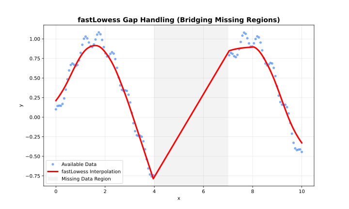

# Batch Mode (Loess)

> **See also:** [Choosing an Execution
> Mode](https://thisisamirv.github.io/loess-project/r/articles/adapter-choice.md)
> for a comparison of all three modes.

The default mode. Processes the entire dataset at once and supports all
features.



Gap handling

## When to Use

- Dataset fits comfortably in memory
- Need confidence/prediction intervals
- Need cross-validation
- One-shot analysis

## Parameters

| Parameter              | Default | Description             |
|------------------------|---------|-------------------------|
| `fraction`             | 0.67    | Neighbourhood size      |
| `iterations`           | 0       | Robustness iterations   |
| `confidence_intervals` | `NULL`  | CI coverage (e.g. 0.95) |
| `prediction_intervals` | `NULL`  | PI coverage (e.g. 0.95) |
| `parallel`             | `FALSE` | Enable CPU parallelism  |

## Example

``` r

library(rfastloess)
set.seed(42)
x <- seq(0, 2 * pi, length.out = 100)
y <- sin(x) + rnorm(100, sd = 0.3)

model <- Loess(
    fraction = 0.5,
    iterations = 3,
    confidence_intervals = 0.95,
    prediction_intervals = 0.95,
    return_diagnostics = TRUE
)
result <- fit(model, x, y)

cat("Confidence lower bounds:\n")
#> Confidence lower bounds:
print(result$confidence_lower)
#>   [1]  0.33814045  0.34559162  0.35399225  0.36347929  0.37358247  0.38383873
#>   [7]  0.39441130  0.40544257  0.41704533  0.42931726  0.44238061  0.45635977
#>  [13]  0.47138978  0.48599617  0.49870935  0.50966200  0.51898743  0.52682310
#>  [19]  0.53330642  0.53856828  0.54274297  0.54596168  0.54835288  0.54949913
#>  [25]  0.54878237  0.54604454  0.54114909  0.53397451  0.52437197  0.51217097
#>  [31]  0.49720203  0.47929995  0.45986428  0.44010108  0.41956595  0.39779601
#>  [37]  0.37434334  0.34875847  0.32055427  0.28922394  0.25427411  0.21713362
#>  [43]  0.17950664  0.14134663  0.10260600  0.06322512  0.02312754 -0.01776651
#>  [49] -0.05952766 -0.10221202 -0.14497582 -0.18701429 -0.22844034 -0.26934813
#>  [55] -0.30982028 -0.34994809 -0.38982323 -0.42952884 -0.46914486 -0.50875386
#>  [61] -0.54688135 -0.58217282 -0.61487482 -0.64522563 -0.67345879 -0.69981202
#>  [67] -0.72452479 -0.74784582 -0.77002714 -0.78968383 -0.80542899 -0.81751694
#>  [73] -0.82619362 -0.83170102 -0.83428763 -0.83419335 -0.83165480 -0.82690669
#>  [79] -0.82018670 -0.81195272 -0.80226934 -0.79078763 -0.77715174 -0.76099585
#>  [85] -0.74194669 -0.71964539 -0.69373511 -0.66386529 -0.63193396 -0.60000186
#>  [91] -0.56796897 -0.53574925 -0.50325928 -0.47041276 -0.43711641 -0.40326534
#>  [97] -0.36874546 -0.33344849 -0.30035213 -0.27187955
cat("Confidence upper bounds:\n")
#> Confidence upper bounds:
print(result$confidence_upper)
#>   [1]  0.613537316  0.623685894  0.634929636  0.647341050  0.660369094
#>   [6]  0.673482436  0.686767699  0.700332349  0.714313434  0.728863140
#>  [11]  0.744109063  0.760176658  0.777180750  0.793586862  0.807871035
#>  [16]  0.820173484  0.830633810  0.839387443  0.846569888  0.852323150
#>  [21]  0.856785840  0.860099685  0.862409101  0.863322170  0.862261515
#>  [26]  0.859079001  0.853604974  0.845654753  0.835070969  0.821717925
#>  [31]  0.805458908  0.786152912  0.765217005  0.743859576  0.721615594
#>  [36]  0.698038467  0.672666683  0.645040252  0.614736882  0.581353896
#>  [41]  0.544475243  0.505572148  0.466355917  0.426736745  0.386625849
#>  [46]  0.345946514  0.304638810  0.262646160  0.219902841  0.176328591
#>  [51]  0.132781331  0.090123951  0.048282037  0.007162380 -0.033339722
#>  [56] -0.073320346 -0.112875141 -0.152108330 -0.191127319 -0.230036883
#>  [61] -0.267392181 -0.301844086 -0.333656980 -0.363103493 -0.390461036
#>  [66] -0.416002788 -0.440000208 -0.462715516 -0.484407580 -0.503686428
#>  [71] -0.519139159 -0.530985026 -0.539451670 -0.544770672 -0.547167114
#>  [76] -0.546874696 -0.544130345 -0.539172952 -0.532238402 -0.523763628
#>  [81] -0.513794664 -0.501977730 -0.487965980 -0.471422511 -0.452017902
#>  [86] -0.429408304 -0.403247852 -0.373184391 -0.341108992 -0.309078850
#>  [91] -0.276984577 -0.244702786 -0.212107487 -0.179075565 -0.145490878
#>  [96] -0.111248896 -0.076254291 -0.040405930 -0.006689797  0.022450759
cat("R²:", result$diagnostics$r_squared, "\n")
#> R²: 0.78173
```

``` r

sessionInfo()
#> R version 4.6.1 (2026-06-24)
#> Platform: x86_64-pc-linux-gnu
#> Running under: Ubuntu 24.04.4 LTS
#> 
#> Matrix products: default
#> BLAS:   /usr/lib/x86_64-linux-gnu/openblas-pthread/libblas.so.3 
#> LAPACK: /usr/lib/x86_64-linux-gnu/openblas-pthread/libopenblasp-r0.3.26.so;  LAPACK version 3.12.0
#> 
#> locale:
#>  [1] LC_CTYPE=C.UTF-8       LC_NUMERIC=C           LC_TIME=C.UTF-8       
#>  [4] LC_COLLATE=C.UTF-8     LC_MONETARY=C.UTF-8    LC_MESSAGES=C.UTF-8   
#>  [7] LC_PAPER=C.UTF-8       LC_NAME=C              LC_ADDRESS=C          
#> [10] LC_TELEPHONE=C         LC_MEASUREMENT=C.UTF-8 LC_IDENTIFICATION=C   
#> 
#> time zone: UTC
#> tzcode source: system (glibc)
#> 
#> attached base packages:
#> [1] stats     graphics  grDevices utils     datasets  methods   base     
#> 
#> other attached packages:
#> [1] rfastloess_1.0.0
#> 
#> loaded via a namespace (and not attached):
#>  [1] digest_0.6.39       desc_1.4.3          R6_2.6.1           
#>  [4] fastmap_1.2.0       xfun_0.60           cachem_1.1.0       
#>  [7] knitr_1.51          BiocGenerics_0.58.1 htmltools_0.5.9    
#> [10] generics_0.1.4      rmarkdown_2.31      lifecycle_1.0.5    
#> [13] cli_3.6.6           sass_0.4.10         pkgdown_2.2.1      
#> [16] textshaping_1.0.5   jquerylib_0.1.4     systemfonts_1.3.2  
#> [19] compiler_4.6.1      tools_4.6.1         ragg_1.5.2         
#> [22] bslib_0.12.0        evaluate_1.0.5      yaml_2.3.12        
#> [25] otel_0.2.0          jsonlite_2.0.0      rlang_1.3.0        
#> [28] fs_2.1.0            htmlwidgets_1.6.4
```
