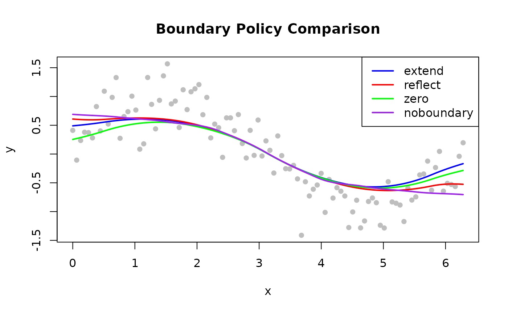

# Boundary Handling

## Overview


Boundary policy comparison

Standard LOESS neighbourhoods become asymmetric at the boundaries: fewer
points exist on one side, pulling the local fit toward the data
interior. The `boundary_policy` parameter controls how the data is
padded to mitigate this effect.

| Policy         | Padding Strategy                | Best For                    |
|----------------|---------------------------------|-----------------------------|
| `"extend"`     | Repeat first / last value       | Most datasets (default)     |
| `"reflect"`    | Mirror data at boundaries       | Periodic or symmetric data  |
| `"zero"`       | Pad with zeros                  | Data known to approach zero |
| `"noboundary"` | No padding (Cleveland original) | Reference behaviour         |

------------------------------------------------------------------------

## Extend (Default)

Pads beyond both endpoints by replicating the first and last observed
values. Prevents the fit from curling toward zero and is a safe default
for nearly all use cases.

**Use when**: No strong prior on boundary behaviour; general-purpose
smoothing.

``` r

library(rfastloess)
set.seed(42)
x <- seq(0, 2 * pi, length.out = 100)
y <- sin(x) + rnorm(100, sd = 0.3)

model <- Loess(boundary_policy = "extend")
result <- fit(model, x, y)
cat("First 6 smoothed values (extend policy):\n")
#> First 6 smoothed values (extend policy):
print(head(result$y))
#> [1] 0.4897657 0.4961584 0.5029665 0.5102219 0.5179564 0.5262019
```

------------------------------------------------------------------------

## Reflect

Mirrors the data about both endpoints before fitting, then discards the
reflected region from the output. Preserves continuity of derivatives at
the endpoints.

**Use when**: Circular data (e.g., angle, day-of-year), symmetric
physical quantities, or when the derivative at the boundary is expected
to be zero.

``` r

model <- Loess(boundary_policy = "reflect")
result <- fit(model, x, y)
cat("First 6 smoothed values (reflect policy):\n")
#> First 6 smoothed values (reflect policy):
print(head(result$y))
#> [1] 0.6080511 0.6030950 0.5991682 0.5963540 0.5947357 0.5943968
```

------------------------------------------------------------------------

## Zero

Pads beyond both endpoints with zeros before fitting. Appropriate when
the underlying process is known to be zero outside the observed range.

**Use when**: Signal decays to zero at both ends; zero is a meaningful
boundary value.

``` r

model <- Loess(boundary_policy = "zero")
result <- fit(model, x, y)
cat("First 6 smoothed values (zero policy):\n")
#> First 6 smoothed values (zero policy):
print(head(result$y))
#> [1] 0.2536630 0.2693578 0.2857017 0.3027509 0.3205618 0.3391908
```

------------------------------------------------------------------------

## No Boundary Padding

Applies no padding. Each local fit uses only the points that are
actually available, which may be fewer than the requested neighbourhood
at the endpoints. This reproduces the original Cleveland (1979)
algorithm exactly.

**Use when**: Reproducing reference results; you prefer the raw LOESS
boundary behaviour.

``` r

model <- Loess(boundary_policy = "noboundary")
result <- fit(model, x, y)
cat("First 6 smoothed values (noboundary policy):\n")
#> First 6 smoothed values (noboundary policy):
print(head(result$y))
#> [1] 0.6893051 0.6846546 0.6806210 0.6770430 0.6737592 0.6706086
```

------------------------------------------------------------------------

## Comparing Policies

``` r

library(rfastloess)
set.seed(42)
x <- seq(0, 2 * pi, length.out = 100)
y <- sin(x) + rnorm(100, sd = 0.3)

policies <- c("extend", "reflect", "zero", "noboundary")
colors   <- c("blue", "red", "green", "purple")

plot(x, y, pch = 16, col = "gray",
    main = "Boundary Policy Comparison")

for (i in seq_along(policies)) {
    model  <- Loess(boundary_policy = policies[i])
    result <- fit(model, x, y)
    lines(result$x, result$y, col = colors[i], lwd = 2)
}

legend("topright", policies, col = colors, lwd = 2)
```



------------------------------------------------------------------------

## Choosing a Policy

| Situation                                | Recommended Policy   |
|------------------------------------------|----------------------|
| General purpose                          | `"extend"` (default) |
| Periodic signal (angle, day-of-year)     | `"reflect"`          |
| Signal known to be zero at boundaries    | `"zero"`             |
| Replicating original Cleveland behaviour | `"noboundary"`       |

``` r

sessionInfo()
#> R version 4.6.1 (2026-06-24)
#> Platform: x86_64-pc-linux-gnu
#> Running under: Ubuntu 24.04.4 LTS
#> 
#> Matrix products: default
#> BLAS:   /usr/lib/x86_64-linux-gnu/openblas-pthread/libblas.so.3 
#> LAPACK: /usr/lib/x86_64-linux-gnu/openblas-pthread/libopenblasp-r0.3.26.so;  LAPACK version 3.12.0
#> 
#> locale:
#>  [1] LC_CTYPE=C.UTF-8       LC_NUMERIC=C           LC_TIME=C.UTF-8       
#>  [4] LC_COLLATE=C.UTF-8     LC_MONETARY=C.UTF-8    LC_MESSAGES=C.UTF-8   
#>  [7] LC_PAPER=C.UTF-8       LC_NAME=C              LC_ADDRESS=C          
#> [10] LC_TELEPHONE=C         LC_MEASUREMENT=C.UTF-8 LC_IDENTIFICATION=C   
#> 
#> time zone: UTC
#> tzcode source: system (glibc)
#> 
#> attached base packages:
#> [1] stats     graphics  grDevices utils     datasets  methods   base     
#> 
#> other attached packages:
#> [1] rfastloess_1.2.0
#> 
#> loaded via a namespace (and not attached):
#>  [1] digest_0.6.39     desc_1.4.3        R6_2.6.1          fastmap_1.2.0    
#>  [5] xfun_0.60         cachem_1.1.0      knitr_1.51        htmltools_0.5.9  
#>  [9] rmarkdown_2.32    lifecycle_1.0.5   cli_3.6.6         sass_0.4.10      
#> [13] pkgdown_2.2.1     textshaping_1.0.5 jquerylib_0.1.4   systemfonts_1.3.2
#> [17] compiler_4.6.1    tools_4.6.1       ragg_1.5.2        bslib_0.12.0     
#> [21] evaluate_1.0.5    yaml_2.3.12       otel_0.2.0        jsonlite_2.0.0   
#> [25] rlang_1.3.0       fs_2.1.0          htmlwidgets_1.6.4
```
