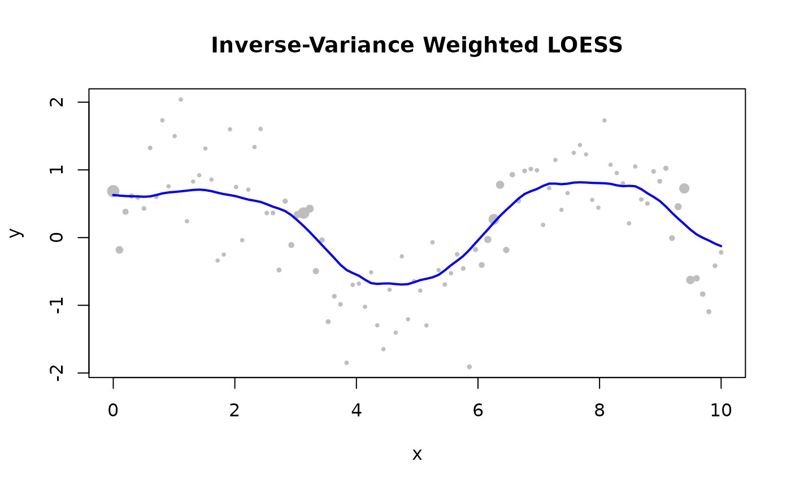

# Custom Weights

## How Custom Weights Work

Per-observation weights encode data quality directly into the LOESS fit.
The effective weight of observation $`j`$ in a local fit centred at
$`x_i`$ is:

``` math
w_{ij} = \text{custom\_weights}[j] \times K\!\left(\frac{d_{ij}}{h_i}\right)
\times r_j
```

> **Note:** `custom_weights` applies in **Batch** mode only.

------------------------------------------------------------------------

## When to Use Custom Weights

| Situation                            | Recommended weight     |
|--------------------------------------|------------------------|
| Point known to be erroneous          | `0.0` — fully excluded |
| Unreliable sensor / low precision    | `0.1 – 0.5`            |
| Standard observation                 | `1.0` (default)        |
| Carefully calibrated measurement     | `> 1.0`                |
| Measurement uncertainty $`\sigma_i`$ | $`1 / \sigma_i^2`$     |

------------------------------------------------------------------------

## Suppress a Known Outlier

``` r

library(rfastloess)

x <- 1:10
y <- x * 2.0
y[6] <- 100.0              # spike at index 6

weights <- rep(1.0, 10)
weights[6] <- 0.0          # exclude the spike

model <- Loess(fraction = 0.5, iterations = 0L)
result <- fit(model, x, y, custom_weights = weights)
cat("First 6 smoothed values (outlier excluded, no robustness):\n")
#> First 6 smoothed values (outlier excluded, no robustness):
print(head(result$y))
#> [1]  2.572621  4.000000  6.000000  8.000000 10.000000 12.000000
```

------------------------------------------------------------------------

## Inverse-Variance Weights

``` r

library(rfastloess)
set.seed(42)
x <- seq(0, 10, length.out = 100)
y <- sin(x) + rnorm(100, sd = 0.5)

sigma <- 0.1 + 0.5 * abs(sin(x))
weights <- 1 / sigma^2

model <- Loess(fraction = 0.3)
result <- fit(model, x, y, custom_weights = weights)

plot(x, y, pch = 16, cex = 0.5 + weights / max(weights),
    col = "gray", main = "Inverse-Variance Weighted LOESS")
lines(result$x, result$y, col = "blue", lwd = 2)
```



------------------------------------------------------------------------

## Combining with Robustness

``` r

library(rfastloess)
set.seed(42)
x <- 1:100
y <- sin(x / 10) + rnorm(100, sd = 0.3)

# Known bad region: indices 40–50
weights <- rep(1.0, 100)
weights[40:50] <- 0.1

# Also use robustness for unknown outliers
model <- Loess(fraction = 0.3, iterations = 3)
result <- fit(model, x, y, custom_weights = weights)
cat("First 6 smoothed values (custom weights, robust fitting):\n")
#> First 6 smoothed values (custom weights, robust fitting):
print(head(result$y))
#> [1] 0.5762247 0.5941348 0.6134176 0.6326894 0.6539161 0.6790636
```

``` r

sessionInfo()
#> R version 4.6.1 (2026-06-24)
#> Platform: x86_64-pc-linux-gnu
#> Running under: Ubuntu 24.04.4 LTS
#> 
#> Matrix products: default
#> BLAS:   /usr/lib/x86_64-linux-gnu/openblas-pthread/libblas.so.3 
#> LAPACK: /usr/lib/x86_64-linux-gnu/openblas-pthread/libopenblasp-r0.3.26.so;  LAPACK version 3.12.0
#> 
#> locale:
#>  [1] LC_CTYPE=C.UTF-8       LC_NUMERIC=C           LC_TIME=C.UTF-8       
#>  [4] LC_COLLATE=C.UTF-8     LC_MONETARY=C.UTF-8    LC_MESSAGES=C.UTF-8   
#>  [7] LC_PAPER=C.UTF-8       LC_NAME=C              LC_ADDRESS=C          
#> [10] LC_TELEPHONE=C         LC_MEASUREMENT=C.UTF-8 LC_IDENTIFICATION=C   
#> 
#> time zone: UTC
#> tzcode source: system (glibc)
#> 
#> attached base packages:
#> [1] stats     graphics  grDevices utils     datasets  methods   base     
#> 
#> other attached packages:
#> [1] rfastloess_1.0.0
#> 
#> loaded via a namespace (and not attached):
#>  [1] digest_0.6.39     desc_1.4.3        R6_2.6.1          fastmap_1.2.0    
#>  [5] xfun_0.60         cachem_1.1.0      knitr_1.51        htmltools_0.5.9  
#>  [9] rmarkdown_2.31    lifecycle_1.0.5   cli_3.6.6         sass_0.4.10      
#> [13] pkgdown_2.2.1     textshaping_1.0.5 jquerylib_0.1.4   systemfonts_1.3.2
#> [17] compiler_4.6.1    tools_4.6.1       ragg_1.5.2        bslib_0.12.0     
#> [21] evaluate_1.0.5    yaml_2.3.12       otel_0.2.0        jsonlite_2.0.0   
#> [25] rlang_1.3.0       fs_2.1.0          htmlwidgets_1.6.4
```
