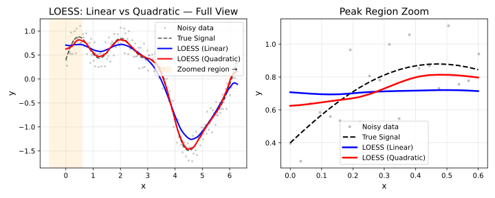

# Polynomial Degree

## Overview

At each target point, LOESS fits a polynomial to the neighbouring data
using weighted least squares. The `degree` parameter controls the order
of that polynomial.



Degree comparison

| Degree | Local Fit | Captures | Risk |
|----|----|----|----|
| `0` / `"constant"` | Weighted mean | Level only | Over-smooth; edge bias |
| `1` / `"linear"` | Weighted line | Trend (default) | Rarely overfits |
| `2` / `"quadratic"` | Parabola | Curvature | Overfits with small `fraction` |
| `3` / `"cubic"` | Cubic curve | Inflections | Requires larger `fraction` |
| `4` / `"quartic"` | Quartic curve | Fine structure | High variance, rare |

Degree can be specified as an integer (`0L`–`4L`) or as a string
(`"constant"`, `"linear"`, `"quadratic"`, `"cubic"`, `"quartic"`).

------------------------------------------------------------------------

## Degree 0 — Local Constant

The fit at each point is a weighted mean. Produces very smooth results
but ignores local slope, introducing bias wherever the true function
changes.

**Use when**: Maximum smoothness matters more than accuracy;
computationally cheapest.

``` r

library(rfastloess)
set.seed(42)
x <- seq(0, 2 * pi, length.out = 100)
y <- sin(x) + rnorm(100, sd = 0.3)

model <- Loess(degree = "constant", fraction = 0.5)
result <- fit(model, x, y)
cat("First 6 smoothed values (constant/Nadaraya-Watson):\n")
#> First 6 smoothed values (constant/Nadaraya-Watson):
print(head(result$y))
#> [1] 0.4694689 0.4748509 0.4785029 0.4798484 0.4836073 0.4936813
```

------------------------------------------------------------------------

## Degree 1 — Local Linear (Default)

Fits a weighted line through the neighbourhood. Removes first-order bias
and handles boundary regions correctly. The right choice for the vast
majority of applications.

**Use when**: Default; monotone or gently curved data; boundary accuracy
matters.

``` r

model <- Loess(degree = "linear", fraction = 0.5)
result <- fit(model, x, y)
cat("First 6 smoothed values (linear local regression):\n")
#> First 6 smoothed values (linear local regression):
print(head(result$y))
#> [1] 0.4758389 0.4846388 0.4944609 0.5054102 0.5169758 0.5286606
```

------------------------------------------------------------------------

## Degree 2 — Local Quadratic

Fits a weighted parabola. Captures curvature in the data and reduces
bias in regions with strong local curvature, at the cost of higher
variance.

**Use when**: Data has visible curvature or local extrema; use a larger
`fraction` to stabilise the fit.

``` r

model <- Loess(degree = "quadratic", fraction = 0.5)
result <- fit(model, x, y)
cat("First 6 smoothed values (quadratic local regression):\n")
#> First 6 smoothed values (quadratic local regression):
print(head(result$y))
#> [1] 0.4043043 0.4131994 0.4244604 0.4384709 0.4565813 0.4791656
```

------------------------------------------------------------------------

## Degree 3 and 4 — Higher-Order Fits

Cubic and quartic local fits capture inflections and fine structure but
require a sufficiently large neighbourhood to remain stable. Rarely
needed in practice.

**Use when**: Highly non-linear local structure; combine with a larger
`fraction`.

``` r

model <- Loess(degree = "cubic", fraction = 0.6)
result <- fit(model, x, y)
cat("First 6 smoothed values (cubic local regression):\n")
#> First 6 smoothed values (cubic local regression):
print(head(result$y))
#> [1] 0.4183075 0.4299695 0.4442197 0.4608883 0.4798054 0.5008015
```

------------------------------------------------------------------------

## Degree and Boundary Fallback

At the dataset boundary, the neighbourhood is one-sided and may not
contain enough points to support the requested degree. Setting
`boundary_degree_fallback = TRUE` automatically reduces the degree at
boundaries to avoid instability.

``` r

model <- Loess(degree = 2L, boundary_degree_fallback = TRUE)
result <- fit(model, x, y)
cat("First 6 smoothed values (quadratic, boundary fallback):\n")
#> First 6 smoothed values (quadratic, boundary fallback):
print(head(result$y))
#> [1] 0.4577829 0.4682789 0.4793020 0.4908341 0.5028573 0.5153538
```

------------------------------------------------------------------------

## Choosing a Degree

| Situation                           | Recommended Degree |
|-------------------------------------|--------------------|
| Flat or slowly varying signal       | `0`                |
| General purpose                     | `1` (default)      |
| Visibly curved signal               | `2`                |
| Strong non-linearity, large dataset | `3`                |
| Benchmark / exploratory only        | `4`                |

> **Rule of thumb:** Start with `degree = 1` (default). Move to
> `degree = 2` only if you see systematic bias in regions of high
> curvature, and increase `fraction` at the same time.

``` r

sessionInfo()
#> R version 4.6.1 (2026-06-24)
#> Platform: x86_64-pc-linux-gnu
#> Running under: Ubuntu 24.04.4 LTS
#> 
#> Matrix products: default
#> BLAS:   /usr/lib/x86_64-linux-gnu/openblas-pthread/libblas.so.3 
#> LAPACK: /usr/lib/x86_64-linux-gnu/openblas-pthread/libopenblasp-r0.3.26.so;  LAPACK version 3.12.0
#> 
#> locale:
#>  [1] LC_CTYPE=C.UTF-8       LC_NUMERIC=C           LC_TIME=C.UTF-8       
#>  [4] LC_COLLATE=C.UTF-8     LC_MONETARY=C.UTF-8    LC_MESSAGES=C.UTF-8   
#>  [7] LC_PAPER=C.UTF-8       LC_NAME=C              LC_ADDRESS=C          
#> [10] LC_TELEPHONE=C         LC_MEASUREMENT=C.UTF-8 LC_IDENTIFICATION=C   
#> 
#> time zone: UTC
#> tzcode source: system (glibc)
#> 
#> attached base packages:
#> [1] stats     graphics  grDevices utils     datasets  methods   base     
#> 
#> other attached packages:
#> [1] rfastloess_1.0.0
#> 
#> loaded via a namespace (and not attached):
#>  [1] digest_0.6.39     desc_1.4.3        R6_2.6.1          fastmap_1.2.0    
#>  [5] xfun_0.60         cachem_1.1.0      knitr_1.51        htmltools_0.5.9  
#>  [9] rmarkdown_2.31    lifecycle_1.0.5   cli_3.6.6         sass_0.4.10      
#> [13] pkgdown_2.2.1     textshaping_1.0.5 jquerylib_0.1.4   systemfonts_1.3.2
#> [17] compiler_4.6.1    tools_4.6.1       ragg_1.5.2        bslib_0.12.0     
#> [21] evaluate_1.0.5    yaml_2.3.12       otel_0.2.0        jsonlite_2.0.0   
#> [25] rlang_1.3.0       fs_2.1.0          htmlwidgets_1.6.4
```
