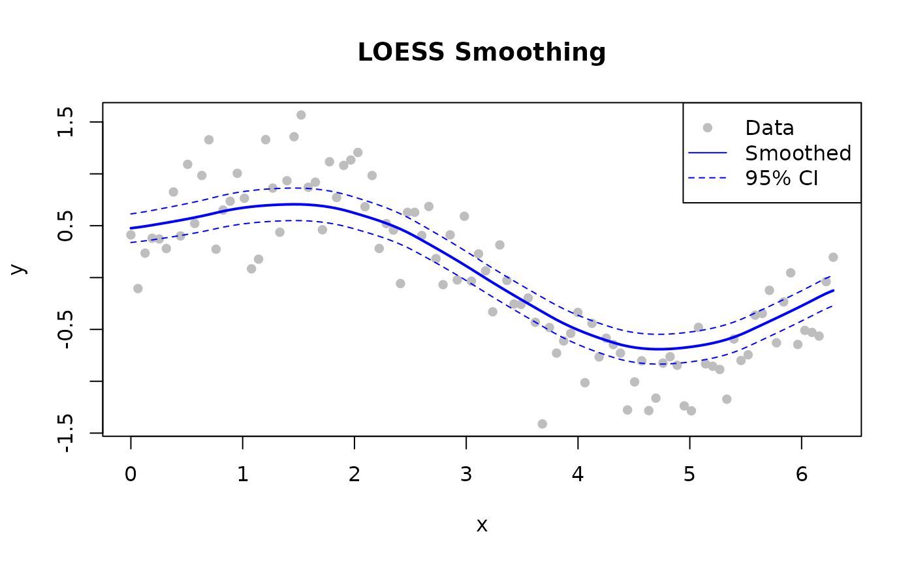

# Quick Start

## Basic Smoothing

Smooth a noisy sine wave — the kind of signal where LOESS shines.
`fraction = 0.3` and `iterations = 3` are good starting values for most
signals.

``` r

library(rfastloess)

# 100-point noisy sine wave
set.seed(42)
x <- seq(0, 2 * pi, length.out = 100)
y <- sin(x) + rnorm(100, sd = 0.3)

model <- Loess(fraction = 0.3, iterations = 3)
result <- fit(model, x, y)

cat(sprintf("First smoothed value: %.4f (true: %.4f)\n",
            result$y[1], sin(x[1])))
#> First smoothed value: 0.4263 (true: 0.0000)
```

------------------------------------------------------------------------

## With Confidence Intervals

``` r

library(rfastloess)
set.seed(42)
x <- seq(0, 2 * pi, length.out = 100)
y <- sin(x) + rnorm(100, sd = 0.3)

model <- Loess(
    fraction = 0.5,
    iterations = 3,
    confidence_intervals = 0.95,
    prediction_intervals = 0.95,
    return_diagnostics = TRUE
)
result <- fit(model, x, y)

cat("Smoothed (first 5):", head(result$y, 5), "\n")
#> Smoothed (first 5): 0.4758389 0.4846388 0.4944609 0.5054102 0.5169758
cat("CI Lower (first 5):", head(result$confidence_lower, 5), "\n")
#> CI Lower (first 5): 0.3381404 0.3455916 0.3539923 0.3634793 0.3735825
cat("CI Upper (first 5):", head(result$confidence_upper, 5), "\n")
#> CI Upper (first 5): 0.6135373 0.6236859 0.6349296 0.647341 0.6603691
cat("R2:", result$diagnostics$r_squared, "\n")
#> R2: 0.78173
```

------------------------------------------------------------------------

## Handling Outliers

LOESS can robustly handle outliers through iterative reweighting:

``` r

library(rfastloess)

x_out <- 1:6
y_with_outlier <- c(2.0, 4.0, 6.0, 50.0, 10.0, 12.0)

model <- Loess(
    fraction = 0.7,
    iterations = 5,
    robustness_method = "bisquare",
    return_robustness_weights = TRUE
)
result <- fit(model, x_out, y_with_outlier)

# Check which points were downweighted
for (i in seq_along(result$robustness_weights)) {
    if (result$robustness_weights[i] < 0.5) {
        cat(sprintf("Point %d is likely an outlier (weight: %.3f)\n",
                    i, result$robustness_weights[i]))
    }
}
#> Point 4 is likely an outlier (weight: 0.000)
```

------------------------------------------------------------------------

## Streaming Mode

For datasets too large to fit in memory, stream them in fixed-size
chunks with overlap.

``` r

library(rfastloess)
set.seed(42)
x <- seq(0, 10 * pi, length.out = 5000)
y <- sin(x / pi) * exp(-x / 30) + rnorm(5000, sd = 0.15)

model <- StreamingLoess(
    fraction = 0.2,
    chunk_size = 1000,
    overlap = 100,
    merge_strategy = "weighted_average"
)

chunk_size <- 1000
for (start in seq(1, 4001, by = chunk_size)) {
    end <- min(start + chunk_size - 1, length(x))
    process_chunk(model, x[start:end], y[start:end])
}
result <- finalize(model)
cat("Smoothed", length(result$y), "points in streaming mode\n")
#> Smoothed 100 points in streaming mode
```

------------------------------------------------------------------------

## Online Mode

For real-time / point-by-point processing.

``` r

library(rfastloess)
set.seed(42)
times <- 1:100
temperatures <- 20 + 5 * sin(times / 10) + rnorm(100)

model <- OnlineLoess(
    fraction = 0.3,
    window_capacity = 25,
    min_points = 5,
    update_mode = "incremental"
)

for (i in seq_along(times)) {
    result <- add_point(model, times[i], temperatures[i])
    if (!is.null(result))
        cat(sprintf("Time %d: %.2f\n", times[i], result$y))
    if (i >= 10) break  # print only the first few outputs
}
#> Time 5: 22.80
#> Time 6: 22.72
#> Time 7: 24.73
#> Time 8: 23.49
#> Time 9: 25.94
#> Time 10: 24.14
```

------------------------------------------------------------------------

## Plotting Results

``` r

library(rfastloess)
set.seed(42)
x <- seq(0, 2 * pi, length.out = 100)
y <- sin(x) + rnorm(100, sd = 0.3)

model <- Loess(fraction = 0.5, confidence_intervals = 0.95)
result <- fit(model, x, y)

plot(x, y, pch = 16, col = "gray", main = "LOESS Smoothing")
lines(result$x, result$y, col = "blue", lwd = 2)
lines(result$x, result$confidence_lower, col = "blue", lty = 2)
lines(result$x, result$confidence_upper, col = "blue", lty = 2)
legend("topright", c("Data", "Smoothed", "95% CI"),
        pch = c(16, NA, NA), lty = c(NA, 1, 2),
        col = c("gray", "blue", "blue"))
```



------------------------------------------------------------------------

## Next Steps

| Topic | Link |
|----|----|
| How LOESS works | [`vignette("concepts", package = "rfastloess")`](https://thisisamirv.github.io/loess-project/r/articles/concepts.md) |
| All parameters explained | [`?Loess`](https://thisisamirv.github.io/loess-project/r/reference/Loess.md) |
| Batch vs Streaming vs Online | [`vignette("adapter-choice")`](https://thisisamirv.github.io/loess-project/r/articles/adapter-choice.md) |
| Polynomial degree choices | [`vignette("degree", package = "rfastloess")`](https://thisisamirv.github.io/loess-project/r/articles/degree.md) |
| Multivariate smoothing | [`vignette("dimensions", package = "rfastloess")`](https://thisisamirv.github.io/loess-project/r/articles/dimensions.md) |
| Edge handling | [`vignette("boundary", package = "rfastloess")`](https://thisisamirv.github.io/loess-project/r/articles/boundary.md) |
| Outlier handling in depth | [`vignette("robustness", package = "rfastloess")`](https://thisisamirv.github.io/loess-project/r/articles/robustness.md) |

``` r

sessionInfo()
#> R version 4.6.1 (2026-06-24)
#> Platform: x86_64-pc-linux-gnu
#> Running under: Ubuntu 24.04.4 LTS
#> 
#> Matrix products: default
#> BLAS:   /usr/lib/x86_64-linux-gnu/openblas-pthread/libblas.so.3 
#> LAPACK: /usr/lib/x86_64-linux-gnu/openblas-pthread/libopenblasp-r0.3.26.so;  LAPACK version 3.12.0
#> 
#> locale:
#>  [1] LC_CTYPE=C.UTF-8       LC_NUMERIC=C           LC_TIME=C.UTF-8       
#>  [4] LC_COLLATE=C.UTF-8     LC_MONETARY=C.UTF-8    LC_MESSAGES=C.UTF-8   
#>  [7] LC_PAPER=C.UTF-8       LC_NAME=C              LC_ADDRESS=C          
#> [10] LC_TELEPHONE=C         LC_MEASUREMENT=C.UTF-8 LC_IDENTIFICATION=C   
#> 
#> time zone: UTC
#> tzcode source: system (glibc)
#> 
#> attached base packages:
#> [1] stats     graphics  grDevices utils     datasets  methods   base     
#> 
#> other attached packages:
#> [1] rfastloess_1.0.0
#> 
#> loaded via a namespace (and not attached):
#>  [1] digest_0.6.39       desc_1.4.3          R6_2.6.1           
#>  [4] fastmap_1.2.0       xfun_0.60           cachem_1.1.0       
#>  [7] knitr_1.51          BiocGenerics_0.58.1 htmltools_0.5.9    
#> [10] generics_0.1.4      rmarkdown_2.32      lifecycle_1.0.5    
#> [13] cli_3.6.6           sass_0.4.10         pkgdown_2.2.1      
#> [16] textshaping_1.0.5   jquerylib_0.1.4     systemfonts_1.3.2  
#> [19] compiler_4.6.1      tools_4.6.1         ragg_1.5.2         
#> [22] bslib_0.12.0        evaluate_1.0.5      yaml_2.3.12        
#> [25] otel_0.2.0          jsonlite_2.0.0      rlang_1.3.0        
#> [28] fs_2.1.0            htmlwidgets_1.6.4
```
