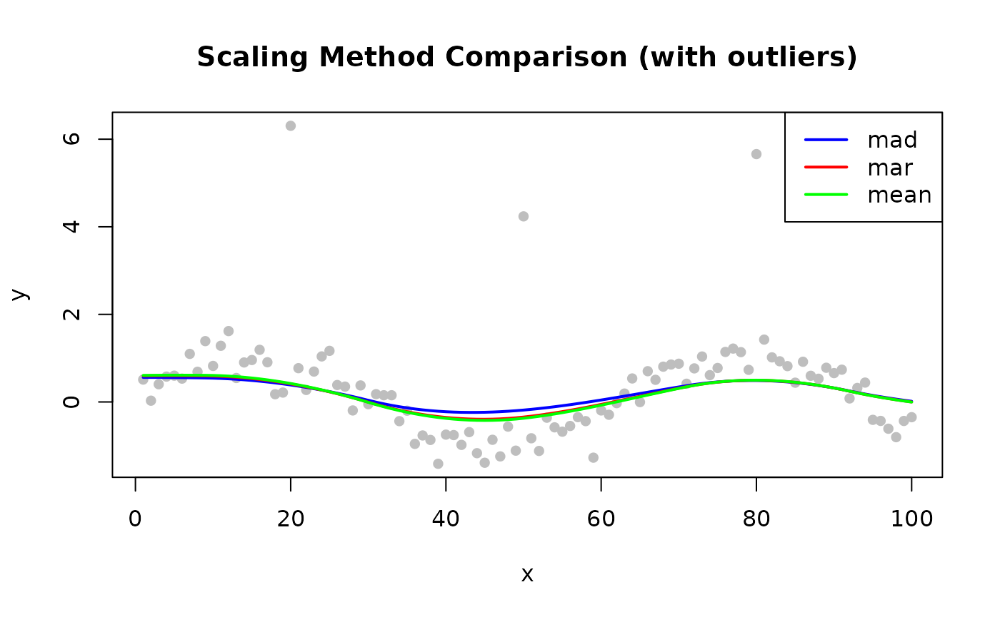

# Scaling Methods

## Overview

When `iterations > 0`, LOESS computes robustness weights by comparing
each residual to the current residual scale estimate $`\hat{\sigma}`$.
The `scaling_method` parameter controls how $`\hat{\sigma}`$ is
estimated.

``` math
w_i = B\!\left(\frac{|r_i|}{6 \cdot \hat{\sigma}}\right)
```

| Method   | Formula                               | Robustness  | Speed    |
|----------|---------------------------------------|-------------|----------|
| `"mad"`  | Median absolute deviation from median | Very robust | Moderate |
| `"mar"`  | Median of \|residuals\|               | Robust      | Fast     |
| `"mean"` | Mean of \|residuals\|                 | Less robust | Fastest  |


Scaling method comparison

------------------------------------------------------------------------

## MAD — Median Absolute Deviation (Default)

``` math
\hat{\sigma} = \text{median}(|r_i - \text{median}(r_i)|)
```

First centers residuals at their median, then takes the median of the
absolute deviations. Double use of the median makes it highly resistant
to extreme outliers.

**Use when**: Data may contain outliers (default for most applications).

``` r

library(rfastloess)
set.seed(42)
x <- seq(0, 2 * pi, length.out = 100)
y <- sin(x) + rnorm(100, sd = 0.3)

model <- Loess(iterations = 3, scaling_method = "mad")
result <- fit(model, x, y)
cat("First 6 smoothed values (MAD scaling):\n")
#> First 6 smoothed values (MAD scaling):
print(head(result$y))
#> [1] 0.4897657 0.4961584 0.5029665 0.5102219 0.5179564 0.5262019
```

------------------------------------------------------------------------

## MAR — Median Absolute Residual

``` math
\hat{\sigma} = \text{median}(|r_i|)
```

Uses the uncentered median — unlike MAD it does not subtract the
residual median first. Still robust (median-based), faster (one partial
sort instead of two).

**Use when**: Speed matters and data have minimal systematic bias in
residuals.

``` r

model <- Loess(iterations = 3, scaling_method = "mar")
result <- fit(model, x, y)
cat("First 6 smoothed values (MAR scaling):\n")
#> First 6 smoothed values (MAR scaling):
print(head(result$y))
#> [1] 0.5096452 0.5176529 0.5262527 0.5354995 0.5454482 0.5561534
```

------------------------------------------------------------------------

## Mean — Mean Absolute Residual

``` math
\hat{\sigma} = \frac{1}{n}\sum_i |r_i|
```

Arithmetic mean of absolute residuals. Non-robust: a single extreme
outlier inflates $`\hat{\sigma}`$, causing the bisquare weight function
to under-downweight other outliers.

**Use when**: Clean data with no outliers; maximum computation speed
required.

``` r

model <- Loess(iterations = 3, scaling_method = "mean")
result <- fit(model, x, y)
cat("First 6 smoothed values (mean scaling):\n")
#> First 6 smoothed values (mean scaling):
print(head(result$y))
#> [1] 0.5127460 0.5210276 0.5299371 0.5395344 0.5498791 0.5610310
```

------------------------------------------------------------------------

## Comparing Scaling Methods

``` r

library(rfastloess)
set.seed(42)
x <- 1:100
y <- sin(x / 10) + rnorm(100, sd = 0.3)
y[c(20, 50, 80)] <- y[c(20, 50, 80)] + 5  # outliers

methods <- c("mad", "mar", "mean")
colors  <- c("blue", "red", "green")

plot(x, y, pch = 16, col = "gray",
    main = "Scaling Method Comparison (with outliers)")

for (i in seq_along(methods)) {
    model  <- Loess(iterations = 3, scaling_method = methods[i])
    result <- fit(model, x, y)
    lines(result$x, result$y, col = colors[i], lwd = 2)
}

legend("topright", methods, col = colors, lwd = 2)
```



``` r

sessionInfo()
#> R version 4.6.1 (2026-06-24)
#> Platform: x86_64-pc-linux-gnu
#> Running under: Ubuntu 24.04.4 LTS
#> 
#> Matrix products: default
#> BLAS:   /usr/lib/x86_64-linux-gnu/openblas-pthread/libblas.so.3 
#> LAPACK: /usr/lib/x86_64-linux-gnu/openblas-pthread/libopenblasp-r0.3.26.so;  LAPACK version 3.12.0
#> 
#> locale:
#>  [1] LC_CTYPE=C.UTF-8       LC_NUMERIC=C           LC_TIME=C.UTF-8       
#>  [4] LC_COLLATE=C.UTF-8     LC_MONETARY=C.UTF-8    LC_MESSAGES=C.UTF-8   
#>  [7] LC_PAPER=C.UTF-8       LC_NAME=C              LC_ADDRESS=C          
#> [10] LC_TELEPHONE=C         LC_MEASUREMENT=C.UTF-8 LC_IDENTIFICATION=C   
#> 
#> time zone: UTC
#> tzcode source: system (glibc)
#> 
#> attached base packages:
#> [1] stats     graphics  grDevices utils     datasets  methods   base     
#> 
#> other attached packages:
#> [1] rfastloess_1.0.0
#> 
#> loaded via a namespace (and not attached):
#>  [1] digest_0.6.39       desc_1.4.3          R6_2.6.1           
#>  [4] fastmap_1.2.0       xfun_0.60           cachem_1.1.0       
#>  [7] knitr_1.51          BiocGenerics_0.58.1 htmltools_0.5.9    
#> [10] generics_0.1.4      rmarkdown_2.31      lifecycle_1.0.5    
#> [13] cli_3.6.6           sass_0.4.10         pkgdown_2.2.1      
#> [16] textshaping_1.0.5   jquerylib_0.1.4     systemfonts_1.3.2  
#> [19] compiler_4.6.1      tools_4.6.1         ragg_1.5.2         
#> [22] bslib_0.12.0        evaluate_1.0.5      yaml_2.3.12        
#> [25] otel_0.2.0          jsonlite_2.0.0      rlang_1.3.0        
#> [28] fs_2.1.0            htmlwidgets_1.6.4
```
