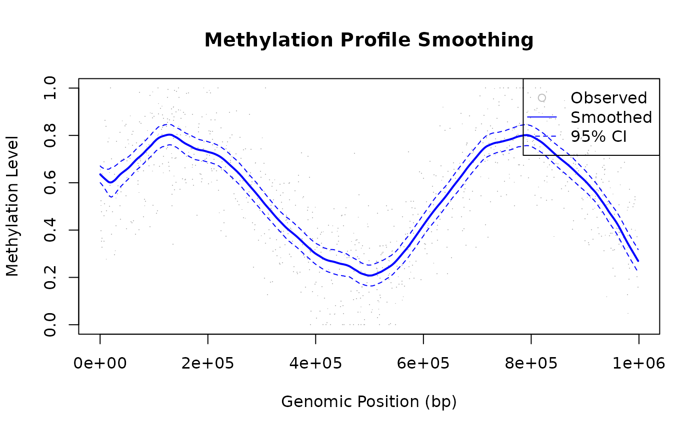

# Use Case: Genomic Data Smoothing

## Overview

LOESS is well-suited for genomic data such as DNA methylation profiles,
ChIP-seq signals, and expression arrays.

------------------------------------------------------------------------

## Methylation Profile Smoothing

### The Challenge

DNA methylation data (from bisulfite sequencing or arrays) shows
position-dependent patterns that can be obscured by measurement noise.

### Solution

A small `fraction = 0.1` lets LOESS follow fine-scale spatial structure
without smearing the transitions between methylated and unmethylated
regions. `confidence_intervals = 0.95` produces uncertainty bands that
naturally widen at positions with sparser CpG coverage, making
low-confidence segments immediately apparent in the plot.

``` r

library(rfastloess)

set.seed(42)
n <- 1000
positions <- sort(runif(n, 0, 1e6))

true_meth <- 0.5 + 0.3 * sin(positions / 1e5)
observed  <- true_meth + rnorm(n, sd = 0.15)
observed  <- pmax(0, pmin(1, observed))

model <- Loess(
    fraction = 0.1,
    iterations = 3,
    confidence_intervals = 0.95
)
result <- fit(model, positions, observed)

plot(positions, observed, pch = ".", col = "gray",
    xlab = "Genomic Position (bp)", ylab = "Methylation Level",
    main = "Methylation Profile Smoothing")
lines(result$x, result$y, col = "blue", lwd = 2)
lines(result$x, result$confidence_lower, col = "blue", lty = 2)
lines(result$x, result$confidence_upper, col = "blue", lty = 2)
legend("topright", c("Observed", "Smoothed", "95% CI"),
        pch = c(1, NA, NA), lty = c(NA, 1, 2),
        col = c("gray", "blue", "blue"))
```



------------------------------------------------------------------------

## ChIP-seq Signal Smoothing

### Application

ChIP-seq experiments produce sparse, noisy coverage data. LOESS can help
identify binding regions.

`fraction = 0.05` provides high spatial resolution — important for
resolving narrow binding peaks that would otherwise be smeared into the
background. The larger `iterations = 5` is deliberate:
Poisson-distributed read counts produce tall, isolated spikes, and extra
robustness iterations progressively down-weight them so the estimated
background level is not inflated by a handful of extreme counts.

``` r

library(rfastloess)
set.seed(123)

positions <- seq(0, 9990, by = 10)
n <- length(positions)

background <- 10
peak1 <- 50 * exp(-((positions - 2000)^2) / (2 * 200^2))
peak2 <- 80 * exp(-((positions - 5000)^2) / (2 * 300^2))
peak3 <- 40 * exp(-((positions - 8000)^2) / (2 * 150^2))

true_signal <- background + peak1 + peak2 + peak3
observed <- rpois(n, true_signal)

model <- Loess(
    fraction = 0.05,   # Very local smoothing
    iterations = 5,    # Strong robustness
    return_residuals = TRUE
)
result <- fit(model, positions, observed)

# Identify peaks (smoothed signal significantly above background)
threshold <- quantile(result$y, 0.75)
peaks <- positions[result$y > threshold]
cat(sprintf("Found %d peak positions (first 5): %s\n",
            length(peaks), toString(head(peaks, 5))))
#> Found 250 peak positions (first 5): 1630, 1640, 1650, 1660, 1670
```

------------------------------------------------------------------------

## Large Genome Coverage (Streaming)

For whole-genome data that doesn’t fit in memory:

``` r

library(rfastloess)
set.seed(42)

positions <- seq(0, 9990, by = 10)
coverage  <- rpois(length(positions), 50)

# Process chromosome-by-chromosome or in chunks
model <- StreamingLoess(
    fraction   = 0.05,
    chunk_size = 100000,   # 100kb chunks
    overlap    = 10000,    # 10kb overlap
    merge_strategy = "weighted_average"
)
process_chunk(model, positions, coverage)
#> <LoessResult>
#>   Points:            0 
#>   Fraction Used:     0.05 
#>   Iterations Used:   3
result <- finalize(model)
cat("Smoothed y[0]:", result$y[1], "\n")
#> Smoothed y[0]: 56.83401
```

------------------------------------------------------------------------

## Best Practices for Genomic Data

| Consideration            | Recommendation                      |
|--------------------------|-------------------------------------|
| **Fraction**             | 0.05–0.15 (preserve local features) |
| **Iterations**           | 3–5 (handle sequencing outliers)    |
| **Large data**           | Use streaming mode                  |
| **Sparse regions**       | Use `boundary_policy = "extend"`    |
| **Multiple chromosomes** | Process separately or ensure sorted |

------------------------------------------------------------------------

## See Also

- [`vignette("concepts", package = "rfastloess")`](https://thisisamirv.github.io/loess-project/r/articles/concepts.md)
  — How LOESS works
- [`?Loess`](https://thisisamirv.github.io/loess-project/r/reference/Loess.md)
  — All options
- [`vignette("robustness", package = "rfastloess")`](https://thisisamirv.github.io/loess-project/r/articles/robustness.md)
  — Outlier downweighting in depth
- [`vignette("merge", package = "rfastloess")`](https://thisisamirv.github.io/loess-project/r/articles/merge.md)
  — Streaming chunk reconciliation
- [`vignette("boundary", package = "rfastloess")`](https://thisisamirv.github.io/loess-project/r/articles/boundary.md)
  — Edge handling for sparse regions
- [`vignette("use-case-real-time", package = "rfastloess")`](https://thisisamirv.github.io/loess-project/r/articles/use-case-real-time.md)
  — For sequencing runs

``` r

sessionInfo()
#> R version 4.6.1 (2026-06-24)
#> Platform: x86_64-pc-linux-gnu
#> Running under: Ubuntu 24.04.4 LTS
#> 
#> Matrix products: default
#> BLAS:   /usr/lib/x86_64-linux-gnu/openblas-pthread/libblas.so.3 
#> LAPACK: /usr/lib/x86_64-linux-gnu/openblas-pthread/libopenblasp-r0.3.26.so;  LAPACK version 3.12.0
#> 
#> locale:
#>  [1] LC_CTYPE=C.UTF-8       LC_NUMERIC=C           LC_TIME=C.UTF-8       
#>  [4] LC_COLLATE=C.UTF-8     LC_MONETARY=C.UTF-8    LC_MESSAGES=C.UTF-8   
#>  [7] LC_PAPER=C.UTF-8       LC_NAME=C              LC_ADDRESS=C          
#> [10] LC_TELEPHONE=C         LC_MEASUREMENT=C.UTF-8 LC_IDENTIFICATION=C   
#> 
#> time zone: UTC
#> tzcode source: system (glibc)
#> 
#> attached base packages:
#> [1] stats     graphics  grDevices utils     datasets  methods   base     
#> 
#> other attached packages:
#> [1] rfastloess_2.0.0
#> 
#> loaded via a namespace (and not attached):
#>  [1] digest_0.6.39     desc_1.4.3        R6_2.6.1          fastmap_1.2.0    
#>  [5] xfun_0.60         cachem_1.1.0      knitr_1.51        htmltools_0.5.9  
#>  [9] rmarkdown_2.32    lifecycle_1.0.5   cli_3.6.6         sass_0.4.10      
#> [13] pkgdown_2.2.1     textshaping_1.0.5 jquerylib_0.1.4   systemfonts_1.3.2
#> [17] compiler_4.6.1    tools_4.6.1       ragg_1.5.2        bslib_0.12.0     
#> [21] evaluate_1.0.5    yaml_2.3.12       otel_0.2.0        jsonlite_2.0.0   
#> [25] rlang_1.3.0       fs_2.1.0          htmlwidgets_1.6.4
```
