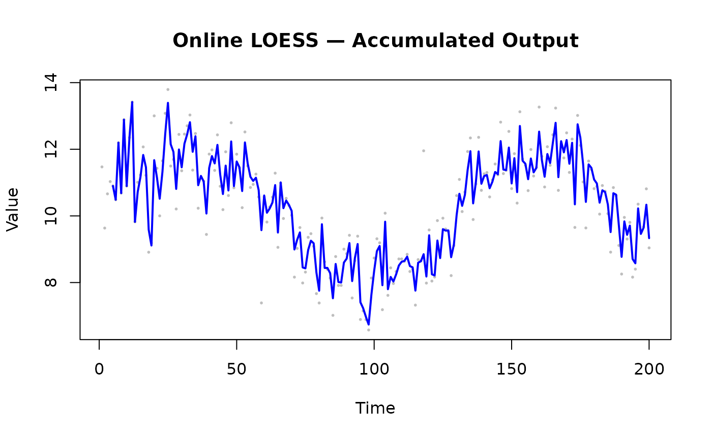

# Use Case: Real-Time Processing

## Overview

The Online adapter provides incremental smoothing for continuously
arriving data.

------------------------------------------------------------------------

## Online Mode: Point-by-Point

`window_capacity = 25` limits the internal buffer to the 25 most recent
observations; each `add_point` call costs O(window) rather than growing
with total history. `min_points = 5` suppresses output until the window
holds enough points for a stable fit — calls made before that threshold
return `NULL`. `update_mode = "incremental"` re-fits only the most
recent point rather than the full window, halving typical latency at a
modest accuracy cost.

### Sensor Data Example

``` r

library(rfastloess)

set.seed(42)
times        <- 1:100
temperatures <- 20 + 5 * sin(times / 10) + rnorm(100)

model <- OnlineLoess(
    fraction = 0.3,
    window_capacity = 25,
    min_points = 5,
    update_mode = "incremental"
)
for (i in seq_along(times)) {
    result <- add_point(model, times[i], temperatures[i])
    if (!is.null(result))
        cat(sprintf("Time %d: %.2f\n", times[i], result$y))
}
#> Time 5: 22.80
#> Time 6: 22.72
#> Time 7: 24.73
#> Time 8: 23.49
#> Time 9: 25.94
#> Time 10: 24.14
#> Time 11: 25.76
#> Time 12: 26.95
#> Time 13: 23.43
#> Time 14: 24.30
#> Time 15: 24.80
#> Time 16: 25.41
#> Time 17: 24.95
#> Time 18: 22.92
#> Time 19: 22.27
#> Time 20: 24.58
#> Time 21: 24.31
#> Time 22: 23.07
#> Time 23: 23.27
#> Time 24: 24.09
#> Time 25: 24.68
#> Time 26: 23.09
#> Time 27: 22.25
#> Time 28: 20.64
#> Time 29: 21.23
#> Time 30: 20.46
#> Time 31: 20.61
#> Time 32: 20.44
#> Time 33: 20.33
#> Time 34: 18.89
#> Time 35: 18.74
#> Time 36: 16.96
#> Time 37: 16.66
#> Time 38: 16.21
#> Time 39: 14.89
#> Time 40: 15.70
#> Time 41: 15.95
#> Time 42: 15.59
#> Time 43: 15.94
#> Time 44: 15.02
#> Time 45: 14.19
#> Time 46: 14.93
#> Time 47: 14.47
#> Time 48: 15.78
#> Time 49: 15.07
#> Time 50: 15.61
#> Time 51: 15.63
#> Time 52: 15.13
#> Time 53: 16.57
#> Time 54: 16.74
#> Time 55: 16.70
#> Time 56: 16.94
#> Time 57: 17.58
#> Time 58: 17.74
#> Time 59: 16.09
#> Time 60: 17.81
#> Time 61: 18.41
#> Time 62: 19.41
#> Time 63: 20.24
#> Time 64: 21.42
#> Time 65: 20.80
#> Time 66: 22.13
#> Time 67: 22.29
#> Time 68: 23.15
#> Time 69: 23.59
#> Time 70: 23.91
#> Time 71: 23.08
#> Time 72: 23.56
#> Time 73: 24.39
#> Time 74: 23.92
#> Time 75: 24.06
#> Time 76: 24.91
#> Time 77: 25.48
#> Time 78: 25.52
#> Time 79: 24.61
#> Time 80: 24.08
#> Time 81: 25.49
#> Time 82: 25.21
#> Time 83: 24.87
#> Time 84: 24.35
#> Time 85: 23.33
#> Time 86: 23.89
#> Time 87: 23.37
#> Time 88: 22.99
#> Time 89: 23.23
#> Time 90: 23.01
#> Time 91: 23.01
#> Time 92: 21.47
#> Time 93: 21.28
#> Time 94: 21.37
#> Time 95: 19.56
#> Time 96: 18.66
#> Time 97: 17.80
#> Time 98: 17.07
#> Time 99: 17.49
#> Time 100: 17.77
```

------------------------------------------------------------------------

## Accumulating Results

``` r

library(rfastloess)
set.seed(42)
n      <- 200
times  <- seq_len(n)
signal <- 10 + 2 * sin(times / 20) + rnorm(n, sd = 1)

model <- OnlineLoess(
    fraction        = 0.3,
    window_capacity = 30,
    min_points      = 5
)

smoothed_x <- numeric(n)
smoothed_y <- numeric(n)
n_out <- 0L

for (i in seq_len(n)) {
    result <- add_point(model, times[i], signal[i])
    if (!is.null(result)) {
        n_out <- n_out + 1L
        smoothed_x[n_out] <- times[i]
        smoothed_y[n_out] <- result$y
    }
}

smoothed_x <- smoothed_x[seq_len(n_out)]
smoothed_y <- smoothed_y[seq_len(n_out)]

plot(times, signal, pch = 16, cex = 0.4, col = "gray",
    xlab = "Time", ylab = "Value",
    main = "Online LOESS — Accumulated Output")
lines(smoothed_x, smoothed_y, col = "blue", lwd = 2)
```



------------------------------------------------------------------------

## Update Modes

| Mode            | Behaviour                     | Latency | Accuracy |
|-----------------|-------------------------------|---------|----------|
| `"incremental"` | Re-fits only the newest point | Low     | Moderate |
| `"full"`        | Re-fits the entire window     | Higher  | Higher   |

------------------------------------------------------------------------

## Streaming Mode for Large Batches

``` r

library(rfastloess)

model <- StreamingLoess(
    fraction       = 0.3,
    iterations     = 2,
    chunk_size     = 5000,
    overlap        = 500,
    merge_strategy = "weighted_average"
)

set.seed(42)
n_total <- 20000
x_all   <- seq_len(n_total)
y_all   <- sin(x_all / 500) + rnorm(n_total, sd = 0.5)

chunk_size <- 5000
n_chunks   <- ceiling(n_total / chunk_size)

for (i in seq_len(n_chunks)) {
    idx_from <- (i - 1) * chunk_size + 1
    idx_to   <- min(i * chunk_size, n_total)
    result   <- process_chunk(model, x_all[idx_from:idx_to],
                                    y_all[idx_from:idx_to])
}

final <- finalize(model)
cat("First 6 smoothed values (streaming, weighted_average merge):\n")
#> First 6 smoothed values (streaming, weighted_average merge):
print(head(final$y))
#> [1] 0.8375773 0.8384586 0.8393410 0.8402243 0.8411086 0.8419938
```

``` r

sessionInfo()
#> R version 4.6.1 (2026-06-24)
#> Platform: x86_64-pc-linux-gnu
#> Running under: Ubuntu 24.04.4 LTS
#> 
#> Matrix products: default
#> BLAS:   /usr/lib/x86_64-linux-gnu/openblas-pthread/libblas.so.3 
#> LAPACK: /usr/lib/x86_64-linux-gnu/openblas-pthread/libopenblasp-r0.3.26.so;  LAPACK version 3.12.0
#> 
#> locale:
#>  [1] LC_CTYPE=C.UTF-8       LC_NUMERIC=C           LC_TIME=C.UTF-8       
#>  [4] LC_COLLATE=C.UTF-8     LC_MONETARY=C.UTF-8    LC_MESSAGES=C.UTF-8   
#>  [7] LC_PAPER=C.UTF-8       LC_NAME=C              LC_ADDRESS=C          
#> [10] LC_TELEPHONE=C         LC_MEASUREMENT=C.UTF-8 LC_IDENTIFICATION=C   
#> 
#> time zone: UTC
#> tzcode source: system (glibc)
#> 
#> attached base packages:
#> [1] stats     graphics  grDevices utils     datasets  methods   base     
#> 
#> other attached packages:
#> [1] rfastloess_1.0.0
#> 
#> loaded via a namespace (and not attached):
#>  [1] digest_0.6.39       desc_1.4.3          R6_2.6.1           
#>  [4] fastmap_1.2.0       xfun_0.60           cachem_1.1.0       
#>  [7] knitr_1.51          BiocGenerics_0.58.1 htmltools_0.5.9    
#> [10] generics_0.1.4      rmarkdown_2.31      lifecycle_1.0.5    
#> [13] cli_3.6.6           sass_0.4.10         pkgdown_2.2.1      
#> [16] textshaping_1.0.5   jquerylib_0.1.4     systemfonts_1.3.2  
#> [19] compiler_4.6.1      tools_4.6.1         ragg_1.5.2         
#> [22] bslib_0.12.0        evaluate_1.0.5      yaml_2.3.12        
#> [25] otel_0.2.0          jsonlite_2.0.0      rlang_1.3.0        
#> [28] fs_2.1.0            htmlwidgets_1.6.4
```
