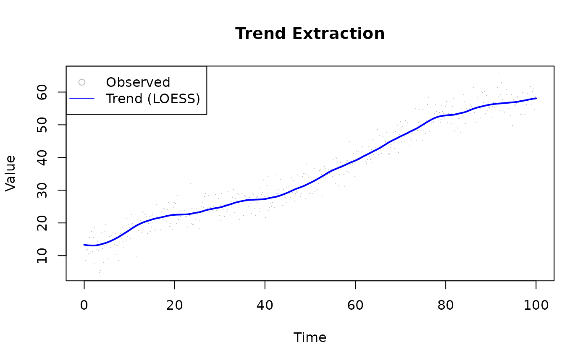
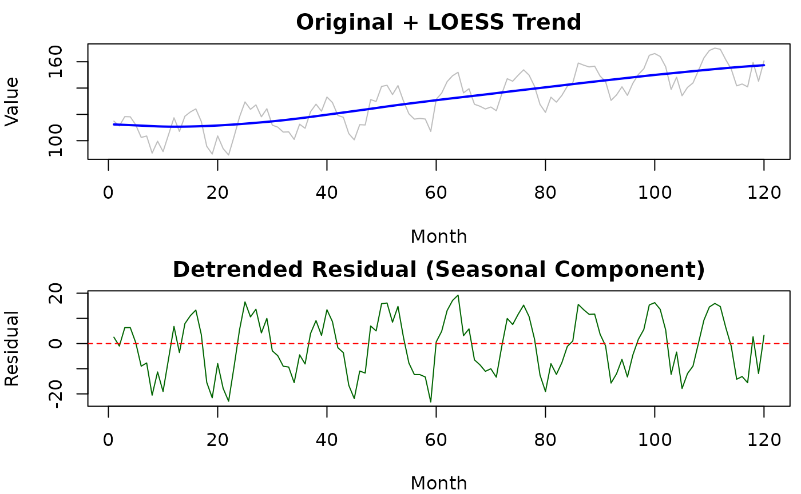
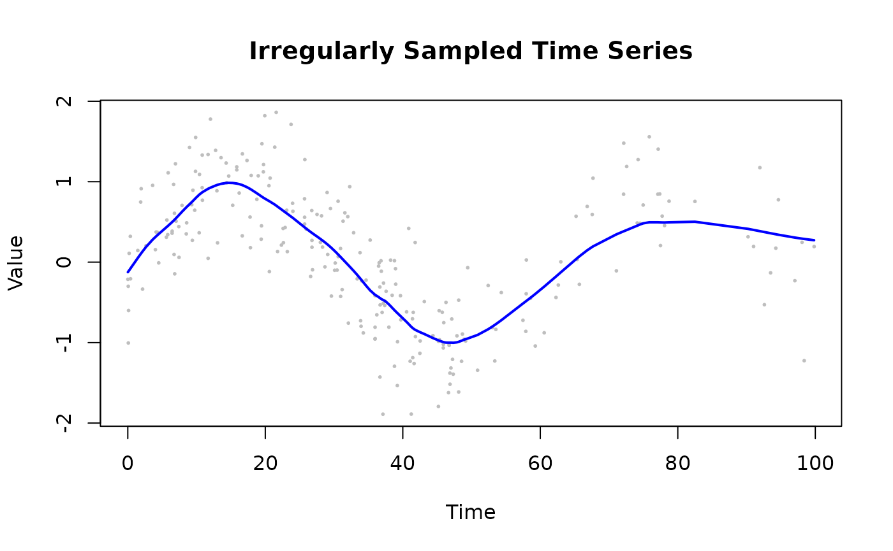
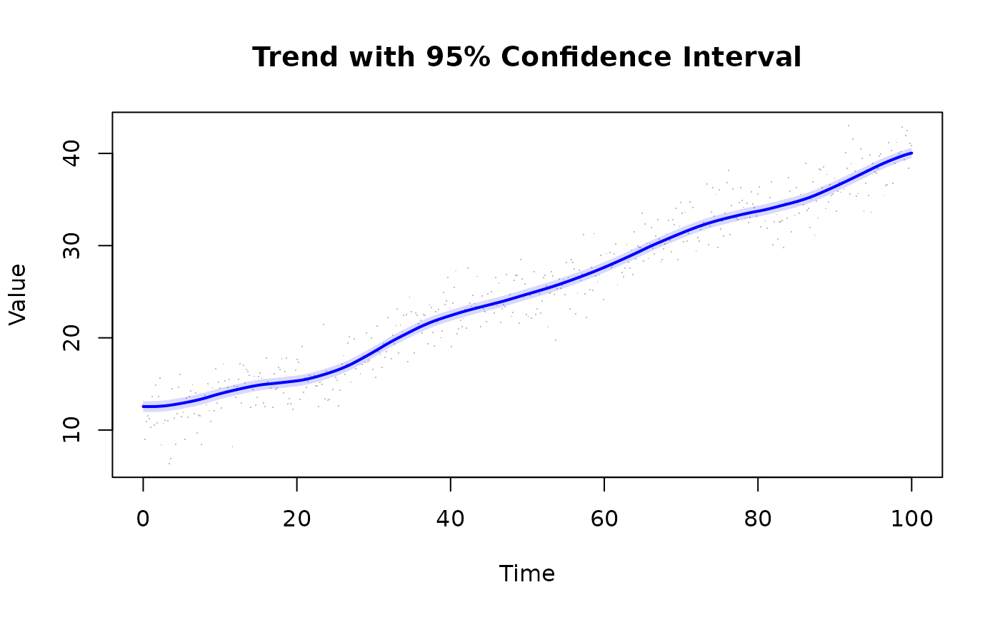
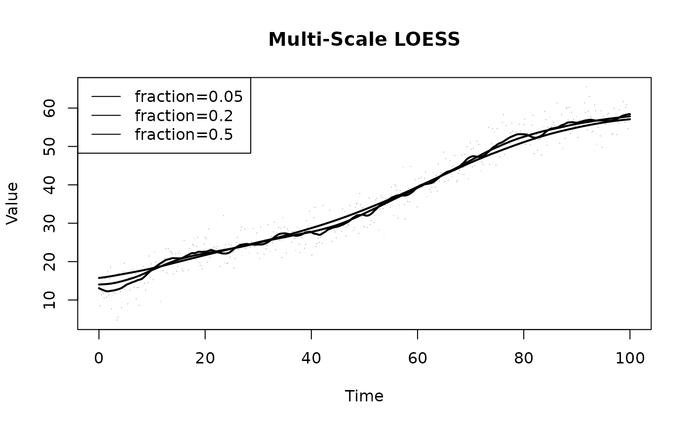

# Use Case: Time Series Analysis

## Overview

LOESS provides flexible trend extraction from time series without
parametric assumptions.

------------------------------------------------------------------------

## Basic Trend Extraction

`fraction = 0.1` sizes the neighbourhood as 10% of the data at each
evaluation point — narrow enough to follow a slowly varying trend
without smearing periodic variation. Three robustness `iterations`
down-weight noise spikes so they cannot bias the fitted curve; this is
especially important when the signal-to-noise ratio is low or when
occasional outliers are expected.

``` r

library(rfastloess)

set.seed(42)
t <- seq(0, 100, length.out = 500)
trend <- 10 + 0.5 * t + 3 * sin(t / 10)
noise <- rnorm(500, sd = 3)
y <- trend + noise

model <- Loess(fraction = 0.1, iterations = 3)
result <- fit(model, t, y)

plot(t, y, col = "gray", pch = ".",
    xlab = "Time", ylab = "Value", main = "Trend Extraction")
lines(result$x, result$y, col = "blue", lwd = 2)
legend("topleft", c("Observed", "Trend (LOESS)"),
        pch = c(1, NA), lty = c(NA, 1), col = c("gray", "blue"))
```



------------------------------------------------------------------------

## Seasonal Decomposition

Setting `return_residuals = TRUE` stores `observed − smoothed` alongside
the smooth. A slightly wider `fraction = 0.4` produces a smoother
baseline trend, so short-duration oscillations end up in the residuals
rather than being absorbed into the trend component. The residual series
is then ready for spectral analysis, seasonality detection, or
change-point methods.

``` r

library(rfastloess)
set.seed(42)

t        <- 1:120
trend    <- 100 + 0.5 * t
seasonal <- 15 * sin(2 * pi * t / 12)
noise    <- rnorm(120, sd = 5)
y        <- trend + seasonal + noise

model    <- Loess(fraction = 0.4, iterations = 2)
result   <- fit(model, t, y)
residual <- y - result$y

par(mfrow = c(2, 1), mar = c(4, 4, 2, 0.5))
plot(t, y, type = "l", col = "gray",
    main = "Original + LOESS Trend", xlab = "Month", ylab = "Value")
lines(result$x, result$y, col = "blue", lwd = 2)

plot(t, residual, type = "l", col = "darkgreen",
    main = "Detrended Residual (Seasonal Component)",
    xlab = "Month", ylab = "Residual")
abline(h = 0, lty = 2, col = "red")
```



``` r

par(mfrow = c(1, 1))
```

------------------------------------------------------------------------

## Irregular Time Grids

``` r

library(rfastloess)
set.seed(42)

t_irregular <- c(sort(runif(200, 0, 50)), sort(runif(50, 50, 100)))
y_irregular <- sin(t_irregular / 10) + rnorm(length(t_irregular), sd = 0.5)

model  <- Loess(fraction = 0.2, iterations = 2)
result <- fit(model, t_irregular, y_irregular)

plot(t_irregular, y_irregular, pch = 16, cex = 0.4, col = "gray",
    xlab = "Time", ylab = "Value", main = "Irregularly Sampled Time Series")
lines(result$x, result$y, col = "blue", lwd = 2)
```



------------------------------------------------------------------------

## Forecasting with Prediction Intervals

Prediction intervals widen the uncertainty band to include both the
uncertainty in the fitted curve (confidence interval) and the expected
scatter of new observations around it. `fraction = 0.2` offers a balance
between local detail and stable interval width — too small a fraction
produces jagged interval edges; too large a fraction underestimates
local variance near turning points.

``` r

library(rfastloess)
set.seed(42)
t <- seq(0, 100, length.out = 500)
y <- 10 + 0.3 * t + sin(t / 5) + rnorm(500, sd = 2)

model <- Loess(
    fraction = 0.2,
    iterations = 3,
    confidence_intervals = 0.95,
    prediction_intervals = 0.95
)
result <- fit(model, t, y)

plot(t, y, pch = ".", col = "gray",
    xlab = "Time", ylab = "Value",
    main = "Trend with 95% Prediction Interval")
polygon(c(result$x, rev(result$x)),
        c(result$prediction_upper, rev(result$prediction_lower)),
        col = rgb(0, 0, 1, 0.15), border = NA)
lines(result$x, result$y, col = "blue", lwd = 2)
```



------------------------------------------------------------------------

## Handling Missing Data

LOESS naturally handles irregular time sampling:

``` r

library(rfastloess)
set.seed(42)

t_irregular <- sort(runif(200, 0, 100))
y_irregular <- 10 + t_irregular * 0.3 + rnorm(200, sd = 2)

model <- Loess(fraction = 0.2)
result <- fit(model, t_irregular, y_irregular)
cat("Smoothed y[0]:", result$y[1], "\n")
#> Smoothed y[0]: 12.10549
```

------------------------------------------------------------------------

## Multi-Scale Analysis

Use different fractions to extract features at different scales:

``` r

library(rfastloess)
set.seed(42)
t <- seq(0, 100, length.out = 500)
trend_true <- 10 + 0.5 * t + 3 * sin(t / 10)
y <- trend_true + rnorm(length(t), sd = 3)

fractions <- c(0.05, 0.2, 0.5)

plot(t, y, col = "gray", pch = ".",
    xlab = "Time", ylab = "Value", main = "Multi-Scale LOESS")

for (f in fractions) {
    model <- Loess(fraction = f)
    result <- fit(model, t, y)
    lines(result$x, result$y, lwd = 2)
}
legend("topleft", paste0("fraction=", fractions), lty = 1)
```



------------------------------------------------------------------------

## Gene Expression Time Course

Biological application:

``` r

library(rfastloess)
set.seed(42)

hours <- seq(0, 24, by = 0.5)
expression <- 100 * (1 + 0.5 * sin(hours * pi / 12)) +
    rnorm(length(hours), sd = 10)

model <- Loess(
    fraction = 0.3,
    iterations = 3,
    confidence_intervals = 0.95,
    return_diagnostics = TRUE
)
result <- fit(model, hours, expression)

cat("R2:", result$diagnostics$r_squared, "\n")
#> R2: 0.9096872
```

------------------------------------------------------------------------

## Choosing Fraction for Time Series

| Data Type             | Recommended Fraction | Rationale                    |
|-----------------------|----------------------|------------------------------|
| Daily data (years)    | 0.3–0.5              | Capture annual trends        |
| Hourly data (days)    | 0.1–0.2              | Capture daily patterns       |
| Sensor data (minutes) | 0.05–0.1             | Preserve short-term features |
| Noisy data            | Higher               | Reduce noise impact          |
| Clean data            | Lower                | Preserve detail              |

------------------------------------------------------------------------

## See Also

- [`vignette("use-case-real-time", package = "rfastloess")`](https://thisisamirv.github.io/loess-project/r/articles/use-case-real-time.md)
  — For streaming time series
- [`vignette("cross-validation", package = "rfastloess")`](https://thisisamirv.github.io/loess-project/r/articles/cross-validation.md)
  — Optimal fraction selection
- [`vignette("degree", package = "rfastloess")`](https://thisisamirv.github.io/loess-project/r/articles/degree.md)
  — Degree 2 for curved trends
- [`vignette("boundary", package = "rfastloess")`](https://thisisamirv.github.io/loess-project/r/articles/boundary.md)
  — Edge bias in trend extraction
- [`?Loess`](https://thisisamirv.github.io/loess-project/r/reference/Loess.md)
  — Full parameter reference

``` r

sessionInfo()
#> R version 4.6.1 (2026-06-24)
#> Platform: x86_64-pc-linux-gnu
#> Running under: Ubuntu 24.04.4 LTS
#> 
#> Matrix products: default
#> BLAS:   /usr/lib/x86_64-linux-gnu/openblas-pthread/libblas.so.3 
#> LAPACK: /usr/lib/x86_64-linux-gnu/openblas-pthread/libopenblasp-r0.3.26.so;  LAPACK version 3.12.0
#> 
#> locale:
#>  [1] LC_CTYPE=C.UTF-8       LC_NUMERIC=C           LC_TIME=C.UTF-8       
#>  [4] LC_COLLATE=C.UTF-8     LC_MONETARY=C.UTF-8    LC_MESSAGES=C.UTF-8   
#>  [7] LC_PAPER=C.UTF-8       LC_NAME=C              LC_ADDRESS=C          
#> [10] LC_TELEPHONE=C         LC_MEASUREMENT=C.UTF-8 LC_IDENTIFICATION=C   
#> 
#> time zone: UTC
#> tzcode source: system (glibc)
#> 
#> attached base packages:
#> [1] stats     graphics  grDevices utils     datasets  methods   base     
#> 
#> other attached packages:
#> [1] rfastloess_1.0.0
#> 
#> loaded via a namespace (and not attached):
#>  [1] digest_0.6.39       desc_1.4.3          R6_2.6.1           
#>  [4] fastmap_1.2.0       xfun_0.60           cachem_1.1.0       
#>  [7] knitr_1.51          BiocGenerics_0.58.1 htmltools_0.5.9    
#> [10] generics_0.1.4      rmarkdown_2.32      lifecycle_1.0.5    
#> [13] cli_3.6.6           sass_0.4.10         pkgdown_2.2.1      
#> [16] textshaping_1.0.5   jquerylib_0.1.4     systemfonts_1.3.2  
#> [19] compiler_4.6.1      tools_4.6.1         ragg_1.5.2         
#> [22] bslib_0.12.0        evaluate_1.0.5      yaml_2.3.12        
#> [25] otel_0.2.0          jsonlite_2.0.0      rlang_1.3.0        
#> [28] fs_2.1.0            htmlwidgets_1.6.4
```
